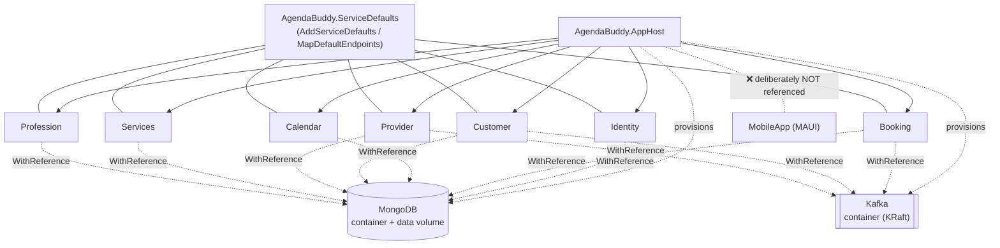

# Brainstorm Log: Aspire Wiring

**Feature ID:** F-013
**Original request (verbatim):** "wire solution as Aspire solution"
**Interaction mode:** Sketch (CONSTITUTION.md §8)
**Context catalog:** `docs/pdlc/context/` — hydrated 2026-08-15 at commit `997e933` (17 concern files, full-scan)

> **Session note.** After Round 1 the user instructed: *"no more questions, approval for all, continue, end with commit and Pr"*. Rounds 1's drafts were accepted verbatim. Rounds 2–3, Progressive Thinking, Adversarial Review, and Edge Case Analysis were therefore completed **non-interactively by the agent team**, with every judgement the user would otherwise have made recorded as an explicit **ASSUMPTION** below and carried into the PRD's Open Questions. Approval gates were pre-approved by the same instruction. This is a deviation from the normal interactive flow and is logged here so a later reader knows which answers are the user's and which are the team's.

## Divergent Ideation
_Skipped — user declined at Discover Step 0 (2026-08-15). Rationale offered and accepted: the freshly hydrated context catalog already bounded the problem space concretely, so open-ended idea generation had low marginal value._

## Visual Companion
_Not started — user's reply to the offer was "contine", read as "proceed" rather than acceptance. Session ran text-only; architecture rendered as inline Mermaid. Consequence: Discover Step 4.5 (UX Discovery) and Design Step 10.7 (Variant Convergence) are both skipped — see their sections._

---

## Socratic Discovery

**Completed:** 2026-08-15T17:00:00Z
**Interaction mode:** Sketch
**User response to Round 1:** "approval for all" — all four drafts accepted verbatim.

### Round 1 — Problem Statement

**Q1: What problem does `aspire-wiring` actually solve? What is a developer unable to do today, and what is the cost of that gap?**

**A (accepted):** Today you cannot start Agenda Buddy.
- `docker compose up` does not run the app — only `identity` is present; `provider` and `services-api` are commented out (`docker-compose.yml:42-56`) and Booking/Calendar/Customer/Profession were never added. Three of ten Compose "services" (`events`, `kafka-library`, `common-library`) are class libraries with no `ENTRYPOINT`, and their Dockerfiles publish `net10.0` output onto a `dotnet/runtime:8.0` base (`Library/Dockerfile:13`, `Kafka/Dockerfile:13`, `EventAndCommands/Dockerfile:12`).
- `dotnet run` needs 7 terminals plus manual environment setup — `JWT_PUBLIC_KEY` for all seven (`AuthenticationExtensions.cs:18-21` throws without it), `JWT_PRIVATE_KEY` for Identity, and each service binds a hardcoded `localhost:603x`.
- The app only starts in `Development` — all six domain services read a **root-level** `MongoDB` config section that exists solely in `appsettings.Development.json`; any other environment yields `new MongoClient(null!)` and a startup throw (`Booking/Extensions/ServiceCollectionExtension.cs:10`, `Booking/Configuration/MongoDbConfiguration.cs:7`).
- Nothing is observable — zero health checks, zero OpenTelemetry, zero metrics, zero tracing, zero resilience policies.

**Cost:** no reliable local run, no deployable artifact, and no way to diagnose either. Aspire's AppHost (orchestration), ServiceDefaults (health + OTel + resilience), and resource references (injected connection strings) map onto all four.

*Source: `docs/pdlc/context/08-cicd-deploy.md`, `06-configuration.md`, `12-observability.md`.*

**Q2: Who specifically will use this, and in what context?**

**A (accepted):** Not an end-user persona. `INTENT.md`'s Independent Service Provider and their customers are **unaffected**. The user is the **developer/operator** — currently the sole maintainer (`ogdevlabs`) — in two contexts: starting the stack to work on a feature, and eventually deploying it.

Atlas's challenge was accepted along with the draft: this feature changes no end-user behaviour directly. Its value is second-order and specific:
1. It unblocks *finishing* features already marked Shipped but unreachable — F-006–F-010 have domain services and tests but **no DI registration and no routes** (`03-services.md`); F-012's mobile client **cannot reach the backend** (`16-mobile-client.md`).
2. It removes the committed Atlas credential by making injected connection strings the default path (`13-security.md`).

**ASSUMPTION A-1:** The primary motive is (1) — unblocking delivery of the already-"shipped" backlog — with (2) as a required side effect. *Not user-confirmed.* If the motive were purely deployment-readiness, the scope in Round 2 would tilt toward publish/manifest work rather than local orchestration.

*Source: `INTENT.md` — Target User; `docs/pdlc/context/03-services.md`, `16-mobile-client.md`, `13-security.md`.*

**Q3: What does success look like? What specific thing measurably changes?**

**A (accepted):** Four binary, testable outcomes, ranked:
1. **One command starts everything** — `dotnet run --project AgendaBuddy.AppHost` brings up all 7 services + MongoDB + Kafka with **zero manual environment variables**. Today: 7 terminals + 2 exported keys, or a Compose file that starts 1 of 7.
2. **Committed secrets = 0** — the Atlas connection string removed from all 14 files, replaced by an Aspire-managed resource reference. Today: 14.
3. **Every service exposes a health endpoint and reports healthy in the Aspire dashboard** — 0 today.
4. **The stack starts in a non-`Development` environment** — impossible today.

"Developer experience improves" was explicitly rejected as gameable and is not an acceptance criterion.

**ASSUMPTION A-2:** All four are in scope and all four are failure conditions if unmet. *Not user-confirmed* — the user approved the list without ranking which they'd call failure. The PRD treats 1–4 as must-have; if the user intended only #1, criteria AC-2.x and AC-4.x become nice-to-have.

**Q4: What are the technical constraints and dependencies?**

**A (accepted):**
- ✅ **.NET 10 already** — `global.json:3` pins SDK `10.0.0`, `rollForward: latestMajor`, `allowPrerelease: true`. No runtime upgrade needed (F-011 did it).
- ⚠️ **`CONSTITUTION.md` §9: "New packages require discussion before adding — keep the dependency footprint minimal."** Aspire adds an AppHost SDK, a ServiceDefaults project, and one integration package per resource. Adoption needs an explicit `DECISIONS.md` entry, not a quiet `dotnet add package`. → satisfied by **ADR-013**.
- ⚠️ **`CONSTITUTION.md` §3 constraints must survive untouched** — service isolation, shared `Library`, CQRS via `EventAndCommands`, the EventStore audit trail ("do not remove this pattern"), cache-aside, Kafka per-provider topics. This work is additive plumbing, not a refactor of any of these.
- ⚠️ **`MongoDB.Driver` pinned at 2.25.0**, which is why `Directory.Build.props:18-28` carries three transitive CVE pins (`Snappier`, `SharpCompress`, `Newtonsoft.Json`). An Aspire Mongo integration may pull a different driver major — version interaction to verify before committing.
- ⚠️ **Kafka topology would change** — Compose runs Confluent 7.2.1 **with ZooKeeper** (`docker-compose.override.yml:31`); Aspire's Kafka integration provisions a KRaft container.
- ⚠️ **`MobileApp` must stay out of the orchestration graph** — its conditional multi-TFM build (`MobileWorkloads`/`MobilePlatform`, `MobileApp.csproj:9-20`) is delicate; an AppHost reference dragging in `net10.0-android`/`-ios` would break `dotnet build` for anyone without MAUI workloads.
- ⚠️ **CI would not notice this change** — the `dorny/paths-filter` gate ignores `global.json`, `Dockerfile`s, `docker-compose*.yml`, and `.github/**` (`.github/workflows/dotnet.yml:29-57`), so Aspire changes could merge with **zero jobs run**. Filter updates are in scope.
- **`PATH_BASE`** env vars exist in Compose with no `UsePathBase` anywhere — relevant only if a gateway comes into scope (it does not; see Round 2).

### Round 2 — Future State / Key Capabilities

*Completed non-interactively per the user's instruction. Answers are the agent team's, derived from the catalog.*

**Q1: What is the scope boundary — mechanical Aspire wiring only, Aspire plus the gaps it naturally touches, or a broader "make this runnable and deployable" programme?**

**A:** **Aspire plus the gaps it structurally touches, and nothing else.** Three tiers were considered:

| Tier | Contents | Verdict |
|---|---|---|
| **A — mechanical only** | AppHost + ServiceDefaults, services referenced, dashboard runs | ❌ Rejected — leaves the Development-only config defect intact, so the stack still cannot start anywhere else. Success criterion #4 unmet. |
| **B — Aspire + the wiring it owns** *(chosen)* | Tier A, plus: connection strings by reference (kills the committed credential), a shared `IMongoClient` replacing per-scope construction, health checks, OTel, `HttpClient` resilience defaults, Kafka + Mongo as Aspire resources, CI updated to build the AppHost | ✅ **Chosen** — each item is config/DI plumbing that Aspire either provides or displaces. All four success criteria land. |
| **C — full runnable product** | Tier B, plus: register the six unwired services and add their routes, add a gateway, fix the mobile route contract, fix the Dockerfile runtime mismatch | ❌ Rejected as one feature — this is 4+ independent features. Per Discover guideline 2 it needs decomposition, not a bigger PRD. |

**Decomposition of the rejected Tier C work into follow-up roadmap candidates** (to be filed at Plan, not built here):
- **F-014 `wire-unreached-services`** — register + route `NotificationService`, `MessageService`, `NoteService`, `PaymentService`, `ReportingService`, and `DeactivateProviderCommand` (six shipped features with no reachable surface).
- **F-015 `api-gateway-and-mobile-contract`** — a gateway (or Aspire service discovery + path bases) plus fixing the `api/v1/` prefix and verb mismatch so the mobile client stops falling back to `SeedDataProvider`.
- **F-016 `secure-public-endpoints`** — authenticate + ownership-guard + paginate the six anonymous PII endpoints; add the missing `OwnershipGuard` on the two Calendar routes.
- **F-017 `container-and-cd-hardening`** — fix the three `runtime:8.0` Dockerfiles, delete the class-library Dockerfiles/Compose services, add image build + scan + push to CI, and add the mandatory `CONSTITUTION.md` §7 security scan.

**Q2: What are the key components to build?**

**A:** Five, in dependency order:
1. **`AgendaBuddy.ServiceDefaults`** — a shared library project exposing `AddServiceDefaults()` (OpenTelemetry traces/metrics/logs with OTLP export, default health checks, `HttpClient` standard resilience, service discovery) and `MapDefaultEndpoints()` (`/health`, `/alive`). Referenced by all 7 API services.
2. **`AgendaBuddy.AppHost`** — the orchestrator. Declares a MongoDB resource with a persistent data volume, a Kafka resource, and the 7 service projects, wiring `.WithReference(mongo)` / `.WithReference(kafka)` and JWT-key parameters.
3. **Configuration refactor** — the seven `MongoDbConfiguration` + `ServiceCollectionExtension` pairs and `EventStore` move from `GetSection("MongoDB")["ConnectionString"]` to `GetConnectionString("mongodb")` with the legacy section as fallback. This is what fixes the Development-only defect and removes the credential.
4. **Shared `IMongoClient` registration** — `AddMongoDBClient("mongodb")` from the Aspire integration, replacing the eager per-service `new MongoClient(...)` and — critically — `EventStore`'s per-scope client construction.
5. **CI update** — extend the `paths-filter` to cover `AppHost`/`ServiceDefaults`/`global.json`/`Dockerfile*`/`docker-compose*`/`.github/**`, and add an AppHost build step.

**Q3: What explicitly stays out of scope?**

**A:**
- No change to CQRS, MediatR, `RequestCollection`, `EventsHelper`, or the EventStore *pattern* (only *how its Mongo client is obtained*).
- No new HTTP routes; no registration of the six unwired services.
- No gateway, no `UsePathBase`, no mobile-client change.
- No Kafka producer/consumer — the topic-creation-only integration stays as-is.
- No auth/authorization change; no fix to the anonymous PII endpoints.
- No Dockerfile fixes and no Compose deletion — Compose is left in place, superseded but not removed, so the change is reversible.
- No Aspire deployment/publish manifest (`azd`, Kubernetes). Local orchestration + non-Development startup only.

**Q4: How does the Aspire resource graph look?**

**A:**

**ASSUMPTION A-3:** Only Booking, Customer, and Provider get a Kafka reference — they are the three services that register `IKafkaClient` (`Booking/Program.cs:17`, `Customer/Program.cs:20`, `Provider/Program.cs:21`). *Not user-confirmed.*

**ASSUMPTION A-4:** MongoDB runs as an Aspire-provisioned container with a persistent volume for local development, and Atlas is reached via a connection-string parameter in non-local environments. *Not user-confirmed* — the alternative (always Atlas, even locally) would keep the credential-handling problem closer to the surface.

### Round 3 — Acceptance Criteria

*Completed non-interactively. These become the PRD's acceptance criteria.*

**Q1: How do we verify "one command starts everything"?**

**A:** `dotnet run --project AgendaBuddy.AppHost` with **no exported environment variables** in a clean shell reaches a state where the Aspire dashboard lists 9 resources (7 services + mongo + kafka) and all 7 services report `Healthy`. Verified manually and recorded in the episode; there is no automated harness for this (see Edge Cases E-7).

**Q2: How do we verify the credential removal?**

**A:** `grep -r '<the-leaked-password>' -- . ` returns **zero matches in tracked files**, and each service still starts. Note the credential remains in git history — rotation at the Atlas end is a separate operational action, captured as an Open Question, not an acceptance criterion this feature can satisfy.

**Q3: How do we verify non-Development startup?**

**A:** `ASPNETCORE_ENVIRONMENT=Staging dotnet run --project <each service>` with a `ConnectionStrings__mongodb` value set reaches "Now listening on…" rather than throwing. This is the single criterion that proves the config-shape defect is fixed.

**Q4: What proves the existing architecture was not disturbed?**

**A:** The full existing test suite passes unchanged — 256 tests across 11 projects, with **no test modified or deleted**. Any test that requires a change is treated as a regression signal and escalated, not edited. Plus: `git diff` touches no file under `EventAndCommands/Commands/`, `EventAndCommands/Queries/`, or `Library/Services/`.

---

## Progressive Thinking (Agent Team Meeting)

**Completed:** 2026-08-15T17:02:00Z
**Convened by:** Atlas · **Mode:** non-interactive (user instruction) · **Participants:** Neo, Bolt, Friday, Echo, Phantom, Muse, Jarvis, Pulse

Six rounds, Concrete → Strategic. Only conclusions that changed the shape of the work are recorded.

**Round 1 — Concrete.** *Bolt:* the config refactor touches 15 files (7 × `MongoDbConfiguration`, 7 × `ServiceCollectionExtension`, 1 × `EventStore`) and is the true centre of gravity — the AppHost is the easy part. *Neo:* agreed, and `EventStore` is the highest-value single line in the change because it currently constructs a `MongoClient` **per request scope**.

**Round 2 — Inferential.** *Echo:* there is **no test covering any `ServiceCollectionExtension`**, so the refactor has no safety net; the six `MongoDbConfigurationTest.cs` files test the 9-line wrapper, not the wiring. Recommendation accepted: add a test per service asserting the connection string resolves from `ConnectionStrings:mongodb` **and** from the legacy section.

**Round 3 — Consequential.** *Phantom:* removing the credential from `appsettings.json` without a fallback breaks anyone running `dotnet run` on a single service outside the AppHost. Resolution: keep the legacy `LibrarySettings:MongoDB` section shape readable as a *fallback source*, but with the value deleted — so the code path survives, the secret does not. *Pulse:* a shared `IMongoClient` changes connection-pool behaviour from N-clients-per-request to one-per-process; that is strictly better but will change latency characteristics enough to be worth noting in the episode.

**Round 4 — Speculative.** *Friday:* if Aspire service discovery lands, the mobile client's single-`ApiBaseUrl` problem becomes solvable *later* without another architecture change — worth not foreclosing. Recorded as rationale for F-015 rather than scope here.

**Round 5 — Conflicting.** *Two conflicts, both resolved without the user:*
- **Neo vs Bolt on Kafka.** Neo: make Kafka an Aspire resource now, for consistency. Bolt: Kafka carries no messages and hardcodes `localhost:9092` in a parameterless class (`KafkaClient.cs:12`), so wiring a reference changes nothing observable until `KafkaClient` takes configuration. **Resolution:** declare the Kafka resource and pass the reference, **and** make `KafkaClient` read `BootstrapServers` from configuration — that last part closes `CONSTITUTION.md` §9's outstanding item and is 5 lines. Both satisfied.
- **Phantom vs Atlas on scope.** Phantom wanted the anonymous-PII endpoints fixed in this feature since "we're already in the wiring". Atlas refused as textbook "while we're in here" scope creep. **Resolution:** filed as F-016; Phantom's threat model still documents the exposure so it is not lost.

**Round 6 — Strategic.** *Jarvis:* this is the first feature since F-001 that touches every service at once; the episode should record it as the point where the solution became runnable, because every subsequent feature's cost drops if it lands. *Atlas:* accepted — and noted that four roadmap features are marked Shipped while being unreachable, which is a roadmap-accuracy problem this feature exposes but does not fix.

---

## Adversarial Review

**Completed:** 2026-08-15T17:05:00Z · **Mode:** non-interactive

Unstated assumptions and risks, most material first.

| # | Assumption / risk | Challenge | Disposition |
|---|---|---|---|
| R-1 | Aspire's Mongo integration is version-compatible with `MongoDB.Driver` 2.25.0 | `Aspire.MongoDB.Driver` may require driver 3.x. Bumping the driver would likely retire three CVE pins in `Directory.Build.props` — **but that is a second migration hiding inside this one** | **Must verify at Build task T-01 before anything else.** If incompatible, fall back to plain `GetConnectionString` + manual `AddSingleton<IMongoClient>` and skip the Aspire Mongo integration entirely. Escape hatch recorded in the PRD. |
| R-2 | "Removing the credential" is sufficient remediation | It is not. The secret is in git history and remains valid until rotated at Atlas | Rotation is an **operational action outside this feature's control**. Recorded as PRD Open Question OQ-1 and flagged to the user. Not an acceptance criterion. |
| R-3 | The config refactor is safe | There is **no test coverage on any `ServiceCollectionExtension`** and no integration test in the solution at all | Echo's mitigation adopted: add per-service resolution tests (T-04). Accepted residual risk: no end-to-end verification exists. |
| R-4 | Aspire replaces Docker Compose | Compose also runs `kafka-ui` and the Schema Registry, which Aspire's Kafka resource does not | Compose is **kept, not deleted**. Aspire becomes the primary path; Compose remains for Kafka tooling. Reversible. |
| R-5 | The AppHost will not disturb the MAUI build | An AppHost `ProjectReference` to anything referencing `MobileApp` would cascade mobile TFMs | AppHost references only the 7 API projects. Explicit non-goal + a CI assertion that `dotnet build /p:MobileWorkloads=false` still succeeds. |
| R-6 | Health checks are free | A default health check that does not probe Mongo reports "healthy" while the database is unreachable — worse than no signal | Add an explicit Mongo readiness check, and keep liveness (`/alive`) separate from readiness (`/health`). |
| R-7 | This unblocks the "shipped but unreachable" backlog | It removes a *blocker*, it does not deliver those features | Assumption A-1's value claim is **indirect**. Stated plainly in the PRD so the roadmap is not credited with progress it did not make. |
| R-8 | CI will validate the change | The `paths-filter` currently ignores `Dockerfile`, Compose, `global.json`, and `.github/**` — new top-level projects may also miss the `api` filter | Filter update is a **first-class task** (T-06), not a cleanup afterthought. Without it this feature merges untested. |
| R-9 | Aspire is the right tool | Alternatives: a `docker-compose` fix, Tye, or a shell script | Aspire chosen because it is the only option that also delivers ServiceDefaults (health + OTel + resilience) and first-class connection-string injection. Rationale recorded in **ADR-013**; the compose-fix alternative is documented as the rejected option. |
| R-10 | The team can pin an Aspire version | The exact current Aspire version for .NET 10 was **not verified** in this session (no network check performed) | **ASSUMPTION A-5**, flagged. T-01 resolves the version empirically before any code is written. |

---

## Edge Case Analysis

**Completed:** 2026-08-15T17:07:00Z · **Mode:** non-interactive

| # | Edge case | Handling |
|---|---|---|
| E-1 | Developer runs a single service directly (`dotnet run --project Booking`) outside the AppHost | Must still work. Config resolution order: `ConnectionStrings:mongodb` → legacy `MongoDB:ConnectionString` → legacy `LibrarySettings:MongoDB:ConnectionString` → fail with an actionable message naming the env var to set. |
| E-2 | `ConnectionStrings:mongodb` is absent **and** no legacy value exists | Fail fast at startup with a message naming the missing key — never `new MongoClient(null!)`. This is a direct improvement over today's opaque throw. |
| E-3 | Docker is not running when the AppHost starts | Aspire surfaces the container-runtime failure. Documented in the README with the expected error, since it will be the most common first-run failure. |
| E-4 | Port 27017 or 9092 already bound by an existing local Mongo/Kafka | Aspire assigns dynamic host ports by default; do **not** pin them. Note that `scripts/seed/` assumes `mongo:27017` and will need the AppHost-assigned port — captured as a doc note, not a code change. |
| E-5 | JWT keys absent | `AuthenticationExtensions.cs:18-21` already fails fast for the public key. AppHost supplies both keys as Aspire parameters so the zero-env-var criterion holds. ⚠️ `JWT_PRIVATE_KEY` is still checked **lazily** (`IdentityService.cs:189`) — Identity starts without it and fails on first login. Out of scope to fix; recorded. |
| E-6 | Mongo container starts after a service | Services must tolerate a not-yet-ready database. Aspire `WaitFor` is used; the readiness health check covers the residual window. Today Identity already degrades to 503 via `IsMongoDown`; the six domain services do not — unchanged by this feature. |
| E-7 | The zero-env-var success criterion cannot be automated | There is no integration-test harness in the solution. Verification is **manual**, recorded in the episode with the dashboard state. Accepted gap; `11-testing.md` documents the absence of any `WebApplicationFactory`. |
| E-8 | Existing seed script breaks | `scripts/seed/seed-mongo.sh` targets `ProviderDb`/`CustomerDb` — databases **no service reads** (`05-data-model.md`). It is already broken; this feature does not fix it but must not be blamed for it. Noted in the PRD as pre-existing. |
| E-9 | A second developer clones and runs | No `.env.example` exists. AppHost parameters replace the need for one for local dev; the README must state what a first-time clone requires. |
| E-10 | Kafka resource replaces ZooKeeper-based broker, changing topic behaviour | `KafkaClient` only creates topics. A KRaft broker creates topics identically. Low risk — but `CreateTopicIfNotExist` treats an existing topic as failure (`KafkaClient.cs:35-36`), so a re-run against a persisted volume returns 400 on registration. **Pre-existing defect**, newly more visible with a persistent volume. Recorded; volume for Kafka deliberately **not** persisted to avoid amplifying it. |
| E-11 | `MobileApp` in the solution build | AppHost must not reference it. CI assertion added. |
| E-12 | Rollback needed | Compose is retained and the legacy config path is retained, so reverting is `git revert` of one PR with no data migration. |

---

## UX Discovery
_Skipped — no UI surface. `aspire-wiring` adds no user-facing screen; the Aspire dashboard is vendor-provided and not designed by this team. The visual companion was also not started (see Visual Companion above). Muse contributed to Progressive Thinking Round 4 instead._

## Capability Scope Check
_Skipped — `node scripts/capability.cjs read --json` returned `{"found": false, "reason": "no-manifest"}`. This is a standalone repo, not part of a pdlc-fy capability, so there are no sibling repos to check scope against._

## External Context
_None ingested. No external documentation was fetched in this session; the Aspire package versions and integration APIs referenced in the design are **unverified** (ASSUMPTION A-5) and are resolved empirically by Build task T-01._

---

## Discovery Summary

**Feature:** F-013 `aspire-wiring`

**Problem.** Agenda Buddy cannot be started. Compose runs 1 of 7 API services; direct `dotnet run` needs seven terminals and two exported keys; and all six domain services throw at startup outside the `Development` environment because they read a config section that exists only in `appsettings.Development.json`. Nothing in the solution has a health check, a trace, a metric, or a retry policy.

**User.** The developer/operator (sole maintainer). No end-user behaviour changes. Value is indirect: it removes the blocker in front of four roadmap features that are marked Shipped but unreachable, and it makes injected connection strings the default path, which retires the Atlas credential committed in 14 files.

**Scope (Tier B).** Add `AgendaBuddy.AppHost` and `AgendaBuddy.ServiceDefaults`; orchestrate the 7 API services plus MongoDB and Kafka as Aspire resources; move connection-string resolution to `ConnectionStrings:mongodb` with a legacy fallback; register a shared `IMongoClient` (removing `EventStore`'s per-scope client); add health/OTel/resilience via ServiceDefaults; make `KafkaClient.BootstrapServers` configurable; update the CI path filters and add an AppHost build.

**Explicit non-goals.** No CQRS/MediatR/EventStore-pattern change. No new routes and no registration of the six unwired domain services. No gateway, no mobile-client change. No Kafka producer/consumer. No auth changes. No Dockerfile fixes. No Compose deletion. No deployment manifest.

**Success criteria.** (1) `dotnet run --project AgendaBuddy.AppHost` starts 9 resources with zero manual env vars and 7 healthy services. (2) Zero committed secrets. (3) Health endpoint on every service. (4) Services start under `ASPNETCORE_ENVIRONMENT=Staging`. (5) All 256 existing tests pass with none modified.

**Key risks.** R-1 Aspire/MongoDB.Driver 2.25.0 version compatibility (resolved first, with a documented escape hatch). R-3 no test coverage on the code being refactored. R-8 CI would not run at all without a path-filter update.

**Open questions carried to the PRD.** OQ-1 Atlas credential rotation (operational, outside this feature). OQ-2 whether all four success criteria are must-have (A-2). OQ-3 Aspire version and integration API surface (A-5, resolved at T-01).

**Decomposed follow-ups filed for the roadmap.** F-014 `wire-unreached-services`, F-015 `api-gateway-and-mobile-contract`, F-016 `secure-public-endpoints`, F-017 `container-and-cd-hardening`.

**Assumptions requiring user confirmation:** A-1 (motive), A-2 (all four criteria must-have), A-3 (Kafka reference on 3 services), A-4 (Mongo container locally, Atlas remotely), A-5 (Aspire version unverified).
