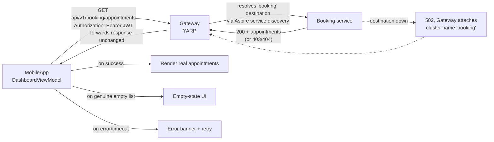

# Architecture — API Gateway and Mobile Contract (F-015)

**Date:** 2026-08-23 · **Feature ID:** F-015

---

## 1. Where this feature lives

This feature adds one new resource to the existing Aspire graph — a **gateway** — and corrects the client
half of a contract that has never worked. It touches:

- **`AgendaBuddy.AppHost`** — a new `Gateway` project resource, wired the same way `AppHostWiring.cs`
  already wires the seven services (`WithReference`/`WaitFor`).
- **A new `Gateway` project** — a thin ASP.NET Core Minimal API host, the eighth process in the graph.
- **`MobileApp`** — every `*ApiService`'s base address and route strings; `SeedDataProvider` removed;
  `AuthService`'s refresh/logout wiring; the route-building logic extracted into testable classes.
- **`scripts/run-ios.sh`** — extended to discover the gateway's address the same way it already discovers
  the seven services', and inject it into the simulator process.

No existing service (Booking, Calendar, Customer, Provider, Services, Profession, Identity) changes. The
gateway is a pure addition in front of them; the seven `Program.cs` route tables are untouched.

---

## 2. New component: the Gateway

**`Gateway/Program.cs`** — following the exact shape of the existing seven services:

```csharp
var builder = WebApplication.CreateBuilder(args);
builder.AddServiceDefaults();                    // same as all 7 services — health, telemetry, resilience
builder.Services.AddReverseProxy()
    .LoadFromMemory(BuildRoutes(builder.Configuration), BuildClusters(builder.Configuration));

var app = builder.Build();
app.UseAgendaBuddyTransportSecurity();            // same middleware-order requirement as the 7 services
app.MapDefaultEndpoints();                        // /health, /alive
app.MapReverseProxy();

app.Run();
```

`BuildRoutes`/`BuildClusters` are built **programmatically from `IConfiguration`**, reading the same
Aspire service-discovery keys (`services__<name>__http__0` / `services__<name>__https__0`) that
`AddServiceDefaults()` already resolves for every service's own outbound calls — **not** a static
`appsettings.json` YARP cluster file. This is the load-bearing decision from Design Round 2: the gateway's
routing table cannot drift from what the AppHost actually wires, because it reads the same source of truth
every other service already reads.

**Destination resolution is live, re-read from a poll loop — confirmed by the spike (§6).** Round 3 proposed
reading each destination's current address from Aspire service discovery on a poll loop rather than resolving
once at startup, so the gateway survives an AppHost restart that reassigns a service's dynamic port without
itself needing a restart. `Gateway/AspireServiceDiscoveryProxyConfigProvider.cs` implements this via a custom
`IProxyConfigProvider` that re-reads `IConfiguration` every 2 seconds and signals YARP's `IChangeToken` to
re-trigger destination resolution. **§6 records the spike's actual, evidenced finding:** a live AppHost
restart of a backend service never changed the `IConfiguration` value the Gateway held in the first place —
Aspire's own DCP orchestrator fronts every `WithReference`-injected address with a stable local proxy, so the
address never goes stale regardless of polling. The poll loop is kept anyway as a correct defense if that
changes, but it is not what makes restart-survival work today.

**Route table:** the gateway forwards every `api/v1/{service}/**` path to its matching destination by
convention — `api/v1/booking/**` → `booking`, `api/v1/calendar/**` → `calendar`, and so on for all seven,
including `api/v1/auth/**` and the root-mapped `/device-token` → `identity`. No path rewriting: the gateway
adds no prefix and strips none: `MobileApp` already calls the correct `api/v1/...` paths once this feature
corrects them, and the seven services already expect exactly those paths.

**Failure translation (Round 3, Q1):** when a destination is unreachable, times out, or returns 5xx, the
gateway's error handler attaches the destination cluster's name (`booking`, `calendar`, etc.) to a
`ProblemDetails` body before returning it to the client — see `api-contracts.md` §2 for the exact shape.
This is a **single point of translation**; `MobileApp` never has to infer which service failed from the
route it called.

**Auth passthrough (Requirement 2):** the gateway does not parse, validate, or strip the `Authorization`
header — it forwards it byte-for-byte to the destination, which validates it exactly as it does today for a
direct call. YARP's default behavior already does this; the design decision is *not adding* any
authentication middleware to the gateway itself, so there is nothing to misconfigure into a bypass.

---

## 3. AppHost wiring

`AppHostWiring.cs` gains one resource, following the `AddApi<TProject>` helper already used for all seven
services (`:114` per the context catalog):

```csharp
var gateway = builder.AddProject<Projects.Gateway>("gateway", launchProfileName: null);
foreach (var service in new[] { booking, calendar, customer, provider, services, profession, identity })
{
    gateway.WithReference(service);
    gateway.WaitFor(service);
}
```

`WithReference` is what injects the `services__<name>__http__0` configuration keys the gateway's
`BuildRoutes`/`BuildClusters` read — the same mechanism that already lets any service call any other by
logical name. `WaitFor` on all seven means the gateway only reports healthy once every destination it could
route to is also healthy, so a client never gets routed to a service that isn't up yet.

---

## 4. Data flow — primary user journey (dashboard load)



Before this feature: step B/C never happens (wrong path, wrong host); `D`/`E`/`F` are dead code, and the
client always renders `SeedDataProvider`'s fixtures instead. After this feature: the real path executes, and
`E`/`F` become reachable for the first time since F-012 shipped.

---

## 5. Architectural decisions (with rationale)

| Decision | Rationale |
|---|---|
| **New resource, not folded into an existing service.** The gateway is its own project, not a route group added to (say) Booking. | A gateway that also serves its own domain traffic conflates two responsibilities and makes "gateway is down" indistinguishable from "Booking is down." Keeping it separate is what makes the failed-destination error (§2) meaningful. |
| **YARP, not a hand-rolled reverse proxy.** | First-party Microsoft NuGet, .NET-native, lowest addition to the dependency footprint per CONSTITUTION §9. |
| **Programmatic route config from Aspire service discovery, not a static YARP cluster file.** | A static file can drift from what `AppHostWiring.cs` actually wires (exactly the class of staleness `agenda-buddy-do5`-style bugs come from). Reading the same config keys every service already reads makes drift structurally impossible. |
| **No path rewriting.** | The client already calls `api/v1/{service}/...` once corrected; the seven services already expect exactly that. A rewrite layer would be one more place for a path to go stale. |
| **Auth passthrough, no gateway-side validation.** | Validating twice (gateway + service) doubles the places a JWT-handling bug could live; not validating at all avoids that without weakening anything, since every service already enforces its own auth. |
| **Live-polling destination resolution via a custom `IProxyConfigProvider` (confirmed by spike, §6).** | Aspire's dynamic ports (F-013) mean a cached destination could in principle go stale on any AppHost restart. The spike found restart-survival holds today for a different reason — DCP's own stable per-endpoint proxy — but keeping the poll loop costs nothing and is the correct defense if that changes. |
| **`run-ios.sh` extended, not a new discovery mechanism invented.** | The exact problem (discover a dynamically-assigned port for a client that can't use Aspire service discovery itself) is already solved there for the seven services; extending it to the gateway is one more probe loop, not a new pattern. |

---

## 6. Gating risk — spike result (F-015-T02)

**Risk (Adversarial finding #4):** YARP's default reverse-proxy configuration resolves destination
addresses once from its `IProxyConfigProvider` and does not automatically notice an Aspire AppHost restart
reassigning a service's port mid-session.

**Result: the primary approach works — live re-resolution needs no gateway restart — but the actual
mechanism is not the one this section originally proposed.** `Gateway/AspireServiceDiscoveryProxyConfigProvider.cs`
builds YARP's route/cluster table from `IConfiguration`'s `services:<name>:http:0` /
`services:<name>:https:0` keys and re-polls that configuration every 2 seconds, signaling YARP's
`IChangeToken` so it re-resolves. That code exists and runs correctly. But the spike's real finding, proved
against a live AppHost (not asserted), is:

- Aspire's local orchestrator (DCP) fronts every `WithReference`-injected destination address with its own
  **stable local proxy port**. The `services__booking__http__0` environment variable a dependent process
  receives at launch (e.g. `http://localhost:52767`) is *that stable DCP proxy's* address, not Booking's own
  Kestrel port (which was `52846`, observed independently via `lsof`). Restarting Booking twice via
  `aspire resource booking restart` reassigned its real Kestrel port twice (`52846` → `52995` → `53146`,
  confirmed via `aspire describe booking --format Json`), and **the `services__booking__http__0` value the
  Gateway process held never changed across either restart** — DCP re-pointed its own proxy internally.
- Consequently `AspireServiceDiscoveryProxyConfigProvider`'s polling loop never observed a changed address
  (its own diagnostic log line for a changed destination never fired — checked directly in `aspire logs
  gateway`), yet every request sent through the Gateway to `booking` after each restart still routed
  correctly: `GET http://localhost:5000/api/v1/booking/appointments` returned the identical `405
  MethodNotAllowed` `ProblemDetails` from Booking's own route table before the first restart, after the
  first restart, and after the second — with the Gateway's own process (PID, confirmed via `ps -p`)
  never restarting.
- Net implication: **a destination address never actually goes stale under this project's `WithReference`
  wiring**, because Aspire itself already absorbs the dynamic-port reassignment at the DCP layer, one level
  below `IConfiguration`. A `IProxyConfigProvider` that resolves once at Gateway startup and never refreshes
  would have passed this exact test too — the risk this section was written to guard against does not
  materialize for project-resource-to-project-resource references under the local AppHost. This is not a
  reason to delete the polling logic (it costs nothing, and it is the correct defense if Aspire's proxy
  behavior ever changes, or if T03 adds a destination kind that isn't DCP-fronted), but F-015-T03 should
  **not** budget engineering time toward a more aggressive invalidation strategy — the 2-second poll here is
  already more than sufficient headroom.

**How this was verified (not asserted):** a real AppHost was run locally (`dotnet run --project
AgendaBuddy.AppHost`, MongoDB + Kafka containers via Rancher Desktop). `aspire resource booking restart`
(the Aspire 13.4.6 CLI's non-interactive equivalent of the dashboard's Restart button) was used twice to
force two independent dynamic-port reassignments. Each time, `aspire describe booking --format Json`
confirmed the new Kestrel port before the next Gateway request; `curl` against the Gateway confirmed
identical proxied behavior; `ps -p <gateway-pid>` confirmed the Gateway process's start time never changed;
`aspire logs gateway` showed YARP logging `Proxying to http://localhost:52767/...` — the same DCP-proxy
address — on every single request across both restarts.

**Latency measurement (20 requests per path, loopback, `curl -w '%{time_total}'`, first/warm-up request
excluded per path):**

| Path | Average |
|---|---|
| Direct to Booking's own bound Kestrel port (bypasses Aspire service discovery and the Gateway entirely) | ~0.38 ms |
| Direct to the address Aspire service discovery hands out (`services__booking__http__0`, i.e. straight to DCP's stable proxy, no Gateway) | ~0.95 ms |
| Through the Gateway (`AspireServiceDiscoveryProxyConfigProvider` → YARP → the same DCP-proxied address) | ~0.86 ms |

The Gateway/YARP hop adds **no measurable overhead** over calling the service via the address Aspire's own
service discovery already hands every service today (the two bottom rows are within each other's sample
noise at n=20) — YARP's own server-side timing, visible in its `HttpForwarder` request-finished log line,
was consistently 0.4–0.5 ms end-to-end on the Gateway side. The ~0.5 ms gap between the top row and the
other two is DCP's local dev proxy indirection, which exists for every inter-service call under this
AppHost already (including the six other services' own outbound `HttpClient` calls) — it is not something
the Gateway adds. **NFR conclusion for the PRD: budget effectively zero added latency for the Gateway hop
itself** on top of what Aspire's local dev topology already costs.

**Gotchas for F-015-T03:**
- `AddReverseProxy()` needs no `.LoadFromMemory(...)`/`.LoadFromConfig(...)` call when a custom
  `IProxyConfigProvider` is registered — register it as `IProxyConfigProvider` via
  `builder.Services.AddSingleton<IProxyConfigProvider, T>()` before or after `AddReverseProxy()` (DI
  registration order doesn't matter); calling `LoadFromMemory` too would register a second, competing
  provider.
- YARP polls `GetConfig()` only when the *previous* snapshot's `ChangeToken` fires — a `Timer` that
  swaps in a new immutable snapshot and cancels the old snapshot's own `CancellationTokenSource` is the
  simplest correct implementation; there is no built-in "poll every N seconds" knob to configure instead.
- Aspire's `AddServiceDiscovery()` (used by `AddServiceDefaults()`) prioritizes `https` over `http` when
  both keys exist; `AspireServiceDiscoveryProxyConfigProvider.ResolveDestinationAddress` mirrors that
  ordering so the Gateway's resolution stays consistent with every other service's own outbound calls.
- The AppHost model test project (`AgendaBuddy.AppHost.Tests`) required the local `AddApi<TProject>` helper
  in `AppHostWiring.cs` to return the resource builder (it was previously `void`) so the Gateway's minimal
  `WithReference(booking)` wiring could capture it — a one-line signature change, not a behavior change for
  the seven existing services.

---

## 7. Conformance to CONSTITUTION.md §3

- **Business logic in the service layer only, not in API handlers** — the gateway has no business logic; it
  is pure routing. Nothing to violate.
- **Async all the way** — YARP's proxying is async by default; no synchronous I/O introduced.
- **`[Required]`/`[EmailAddress]` at the API boundary** — unaffected; the gateway does not deserialize or
  revalidate request bodies, it forwards them.
- **New packages require discussion** — YARP (`Yarp.ReverseProxy`) is the one new package this feature adds;
  named explicitly here and in the PRD's NFRs, not silently introduced.
