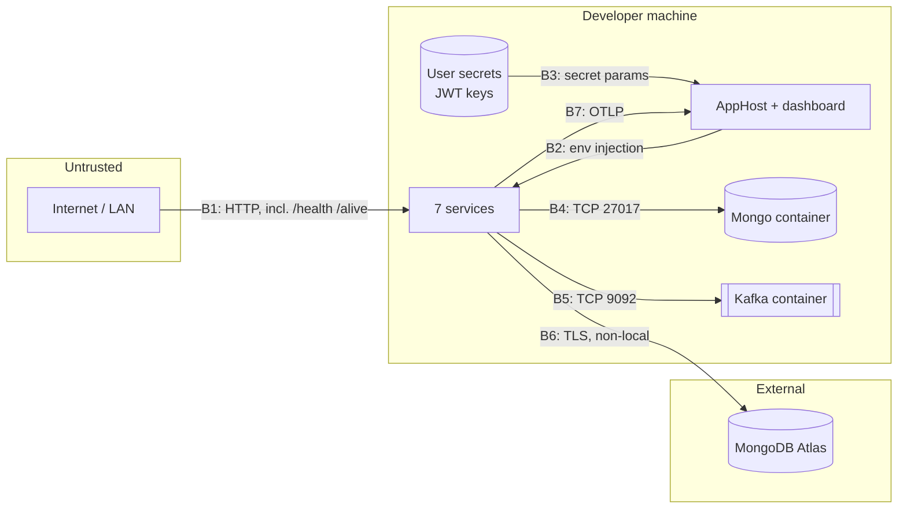

# Threat Model — Aspire Wiring (F-013)

<!-- pdlc-template-version: 1.0.0 -->

**Author:** Phantom (Security Reviewer)
**Date:** 2026-08-15
**Triage:** **Lite** (Phantom solo)
**Design:** [ARCHITECTURE.md](./ARCHITECTURE.md) · **PRD:** [PRD_aspire-wiring_2026-08-15.md](../../prds/PRD_aspire-wiring_2026-08-15.md)
**Baseline:** `docs/pdlc/context/13-security.md` @ `997e933`

---

## Triage rationale

**Lite, not Full.** This feature adds no authentication path, no authorization decision, no new data flow carrying user input, and no new trust boundary crossing that processes untrusted data. It adds two anonymous machine-readable status endpoints and changes *where configuration values come from*.

**Lite, not Skip**, for one reason: this feature is the vehicle that **removes a live committed database credential**, and getting that half-right is worse than not starting. A partial removal that breaks standalone runs would invite developers to paste the credential back.

## Trust boundaries

| ID | Boundary | Changed by this feature? |
|---|---|---|
| B1 | Client → service HTTP | **Yes** — two new anonymous endpoints |
| B2 | AppHost → service env injection | **New** |
| B3 | User secrets → AppHost | **New** |
| B4 | Service → Mongo container | **New** (local); replaces a direct Atlas connection |
| B5 | Service → Kafka | Changed (config-driven address) |
| B6 | Service → Atlas | **Yes** — credential source moves from source to injected config |
| B7 | Service → OTLP collector | **New** |

## STRIDE — new and changed surface only

Pre-existing findings are carried in §"Inherited exposures" rather than re-litigated here.

### B1 — `/health` and `/alive` (new, anonymous)

| Threat | Assessment | Disposition |
|---|---|---|
| **Information disclosure** — an unauthenticated caller learns whether MongoDB is reachable | **Low.** Response is a bare `Healthy`/`Unhealthy` status string. Design requires no check names, no exception detail, no connection string in the body | **Accept.** Verify at Review that the response writer emits status only — the ASP.NET default `HealthCheckService` response is plain text, but a custom `ResponseWriter` must not be added without re-reviewing |
| **DoS** — `/health` triggers a Mongo `ping` per request; unauthenticated flooding amplifies to database load | **Low–Medium.** One admin `ping` per probe is cheap, but there is **no rate limiting anywhere in the solution** | **T-002.** Mitigation: cache the readiness result for a short window (2–5 s) so probe frequency cannot exceed check frequency. Cheap, and it also protects against aggressive orchestrator probe intervals |
| **Spoofing / elevation** | N/A — no identity, no state change | — |
| **Tampering** | N/A — read-only | — |

⚠️ These endpoints are anonymous **by necessity** — orchestrator probes are unauthenticated. Note the asymmetry worth keeping in perspective: `GET /api/v1/providers` is *already* anonymous and returns every provider's embedded appointment history and customer emails (`13-security.md`). A status string is not the exposure that matters in this codebase.

### B2/B3 — Secret handling (new)

| Threat | Assessment | Disposition |
|---|---|---|
| **Information disclosure** — JWT private key in an Aspire parameter | **Low, and a clear improvement.** `secret: true` parameters land in per-user user-secrets, outside the repo. Today `JWT_PRIVATE_KEY` is an exported shell variable (shell history, process listing) or a gitignored `.env` with **no `.env.example`** to describe it | **Accept — net improvement.** |
| **Information disclosure** — the Aspire dashboard displays resource environment variables | **Medium.** The dashboard can surface configuration for running resources; a shoulder-surfer or a screenshot could expose the private key or connection string | **T-003.** Mitigation: rely on Aspire's secret-parameter masking rather than plain `WithEnvironment` for the keys, and note in the README that the dashboard is a sensitive surface. ⚠️ **The design at `ARCHITECTURE.md` §3.2 passes the keys via `WithEnvironment(..., jwtPublicKey)`** — confirm at Build that a parameter passed this way retains masking; if not, the value appears in the dashboard's environment view |
| **Tampering** — a developer overrides a parameter to point at production Atlas | **Low.** Same capability they have today | Accept |
| **Repudiation** | N/A — local dev | — |

### B4/B6 — Connection-string relocation

| Threat | Assessment | Disposition |
|---|---|---|
| **Information disclosure — the reason this feature exists** | The Atlas credential is in **14 tracked files** plus `docker-compose.override.yml:114`. Anyone with read access to the repo — or to its history — has full read/write on every provider, customer, appointment, private session note, payment record, and password hash | **Primary mitigation. AC-2.1/2.2 delete it from the working tree.** ⚠️ **This does not remediate the disclosure.** See T-001 below |
| **T-001 — the credential remains valid** | **Critical, and NOT fixed by this feature.** Deleting a secret from the working tree does not invalidate it. It stays in git history and stays live until rotated at Atlas | **PRD OQ-1 — operational action required of the user.** Rotate the `agenda_buddy` Atlas user and review the cluster access log. **This feature must not be described as "fixing the credential leak"** — it fixes the *ongoing* leak, not the *existing* one |
| **Tampering — a partial removal drives the credential back in** | **Medium.** If deleting the value breaks standalone `dotnet run`, a developer will paste it back | **Mitigated by design.** `MongoConnectionResolver` keeps all legacy keys readable as ordered fallbacks (`ARCHITECTURE.md` §3.3), and AC-2.5 requires a failure message naming exactly what to set. The path of least resistance becomes setting an env var, not restoring a secret |
| **Information disclosure — local Mongo container is unauthenticated** | **Low, accepted.** `AddMongoDB` provisions a container with no credentials, reachable on a dynamic localhost port. Local-dev only; it also means a *real* secret is no longer needed for everyday work — a security gain | Accept; document that the container is not a production posture |

### B5 — Kafka address from configuration

| Threat | Assessment | Disposition |
|---|---|---|
| **Tampering** — `BootstrapServers` becomes externally configurable, so a malicious config could redirect topic creation | **Low.** Configuration is already fully trusted (connection strings, JWT keys). Net improvement: it closes `CONSTITUTION.md` §9's explicit blocker on non-local deployment | Accept |
| **DoS** — unchanged: `CreateTopicIfNotExist` blocks a user-registration request for up to 10 s (`KafkaClient.cs:28`) with Kafka down | Pre-existing | Inherited — not fixed |

### B7 — OTLP telemetry (new)

| Threat | Assessment | Disposition |
|---|---|---|
| **Information disclosure — PII in traces** | **Medium.** Default ASP.NET instrumentation records route **templates**, not values — but several routes carry email in the path (`GET /api/v1/providers/{email}`, `/api/v1/calendar/availability/{email}`). If any instrumentation records the full path or `http.url`, **customer and provider email addresses land in telemetry**. `CONSTITUTION.md` §4 classifies email as PII | **T-004. Verify at Review** that exported spans carry `http.route` (templated) and not raw `http.target`/`http.url`. If raw paths are exported, add a redaction processor before merge |
| **Information disclosure — bodies or headers in telemetry** | **Low.** No body/header capture is enabled by default and none is added | Accept — and note `Identity/Program.cs:81-86`'s existing T-001 control (deliberately no `UseHttpLogging`) applies the same principle. **The same reasoning must extend to telemetry:** do not enable OTel request-body capture on Identity |
| **Information disclosure — Mongo query text in spans** | **N/A today.** `MongoDB.Driver` 2.25.0 has no OTel instrumentation and none is added, so query text is not exported | Accept; re-review if the driver is upgraded |
| **DoS — telemetry volume** | **Low** locally; no sampling configured | Note for any future production wiring |

## Threat register

| ID | Threat | Severity | Status |
|---|---|---|---|
| **T-001** | **Committed Atlas credential remains valid after working-tree removal** | **Critical** | ⚠️ **NOT mitigated by this feature.** Requires user rotation at Atlas — PRD **OQ-1** |
| T-002 | Unauthenticated `/health` amplifies to Mongo load; no rate limiting exists | Low–Medium | Mitigate: cache readiness result 2–5 s |
| T-003 | Aspire dashboard may display the JWT private key / connection string | Medium | Mitigate: confirm secret-parameter masking survives `WithEnvironment`; document the dashboard as sensitive |
| T-004 | Email addresses in route paths could reach OTLP telemetry | Medium | Verify at Review: `http.route` only, no raw path. Add redaction if needed |
| T-005 | Partial credential removal drives developers to re-paste it | Medium | Mitigated by design (fallback chain + actionable error, AC-2.5) |

## Required changes to the design

1. **Cache the readiness check result** (2–5 s window) — T-002.
2. **Confirm Aspire secret-parameter masking** applies when a secret parameter is passed via `WithEnvironment`; if not, use the masking-preserving mechanism instead — T-003. *This is a concrete correction to `ARCHITECTURE.md` §3.2.*
3. **Assert templated-route-only telemetry** at Review, with a redaction processor if raw paths are exported — T-004.
4. **Do not describe this feature as fixing the credential leak.** It stops the ongoing disclosure; rotation is required and is the user's action — T-001.

## Inherited exposures — present before this feature, unchanged by it

Recorded so they are not lost, per Progressive Thinking Round 5 (Phantom's scope-creep attempt was correctly refused by Atlas; the findings survive here).

| Finding | Anchor | Deferred to |
|---|---|---|
| **Six anonymous endpoints expose PII** — `GET /api/v1/providers` returns every provider's embedded appointments + customer emails, unpaginated | `13-security.md`, `01-api-surface.md` | **F-016** |
| **Authenticated-but-unguarded IDOR on both Calendar routes** — any user reads any provider's appointments | `Calendar/Program.cs:93-141` | **F-016** |
| **`RefreshAsync` delete-then-insert can permanently destroy an account** | `Identity/Services/IdentityService.cs:135,155` | Unfiled — recommend filing |
| No rate limiting or account lockout on `/auth/login` | `13-security.md` | ADR-011 (accepted risk) |
| `AssertRole` never called — role claim authorizes nothing | `OwnershipGuard.cs:21` | **F-016** |
| No CI secret or dependency scan — a `CONSTITUTION.md` §7 **mandatory** gate | `08-cicd-deploy.md` | **F-017** |
| `services.BuildServiceProvider()` in `AddAgendaBuddyAuthentication` (ASP0000) | `AuthenticationExtensions.cs:54` | Unfiled |
| HTTPS unconfigured; `UseHttpsRedirection` after `UseAuthentication`; no HSTS | `13-security.md` | Unfiled |
| Session notes (F-008) stored unencrypted | `NoteEntity.cs:28` | Unfiled |
| PII copied into unbounded, never-pruned `events` audit blobs — including on **anonymous** read paths | `15-cqrs-and-messaging.md` | Unfiled |

## Verdict

**Proceed.** The feature's own new surface is low-risk: two status endpoints and a relocation of configuration. Its net security effect is **positive and material** — it removes a live credential from the working tree and replaces exported shell secrets with user-secret-backed parameters.

Two conditions on that verdict:

1. **T-001 is not closed by merging this.** The credential must be rotated at Atlas. If the user reads AC-2.1 as "the leak is fixed", the outcome is worse than before — a false sense of remediation.
2. **T-003 and T-004 are verification items for Review**, not merge blockers. Both are cheap to confirm and expensive to discover later.
