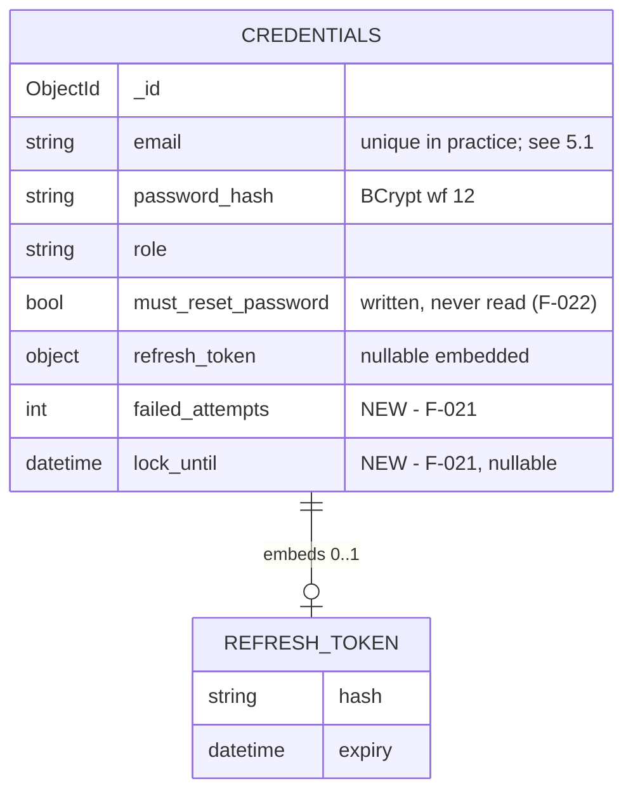

# Data Model — Identity Hardening (F-021)

**Date:** 2026-08-22 · **PRD:** [`PRD_F-021_identity-hardening_2026-08-22.md`](../../prds/PRD_F-021_identity-hardening_2026-08-22.md)

---

## 1. Scope of change

**One modified collection. No new collections, no new indexes required, no migration script.**

`CredentialEntity` (collection `credentials`, database `IdentityDb`) gains two optional fields to support the failed-attempt counter and the self-clearing lock. Everything else in the identity schema is unchanged, and no other service's data is touched.

---

## 2. `CredentialEntity` — before and after

Current shape (`Library/Entities/CredentialEntity.cs`):

| Field | Type | Notes |
|---|---|---|
| `Id` | `string` (ObjectId) | |
| `Email` | `string` | The account identifier. PII (§4) |
| `PasswordHash` | `string` | BCrypt, work factor 12 |
| `Role` | `string` | `Provider` / `Customer` |
| `MustResetPassword` | `bool` | Written, **never read**. F-022 owns it |
| `RefreshToken` | `RefreshTokenDocument?` | Embedded: `Hash`, `Expiry` |

Added by F-021:

| Field | BSON name | Type | Default | Purpose |
|---|---|---|---|---|
| `FailedAttempts` | `failed_attempts` | `int` | `0` | Consecutive failed logins. Reset to 0 on success (AC-10) |
| `LockUntil` | `lock_until` | `DateTime?` | `null` | UTC instant the lock expires. `null` or in the past ⇒ not locked (AC-8) |

Both carry `[BsonElement("snake_case")]` per the project convention. Both are **nullable or defaulted**, so existing documents deserialize without migration — an absent `failed_attempts` reads as `0` and an absent `lock_until` reads as `null`, which is exactly "this account has never failed a login".

### Why `DateTime?` and not a `bool` plus a timestamp

A boolean `IsLocked` would need a writer to clear it — either a background sweeper or a write on the read path. Storing only the expiry instant makes "unlocked" the *absence* of a future value, so **expiry requires no write and no job** (AC-8, PRD requirement 9). `lock_until` in the past is indistinguishable from `null` to every reader, and the next failed attempt overwrites it anyway.

---

## 3. Entity relationships

`credentials` lives in `IdentityDb` and has **no reference** to `providers` or `customers` in `agenda_buddy` — the link is by email value only, and F-021 does not change that. There is no cardinality change in this feature.

---

## 4. Indexes

**No new index is required, and F-021 does not add one.**

- The lock and counter are only ever read or written **for a single document already located by email** (login) or **by refresh-token hash** (refresh). Neither field is ever a query predicate on its own — nothing scans for "all locked accounts".
- ⚠️ **Pre-existing gap, not introduced here:** `credentials` appears to have **no unique index on `email`**, and no index at all beyond `_id`. Login does a `FindOneAsync` by email on every attempt, and at 262 ms of BCrypt per attempt the collection scan is not the bottleneck — but the *absence of a uniqueness constraint* means two credential documents could share an email, in which case `FindOneAsync` silently picks one. Registration guards against duplicates in application code only. **Out of scope for F-021** (it is a correctness/perf issue in registration, not in hardening), but it should be verified rather than assumed at Construction, and filed if confirmed.

---

## 5. Write patterns

Every F-021 write goes through the new `FindOneAndUpdateAsync(filter, update)` primitive. **No F-021 write ever replaces a whole document** — that property is what AC-11 asserts, and it is the direct lesson of item 1.

| Operation | Filter | Update |
|---|---|---|
| **Rotate refresh token** | `refresh_token.hash = H` **and** `refresh_token.expiry > now` **and** (`lock_until` absent **or** `lock_until <= now`) | `$set: { refresh_token: { hash, expiry } }` |
| **Count a failed login** | `email = E` | `$inc: { failed_attempts: 1 }` |
| **Apply a lock** | `email = E` **and** `failed_attempts >= threshold` | `$set: { lock_until: now + window }` |
| **Reset on success** | `email = E` | `$set: { failed_attempts: 0 }`, `$unset: { lock_until: "" }` |

Notes:

- **Never upsert.** No operation passes an upsert option, so a failed login for an unknown email creates nothing (AC-9). This is enforced in the primitive, not per call site.
- **The counter increment and the lock can be one operation or two.** Two is simpler to read and to test; one round trip is possible with an aggregation-pipeline update. The design prefers **two** — the second is conditional on the threshold being reached, so it runs on 1 attempt in N, and correctness beats a saved round trip on a path that already spent 262 ms.
- **The rotate filter carries the lock condition** (AC-4), so a locked account cannot refresh, and it costs no extra query.

---

## 6. Data deliberately not persisted

| Not stored | Why |
|---|---|
| **Per-IP request counts** | Rate-limiter state stays in process memory. Persisting it would put unauthenticated, attacker-controlled write volume into the database — the exact amplification §2 of `ARCHITECTURE.md` warns about. Consequence: with N Identity replicas an attacker gets N× the allowance; recorded there as a known limitation |
| **Failed-attempt history** (timestamps, source IPs) | Would be an audit feature, and a PII-bearing one. `failed_attempts` is a counter, not a log |
| **Lock reason / lock count** | Nothing reads it. The lock is uniform |
| **The refresh token itself** | Unchanged from today: only `SHA-256(token)` is stored, so a database leak does not yield usable tokens |
| **Anything in the `events` EventStore** | Identity does not use the EventStore, and F-021 does not change that. Credential mutations go to **logs** (with a hash prefix, never the address — AC-16), not to an audit collection. Adopting the EventStore for Identity would put credential-shaped documents into a collection every other service writes to |

---

## 7. Migration notes

**No migration file is needed.**

1. Both new fields are optional-by-construction (`int` defaulting to 0, nullable `DateTime?`), so existing `credentials` documents deserialize unchanged.
2. The first failed login for an account writes `failed_attempts` for the first time; `$inc` on a missing field creates it at the increment value, which is MongoDB's documented behaviour and gives the correct result of `1`.
3. `$unset` of an absent `lock_until` is a no-op, so the success path is safe on never-locked documents.
4. **Rollback is field-compatible.** Reverting F-021's code leaves the two fields in place and simply unread — no data cleanup, and no reason to write a down-migration. Combined with the configuration flags (both off ⇒ today's behaviour), the feature is revertible without a data step.

Existing migrations are unaffected: `SeedAuthCredentials.cs` and `SeedDevelopmentAccounts.cs` construct `CredentialEntity` with object initializers, so the new fields take their defaults. Neither needs editing — though `SeedAuthCredentials.cs:68`'s `MustResetPassword = true` remains a live, unenforced flag, noted for **F-022**.
