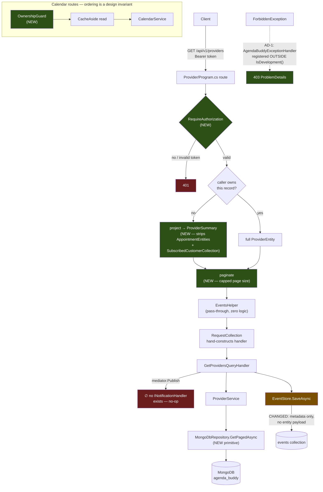

# Architecture — Secure Public Endpoints (F-016)

**Feature:** `secure-public-endpoints` (F-016)
**Date:** 2026-08-18
**PRD:** [`PRD_F-016_secure-public-endpoints_2026-08-18.md`](../../prds/PRD_F-016_secure-public-endpoints_2026-08-18.md)
**Owner:** Neo (Architect)
**Status:** **Approved** at Step 12, 2026-08-18

> ### Approval-gate amendments (2026-08-18)
>
> Three threat-model decisions changed this design after first draft. All are propagated below.
>
> | Decision | Effect |
> |---|---|
> | **T-003** confirmed with the `Provider` role | `GET /api/v1/customers` is role-gated, not merely authenticated (§3.2). Scope addition beyond the approved PRD. |
> | **T-007** resolved by **deleting the route** | `POST /api/v1/professions` is removed. **Supersedes PRD requirement 13** — no route, no role check (§3.2). |
> | **T-005** confirmed | `Event` gains an `actor` field. **`data-model.md` is no longer a no-schema-change document** (§5). |
>
> Also confirmed: **AD-1** (§2) and the reassignment of PRD requirement 18 into this feature (T-001).

---

## 1. Where this feature lives

F-016 touches exactly one architectural seam — **the endpoint boundary of the six domain services** — plus one new test project. It introduces no new runtime service, no new database, and no inter-service call.

That narrowness is not a stylistic choice; it is forced by the actual shape of the code. `15-cqrs-and-messaging.md:16-57` establishes that **MediatR never dispatches**: `RequestCollection` hand-constructs each handler and calls `.Handle()` directly, because handlers take domain data as constructor parameters that DI cannot resolve. The consequence is stated plainly at `15-cqrs-and-messaging.md:51`:

> *"No MediatR pipeline behaviours are possible — no `IPipelineBehavior` for validation, logging, transactions, or retry. The extension seam CQRS-via-MediatR exists to provide is unavailable."*

**So there is no interception seam below the endpoint.** An authorization filter cannot be hung on the dispatcher, because there is no dispatcher. Every authorization decision in this feature therefore sits in `Program.cs`, at the route, where `RequireAuthorization()` and `OwnershipGuard` already live for the endpoints that got it right.

| Layer | Touched? | What changes |
|---|---|---|
| `Program.cs` × 6 domain services | ✅ heavily | auth attributes, ownership guards, role checks, response projection, pagination parameters, exception-handler registration |
| `Library.ServerAuth` | ✅ | new shared `IExceptionHandler`; **and the `AssertOwner` null-claim fix — now required here, not deferred** (T-001) |
| `Library/Repositories` | ✅ | one new paged primitive on `IRepository<T>` + `MongoDbRepository<T>` |
| `Library/Entities` | ⚠️ additive | new response DTOs; **plus one additive field on `Event`** — `actor` (T-005) |
| `EventAndCommands/Queries` × **9** | ✅ | audit writes reduced to metadata via the new `QueryAudit` factory *(18 call sites; the "× 10" was wrong — see §5)*. `actor` is **not** set here — it is stamped centrally in `EventStore` |
| `Profession/Program.cs` + its `RequestCollection`/`EventsHelper` write path | ✅ **deletion** | `POST /api/v1/professions` removed (T-007) |
| `EventAndCommands/Persitency` → `Persistence` | ✅ | rename only, behaviour-preserving |
| `AgendaBuddy.IntegrationTests` | ✅ new project | the harness |
| `Identity` | ❌ **deliberately not** | see §7 |
| MongoDB schema | ⚠️ **one additive field** | `Event.actor`, nullable — **no backfill migration required** (`data-model.md` §7) |
| Aspire AppHost / ServiceDefaults | ❌ | unchanged |

---

## 2. The design decision that the PRD did not anticipate

**Requirement 14 — "map `ForbiddenException` to 403 centrally" — cannot be satisfied by editing the existing exception handler.**

`10-error-handling.md:9-34` documents that in **all seven services** the handler is registered *inside* the Development guard, next to Swagger:

```csharp
if (app.Environment.IsDevelopment())      // Booking/Program.cs:38
{
    app.UseSwagger();
    app.UseSwaggerUI();
    app.UseExceptionHandler(new ExceptionHandlerOptions { ... });   // :43-79
}
```

| Service | Guard | `UseExceptionHandler` |
|---|---|---|
| Booking · Calendar · Customer · Profession | `:38` | `:43` |
| Provider | `:42` | `:47` |
| Services | `:39` | `:44` |
| Identity | `:40` | `:44` |

Adding a `ForbiddenException` branch to that lambda would produce a 403 in Development and a **bare, empty-bodied 500 in Production** — the exact silent-signalling failure requirement 14 exists to eliminate, preserved in the only environment that matters.

### Decision AD-1 — a shared `IExceptionHandler`, registered unconditionally

Implement `AgendaBuddyExceptionHandler : IExceptionHandler` in `Library.ServerAuth` and register it in the six domain services with:

```csharp
builder.Services.AddExceptionHandler<AgendaBuddyExceptionHandler>();   // in DI
app.UseExceptionHandler();                                             // OUTSIDE the IsDevelopment() guard
```

- `IExceptionHandler` is the .NET 8+ idiomatic replacement for the inline lambda, and this codebase uses it nowhere yet (`10-error-handling.md:246`).
- It maps **`ForbiddenException` → 403** and returns ProblemDetails via `IProblemDetailsService`, preserving the existing `requestId` extension.
- It returns `false` for every other exception type, so the existing Development-only lambda continues to handle everything it handles today. **The two coexist**; this is additive, not a replacement.

**Why this is an ADR candidate:** it changes production error behaviour for six services. Today an unhandled exception in Production yields an empty 500; afterwards a `ForbiddenException` yields a well-formed 403 and everything else still yields 500. That is a strict improvement, but it is a behavioural change outside this feature's stated scope, and it should be recorded rather than absorbed.

**Why not fix the whole mapping table.** `10-error-handling.md:91-104` lists nine exception types that all incorrectly surface as 500 — `ArgumentException` (should be 404), `KeyNotFoundException` (404), `UnauthorizedAccessException` (403), `InvalidOperationException` (409), `FormatException` from `new ObjectId(id)` (400). Mapping them is tempting and out of scope: it changes the contract of endpoints this feature is not otherwise touching, with no acceptance criterion covering it. The handler is built so those mappings are a one-line addition later. **Deliberate YAGNI, recorded so it reads as a decision and not an oversight.**

---

## 3. Authorization design

### 3.1 Where each control goes

| Control | Mechanism | Routes |
|---|---|---|
| Authentication | `.RequireAuthorization()` on the route | the 5 anonymous PII GETs |
| Ownership | `OwnershipGuard.AssertOwner` / `AssertOwnerAny` | both Calendar routes |
| Role | `OwnershipGuard.AssertRole` — **first call sites in the solution** | `POST /providers` (req 12), `GET /customers` (**T-003**) |
| Surface removal | delete the route entirely | `POST /professions` (**T-007** — supersedes req 13) |
| Forbidden → 403 | `AgendaBuddyExceptionHandler` (AD-1) | all six domain services |
| Response projection | endpoint-level DTO mapping | provider reads |
| Pagination | new repository primitive + query parameters | the 2 list endpoints |

### 3.2a `GET /api/v1/customers` is role-gated, not just authenticated — T-003

Authentication alone is nearly worthless on this route. `POST /api/v1/auth/register` is anonymous, unverified and unthrottled, so an attacker self-registers as a `Customer`, gets a valid token, and pages through the whole customer table. `totalCount` tells them how many pages. **Pagination bounds the response; it does not bound extraction.**

Atlas's product question decided it: F-003 defines discovery as customers finding **providers**, not each other. No flow lists every customer; the only defensible caller is a provider. → requires the `Provider` role.

**Deferred, not rejected:** scoping results to the calling provider's own `SubscribedCustomerCollection` is stronger and was weighed at the gate. It is a real behaviour change and more work; the role check blocks the actual attack path now. Recorded so the stronger option stays a known follow-up.

⚠️ **Only the list is gated.** `GET /api/v1/customers/{email}` stays authenticated-but-not-role-gated, because a customer legitimately reads their own record through it.

### 3.2b `POST /api/v1/professions` is deleted, not guarded — T-007

Requirement 13 asked for a role check. **There is no role to check for:** Identity's allow-list is exactly `{Provider, Customer}` (`Identity/Program.cs:100-106`) — no admin tier. The only implementable check, `AssertRole(user, "Provider")`, would still let any self-registered provider write to global reference data.

Professions are **seeded** from `Library/Data/ProfessionSeedData.cs` and no shipped flow creates one. **Deleting the route is strictly stronger than guarding it**, needs less code, and avoids inventing an `Admin` role inside a feature that excludes Identity (§7). The two profession *read* routes stay anonymous and unchanged.

This means requirement 13 is **superseded, not dropped** — the intent (a Customer must not write the global catalogue) is fully satisfied by removal.

### 3.2c `AssertRole` is dead code being brought to life

`13-security.md:137`: *"`AssertRole` is never called. No role-based authorization anywhere in the solution."* F-016 creates its first two call sites — `POST /api/v1/providers` and `GET /api/v1/customers`. Two consequences worth stating:

1. **`POST /api/v1/providers` needs both checks, not one.** A role check alone still lets one authenticated Provider create a record for another provider's email. The endpoint currently has neither (`Provider/Program.cs:100-129` — no guard, no role check), so it needs `AssertRole(user, "Provider")` **and** an ownership assertion that the target email is the caller's own. PRD AC-11 tests both arms.
2. **It may surface latent breakage rather than cause it.** `SeedAuthCredentials` is dead code (`13-security.md:113`), so any pre-auth provider/customer record has no credential and cannot authenticate at all. A role check will make that visible. Expected, not feared.

### 3.3 The projection — requirement 10

`ProviderEntity` embeds `ServiceEntities`, `AppointmentEntities` (each carrying `email_customer`) and `SubscribedCustomerCollection` (`ProviderEntity.cs:38-42`). Authentication alone does not fix this: an authenticated *customer* browsing for a coach would still receive every provider's appointment book and client list.

**Two response shapes, selected by whether the caller owns the record:**

- **Non-owner** → `ProviderSummary` — public profile and service catalogue only. No appointments, no subscribed customers.
- **Owner** (`sub` claim matches the provider's email) → the full `ProviderEntity`, unchanged.

This is a **read-boundary projection, not a schema change**. The stored document keeps its embedded shape; restructuring it is a migration and belongs to F-019/F-020 (PRD Assumptions, last bullet).

⚠️ **Architectural honesty:** `ProviderSummary` is a DTO in a codebase that has almost none — endpoints return entities directly. This introduces a pattern. It is the *right* pattern and F-019/F-020 will generalise it, but F-016 is where it starts, so it should be named as such rather than appearing by accident.

---

## 4. Pagination design

`Library/Repositories/IRepository.cs` — read in full — exposes `GetAllAsync()`, `FindAllAsync(BsonDocument)`, and **no skip, no limit, no count**. Requirement 15 therefore needs a new primitive.

```csharp
Task<(IEnumerable<TEntity> Items, long TotalCount)> GetPagedAsync(int skip, int take);
```

- **One method, not a query abstraction.** Per the `yagni` ladder at the CONSTITUTION's default `full` level: the requirement is two paginated list endpoints, not a general query DSL.
- **Every implementer changes:** `MongoDbRepository<T>` and `Identity.Tests/Helpers/InMemoryRepository.cs` (`11-testing.md:37`). The latter is a test helper, so this is cheap — but it must not be forgotten or `Identity.Tests` stops compiling.
- **The cap is a security control.** An uncapped `take` restores the dump this feature exists to remove. Enforced server-side; a request for more than the maximum is clamped, not rejected, so a client cannot brute-force its way to a full extract.

**Contract obligation.** PRD requirement 15 and AC-16 require the response shape to be recorded as an ADR **before the endpoint work closes**, because F-015 writes the mobile client against it. This is a hard hand-off artifact, not documentation hygiene. Shape is specified in `api-contracts.md` §4.

---

## 5. The audit-write fix

`15-cqrs-and-messaging.md:201-224`. Every handler writes a success/fail `Event` whose `Data` is `JsonSerializer.Serialize(payload)` — **42 near-identical blocks** across 11 command and 10 query handlers. `CONSTITUTION.md` §3 mandates the audit pattern ("do not remove this pattern"), so the fix reduces *what is recorded*, never *whether* it is recorded.

```
Event { Id, TimeStamp, Status, Type, Data }
                                    ↑
              currently: the entire result payload, PII included
              after F-016 (queries only): operation metadata, no entity data
```

### Scope finding — the PRD is narrower than the defect

PRD requirement 16 names `GetProvidersQueryHandler.cs:23` as "the specific offender." But **all nine query handlers follow the identical publish → query → audit shape** (`15-cqrs-and-messaging.md:160`), and `GetCustomersQuery` serialises every customer record — an equivalent hole. AC-17 tests only the provider path.

⚠️ **Corrected during T18 — there are NINE query handlers, not ten**, and **18** audit call sites, not 20. The "10" comes from `15-cqrs-and-messaging.md:161`, which states *"10 queries, 10 handlers"* directly above a table listing **9**; it propagated into the PRD, this document, the plan and T18's task body. Verified by grep. The catalog line needs correcting at the next `/ship` context refresh.

**Design decision: implement across all nine query handlers. Flagged for the Plan gate to broaden AC-17.** Recorded here rather than silently widened, because the PRD is approved and scope changes belong to the human.

**Command handlers are left alone.** They serialise the entity the caller just submitted — the caller already has it, so it is not an amplification vector, and it is the actual audit content for a write. Changing 11 more blocks would be scope creep with no criterion behind it.

### Resolved at the approval gate — the `actor` field is being added (T-005)

`15-cqrs-and-messaging.md:215`: *"No actor, no correlation, no request id. The audit trail cannot answer 'who did this'."* Until F-016 these endpoints had no authenticated caller to record. Now they do, which makes an `actor` field newly *possible* — and it is exactly what an audit trail on a security fix should carry.

**Approved 2026-08-18.** `Event` gains a nullable `actor` field populated from the `sub` claim.

⚠️ **Corrected during T18 — "one `[BsonElement]` and one assignment per handler" was wrong.** No query handler can see the caller: `ClaimsPrincipal` is dropped at the endpoint, the query objects carry no properties, and `RequestCollection` hand-constructs handlers from domain data. The actor is therefore stamped **centrally in `EventStore.SaveAsync`** from `IHttpContextAccessor` — ~8 files instead of ~30, it cannot be half-done, and it attributes the 11 command handlers for free. Maintainer-approved; see the ADR-027 amendment for the alternative that was rejected and the ASP.NET coupling accepted. Cost, accepted knowingly: this feature is **no longer schema-change-free**, so its revert leaves harmless residue rather than no trace (Friday's dissent, recorded). Echo's counter carried — with no log sink and `requestId` unexported, nothing outside the `events` collection is durable, so there is no fallback attribution. Detail in `data-model.md` §4a.

---

## 6. The integration harness

Six tasks lifted from F-018's approved-and-merged plan. **Both of F-018's gating spikes passed**, so this is execution, not exploration.

| Component | Responsibility | Origin |
|---|---|---|
| `Persistence` rename | precondition — no test may be written against the misspelled namespace | F-018 T01 / AC-16 |
| `AgendaBuddy.IntegrationTests` + `InternalsVisibleTo` × 7 | the project | T05 |
| `CryptoSessionFixture` | session RSA keypair, in memory, **never on disk** | T06 |
| `ServiceHostFixture` | real service over HTTP + Mongo Testcontainer, **container per class**, unique DB per test, fail-closed endpoint guard | T08 |
| `TokenFactory` | valid / expired / foreign-subject RS256 | T09 |
| `DockerPreflight` | actionable diagnostics instead of an opaque timeout | T07 *(pulled in — see below)* |

### Design constraints inherited from measurement, not assumption

- **Container-per-class, not per-test.** F-018's spike measured **4.45 s warm** container startup against the 1–3 s assumed, which reversed the original per-test design (ADR-017). Per-test would be unusable on this hardware.
- **The Rancher VM is 2 CPUs / 4.1 GB and already runs a k8s cluster.** This is the least-tested assumption in the PRD. If it thrashes, the mitigation is *fewer, larger test classes* — not abandoning containers.
- **`docker` is not on `PATH`** under Rancher Desktop (it lives at `~/.rd/bin`) and Testcontainers shells out to it. This is why `DockerPreflight` (F-018 T07) is pulled in alongside the five tasks the Discover summary named: without it, the single most likely local failure presents as an unexplained hang. **This is a sixth F-018 task beyond the five originally listed — noted so the count stays honest.**
- **Environment-variable serialisation is required.** `AuthenticationExtensions` reads `JWT_PUBLIC_KEY` from the environment at startup, and `Identity.Tests` already solves this with a `TestCollectionDefinition` xUnit collection that serialises tests mutating `JWT_*` (`11-testing.md:37`). The harness follows that established pattern rather than inventing one.

### The fail-closed guard is the load-bearing safety property

Requirement 5 / AC-5. The repository is **public** and a valid Atlas credential remains recoverable from its git history (`ISSUE-002`, unrotated). An integration suite that resolves a non-container connection string would run destructive test setup against a live cluster **with no backups**. The guard aborts before any test executes and names the offending host.

`MongoConnectionResolver` resolves Aspire → environment → appsettings, so the hazard is concrete: a stray `ConnectionStrings__mongodb` in the shell is enough. The guard inspects the *resolved* value, after resolution, not the configuration source.

---

## 7. What is deliberately excluded, and why

- **Identity.** It uses an incompatible ad-hoc `{ error, message }` envelope for 400/409 and is the only service without `ProblemDetailsServiceEndpointFilter` (`10-error-handling.md:146,208`). Registering the new handler there would put two error schemes in one service. F-021 touches Identity next; unification belongs with it.
- **The nine other exception mappings** (§2) — no criterion, and each changes an untouched endpoint's contract.
- **`ProviderEntity`'s embedded shape** — projection at the boundary, not a migration.
- **Command-handler audit payloads** (§5).
- **The `events` collection's existing contents.** §5 stops new PII writes; it does not prune what accumulated. F-024.
- **The string-sentinel error convention.** Endpoints branch on `!result.ToLower().StartsWith("exception")` (`10-error-handling.md:232`) with three different failure encodings — `null`, `""`, `"exception…"`. Genuinely bad, entirely out of scope: it is the refactor program's problem, and touching it would put every write path in this feature's blast radius.
- **`CacheAside`.** Both Calendar routes cache on `$"availability-{email}"` / `$"appointments-{email}"` (`Calendar/Program.cs:101,129`). ⚠️ **See §8 — this needs a decision, not an exclusion.**

---

## 8. ⚠️ Risk found during design: the Calendar cache and the ownership guard

Both Calendar routes cache their result under a key derived **only from `{email}`** — the *subject* of the request, not the *caller*. Today that is safe by accident: the routes have no ownership guard, so every authenticated caller is entitled to every entry.

Adding `OwnershipGuard` (requirement 11) makes the cache key insufficient in principle, because a cached value is no longer necessarily one the next caller may see. **In this specific design it remains safe**, because the guard runs *before* the cache read and rejects the caller outright — the guard is not downstream of the cache.

**This is worth stating precisely because it is a trap for the next person.** Anyone who later moves the guard after the cache read, or caches the *response* rather than the *data*, creates a cross-tenant leak with no test to catch it. The ordering is therefore a design invariant, not an implementation detail, and `api-contracts.md` records it as such.

Additional context: `CacheAside` has **no test at all** and returns `default!` on a 500 ms lock timeout, which surfaces as a spurious 404/204 (`11-testing.md:90`, `04-data-access.md`). F-016 does not fix that. It does mean an integration test asserting 200-with-appointments could flake on cache timeout — a real source of confusing failures during Build.

---

## 9. Data flow



---

## 10. Conformance with CONSTITUTION §3

| Constraint | Status |
|---|---|
| Service isolation — each domain independent | ✅ No inter-service call introduced. Six services change independently. |
| Shared `Library` pattern | ✅ New handler in `Library.ServerAuth`, new repository primitive in `Library`. Nothing service-local that should be shared. |
| CQRS via MediatR | ⚠️ **Pre-existing violation, not worsened.** MediatR never dispatches (`15-cqrs-and-messaging.md:16`). This feature works within that reality by placing authorization at the endpoint — the only seam available. Fixing dispatch is F-019's stated goal. Documented so this design is not read as endorsing the violation. |
| Event sourcing audit trail — "do not remove this pattern" | ✅ Preserved. Every handler still writes success/fail events. Only the `Data` payload of **query** handlers is reduced. |
| Cache-aside must be used for read-heavy queries | ✅ Unchanged and still used. **New invariant recorded: the ownership guard must precede the cache read** (§8). |
| Kafka per-provider topics | ✅ Untouched. |
| Repository pattern only — no direct Mongo outside `MongoDbRepository<T>` | ⚠️ **Pre-existing violation left in place.** `EventStore` constructs its own collection handle (`15-cqrs-and-messaging.md:195`). F-016 changes what it writes, not how it connects. |

**§2 coding standards:** business logic stays in the `Library` service layer; async throughout; `[BsonElement]` snake_case on any new persisted field (there are none). **§9:** the two packages needed (Testcontainers, ASP.NET testing) were approved in F-018's ADR-015 five-package set — cited, not re-litigated. **§4:** this feature *is* the §4 remediation ("PII is stored in MongoDB — ensure access controls are in place").

---

## 11. Open items carried into Plan

1. **Broaden AC-17 to all ten query handlers** (§5). Design covers all ten; the AC tests one.
2. **`actor` field on `Event`** (§5) — newly possible, genuinely valuable, not in scope. Human call at Step 12.
3. **AD-1 needs an ADR** (§2) — moving `UseExceptionHandler` out of the Development guard changes production behaviour in six services.
4. **The pagination response shape needs an ADR before the endpoint work closes** (§4) — F-015 consumes it. AC-16 already requires this.
5. **`DockerPreflight` (F-018 T07) is a sixth absorbed task**, not one of the five the Discover summary listed (§6).
6. **`AssertOwner`'s null-claim fix** (PRD requirement 18) — F-021 owns it, but §3 work opens `OwnershipGuard.cs`. Decide at Plan whether to take it here rather than leave the file touched twice.
7. **CI-dependent criteria cannot be verified locally** — `main` is PR-protected and CI is path-filtered. F-018 hit this and its readiness party logged it as `dependency-missed`: the task graph cannot express "waits on a human."
