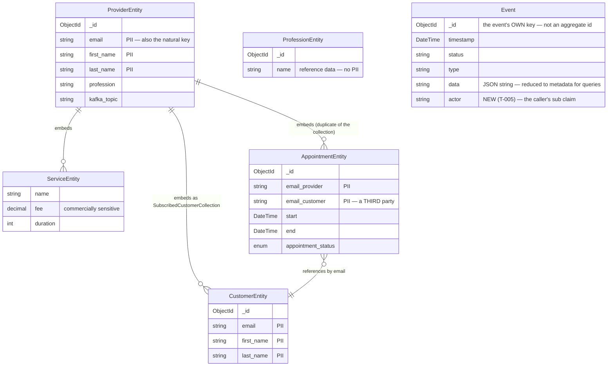

# Data Model — Secure Public Endpoints (F-016)

**Feature:** `secure-public-endpoints` (F-016)
**Date:** 2026-08-18
**Owner:** Neo (Architect)

---

## Summary

> ### ⚠️ Revised at the Step 12 approval gate, 2026-08-18
>
> This document originally stated **"no persisted schema changes, no migration."** That is **no longer true.** The maintainer approved threat **T-005**, which adds an **`actor` field to `Event`** — an additive schema change. Everything below has been updated; the original claim is retained here only so the change is visible rather than silent.

**One additive schema change: `Event` gains an `actor` field.** No field is removed, no type changes, no index is created or dropped, and **no backfill migration is required** (see §7).

Every other change is either a **read-boundary projection** (a new in-memory response type, never stored) or a **reduction in what an existing document records** (`Event.Data`).

`ProviderEntity`'s embedded shape stays fixed, per the PRD's final Assumption: restructuring it is a migration over live documents and belongs to the F-019/F-020 refactor program.

---

## 1. Existing entities this feature reads

| Entity | Collection | DB | Role in this feature |
|---|---|---|---|
| `ProviderEntity` | `providers` | `agenda_buddy` | The core exposure. Read by 2 routes; projected for non-owners. |
| `CustomerEntity` | `customers` | `agenda_buddy` | Read by 2 routes; both become authenticated. |
| `ServiceEntity` | embedded in `ProviderEntity` | `agenda_buddy` | Read by `GET /services/{email}`, which becomes authenticated. |
| `AppointmentEntity` | `appointments` **and** embedded in `ProviderEntity` | `agenda_buddy` | The most sensitive projected-away data. Read by both Calendar routes. |
| `ProfessionEntity` | `professions` | `agenda_buddy` | Untouched — stays anonymous (reference data). |
| `Event` | `events` | `agenda_buddy` | `Data` content reduced for query handlers **and one field added** — `actor` (T-005). |
| `CredentialEntity` | `credentials` | `IdentityDb` | Not touched. F-021 owns it. |

---

## 2. The exposure, as a data-topology problem

The reason authentication alone is insufficient is structural, not procedural. `ProviderEntity` is a **deeply embedded aggregate**:

**One `GET /api/v1/providers` therefore returns, per provider:** the provider's identity, their full price list, their entire appointment book, and their whole client roster — including `email_customer` values belonging to **people who are not the caller and not the provider**. For a therapist or coach the provider↔customer association is itself the sensitive fact.

⚠️ **Note the duplication**: `AppointmentEntity` exists both as its own collection *and* embedded in the provider document. This is why F-024 records that "delete" currently leaves at least two copies, and it is why the projection must be applied at the read boundary rather than trusted to a single source.

---

## 3. New response types — not persisted

These are DTOs. They have no `[BsonElement]` attributes, no collection, and are never written.

### `ProviderSummary`

Returned by `GET /api/v1/providers` and `GET /api/v1/providers/{email}` when the caller is **not** the owning provider.

| Field | Type | Source | Notes |
|---|---|---|---|
| `email` | `string` | `ProviderEntity.Email` | Retained — it is the natural key a customer needs to book. |
| `firstName` | `string` | `ProviderEntity.FirstName` | |
| `lastName` | `string` | `ProviderEntity.LastName` | |
| `profession` | `string` | `ProviderEntity.Profession` | |
| `services` | `ServiceEntity[]` | `ProviderEntity.ServiceEntities` | Retained — a customer choosing a provider needs the catalogue and fees. |

**Deliberately absent:** `AppointmentEntities`, `SubscribedCustomerCollection`, `KafkaTopic`, `_id`.

- The two collections are the exposure.
- `KafkaTopic` is internal infrastructure derived from the email local-part; it has no business leaving the service, and `KafkaHelper` collides across email domains anyway (`15-cqrs-and-messaging.md:234`).
- `_id` is omitted because every route already addresses providers by email; exposing the `ObjectId` would add an identifier clients might start depending on, and `new ObjectId(badInput)` throws `FormatException` → 500 (`10-error-handling.md:116`).

⚠️ **Design note.** `email` is PII and `ProviderSummary` still carries it. That is intentional and unavoidable: the booking flow is email-keyed end to end. The security gain here is *authentication plus removing third-party data*, not eliminating the provider's own contact address from a response only logged-in users can now obtain.

### `PagedResult<T>`

Returned by both list endpoints. Shape specified in `api-contracts.md` §4 and **must be recorded as an ADR before the endpoint work closes** (PRD AC-16) because F-015 writes the mobile client against it.

| Field | Type | Notes |
|---|---|---|
| `items` | `T[]` | The page. |
| `totalCount` | `long` | Total matching documents. `long` because `CountDocumentsAsync` returns `long`. |
| `page` | `int` | 1-based, echoed back. |
| `pageSize` | `int` | **The effective size after server-side clamping** — not what the client asked for. |

The last row matters: a client requesting `pageSize=100000` receives the capped value, so it can detect the clamp rather than silently believing it received everything.

---

## 4. `Event` — one new field, and reduced payload content

### 4a. New field: `actor` (threat T-005, approved 2026-08-18)

| Field | Type | BSON name | Nullable | Source |
|---|---|---|---|---|
| `Actor` | `string?` | `[BsonElement("actor")]` | **yes** | the caller's `sub` claim (`ClaimTypes.NameIdentifier`) |

**Why it belongs in this feature and not a later one.** Until F-016 these endpoints had **no authenticated caller to record** — an `actor` field would have been null on every read. This feature is the first point at which the value exists. Without it, reducing the query payload (§4b) makes the audit trail *less* useful for incident response than the PII dump was: a record saying *"a `GetProvidersQuery` succeeded at 14:03"* with no actor and no correlation id cannot answer a provider asking "who saw my client list?"

**Nullable, deliberately.** Existing documents have no `actor`, and `GET /api/v1/professions*` stays anonymous so its events legitimately have no actor. A non-nullable field would require a backfill; a nullable one does not (§7).

⚠️ **The cost, recorded because it was a real dissent (Friday's, at the threat party).** This is what makes `data-model.md` no longer a no-schema-change document, and it costs F-016 its perfectly clean revert — one of the better properties of a feature that changes authorization across five services. Accepted on Echo's counter: there is no log sink and `requestId` is not exported anywhere (`10-error-handling.md:138`), so **nothing outside the `events` collection is durable**. There is no fallback attribution to fall back on.

⚠️ **What `actor` is not.** It records the `sub` claim as presented in a validated token. It is not tamper-evident, not signed, and not joined to `jti` (which is minted and never recorded). It answers "which account did this" for incident response; it is not a non-repudiation control. F-023 owns the token side.

### 4b. Reduced payload content — `Event.Data`

What changes is what the ten **query** handlers put in `data`.

| | Before | After |
|---|---|---|
| Command handlers (11) | `JsonSerializer.Serialize(entity)` | **unchanged** — the caller submitted it; not an amplification vector, and it is the real audit content for a write |
| Query handlers (10) | `JsonSerializer.Serialize(result)` — up to the entire dataset | operation metadata only; **no entity fields** |

`CONSTITUTION.md` §3 mandates the audit pattern ("do not remove this pattern"). It is preserved: every handler still writes a success/fail event with `status`, `type` and `timestamp`. Only the payload is reduced.

**Worked example — the current worst case.** `GetProvidersQueryHandler.cs:23` on an anonymous `GET /api/v1/providers` serialises every provider, every embedded appointment and every customer email into one `events` document. Combined with the route being anonymous, that is an **unauthenticated unbounded-write amplification vector**: a caller who never logs in can inflate the collection at will. Requirement 9 closes the anonymous half; this closes the amplification half. Neither alone is sufficient.

### Known defects in `Event` that this feature does NOT fix

Stated so they are not mistaken for oversights. *(The "no actor field" defect that was listed here is now **fixed** — see §4a.)*

- **`GetEventsAsync` is structurally non-functional.** It filters on `e.Id`, the event's own freshly-generated primary key, not an aggregate id — and no `AggregateId` field exists, so it can only ever return the single event whose `_id` matches (`15-cqrs-and-messaging.md:217`). Latent; nothing calls it.
- **`data` is a JSON string inside a BSON document** — doubly encoded, unqueryable without `$regex` over serialised text, unindexed.
- **No retention or pruning policy.** The collection grows without bound. F-024.
- **Audit writes are not transactional with the domain write** — a separate non-transactional `InsertOneAsync`. No transactions exist anywhere in the solution.

---

## 5. Indexes

**No index changes.**

Reviewed and deliberately not added:

- **A pagination index on `providers` / `customers`.** `GetPagedAsync` uses `skip`/`limit` over an unfiltered collection scan with no sort key specified. At current data volumes (synthetic/development only) this is immaterial. ⚠️ **`skip` degrades linearly with offset**, so this becomes a real problem at scale, and the fix then is keyset pagination — which would change the contract F-015 is about to consume. **Flagged as accepted debt with a named trigger: revisit before real user data lands, not after.**
- **A TTL index on `events`.** Would bound the collection's growth and is the obvious partner to §4. Out of scope: retention policy is a product decision (how long must an audit trail persist?) and belongs to F-024.
- ⚠️ **A TTL index that the code already claims exists.** `CredentialEntity.cs:44-45` documents *"UTC expiry timestamp. TTL index on this field in MongoDB"* — **no such index is created anywhere in the repo** (`13-security.md:117`); `seed-mongo.sh:39` creates only the unique email index. Expired refresh-token hashes accumulate indefinitely. Not F-016's (that is `IdentityDb`, F-021's territory) but recorded because it is a documentation-vs-reality gap someone will otherwise trip over.

---

## 6. Data deliberately not persisted

| Not persisted | Why |
|---|---|
| The RSA keypair the harness mints | PRD requirement 3 / AC-3 — **in memory only, never on disk.** The repo is public; a committed test key becomes a permanent artifact. |
| Pagination cursors / server-side page state | Offset pagination is stateless. No session store, no cursor table. |
| `ProviderSummary` / `PagedResult<T>` | Response shapes. Projected per request from live documents. |
| The authorization decision | Computed per request from the `sub` claim. No permission table, no ACL documents, no cached decisions — deliberately, because a cached authorization decision is the classic cross-tenant leak (see ARCHITECTURE §8 on the Calendar cache ordering invariant). |

---

## 7. Migration notes

**No migration file, no backfill, no data transformation** — but the reason is now specific rather than trivial.

`Event.Actor` is **nullable and additive**, and MongoDB is schemaless: existing `events` documents simply have no `actor` key, and the driver deserialises that to `null`. Nothing reads `actor` for control flow, so absent values are inert. A backfill is impossible anyway — the actor for a historical anonymous read is genuinely unknown, and inventing one would be worse than a null.

Two consequences worth stating explicitly:

1. **Rollback is *nearly* clean — revised from "clean".** Reverting F-016's code restores prior behaviour, and any `actor` values written in the interim become unread extra keys rather than corrupt data. No cleanup is required. ⚠️ But this is no longer a *no-schema-change* feature, so the revert is "harmless residue" rather than "no trace." Called out because §Summary previously claimed the stronger property.
2. **The `Persitency` → `Persistence` rename is not a data migration.** It renames a C# namespace and directory. The collection name comes from the `EventsCollection` configuration key, not the namespace, and there are **zero references to the misspelling in any `.json`, `.yml`, `.csproj` or `.slnf`** (measured 2026-08-18, 11 files, one reference each). Nothing serialized or configured depends on the spelling.
