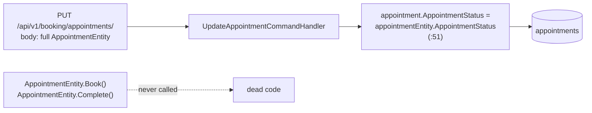
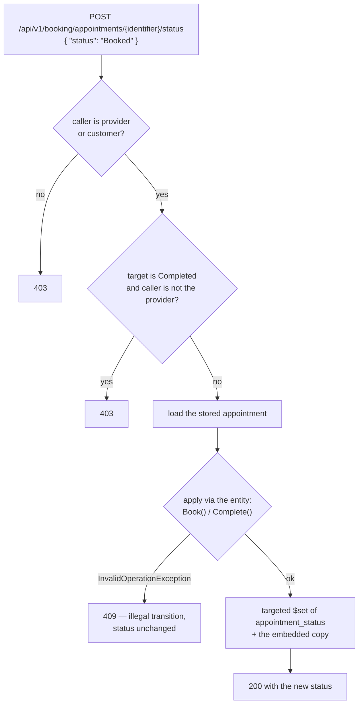

# Architecture — Wire Unreached Services (F-014)

**Date:** 2026-08-23 · **PRD:** [`PRD_F-014_wire-unreached-services_2026-08-23.md`](../../prds/PRD_F-014_wire-unreached-services_2026-08-23.md)
**Status:** Approved

---

## 1. What changes, and where

No new service, no new project, no new entity. Six capabilities land on three existing services, chosen by
who owns the data.

| # | Change | Lives in | Blast radius |
|---|---|---|---|
| A | **Notes + payments routes**, and the **status-transition route** | `Booking/Program.cs`, `Booking/Extensions/ServiceCollectionExtension.cs` | Booking only. The status route changes an existing contract — see §3 |
| B | **Messages + notifications route groups** | `Customer/Program.cs`, `Customer/Extensions/ServiceCollectionExtensions.cs` | Customer only. Two **new top-level route groups** in an existing service — §2 explains why that is not a category error |
| C | **Report + deactivate routes** | `Provider/Program.cs`, `Provider/Extensions/ServiceCollectionExtension.cs` | Provider only |
| D | **`IPaymentGateway` registration**, non-charging by default | `Library/Services/`, plus Booking's DI | New type in `Library`; no existing caller |
| E | **Server-owned appointment status** | `AppointmentEntity`, `UpdateAppointmentCommandHandler`, `CancelAppointmentCommandHandler` | `EventAndCommands` — compiled against by 6 services, but only Booking dispatches these two handlers |
| F | **`ProviderReport` loses `EstimatedRevenue`** | `Library/Entities/ProviderReport.cs`, `ReportingService` | A DTO with **no consumer today**; §5 |

**Nine new routes**, and every one of them is authenticated, ownership-guarded, and role-checked where a
role distinction exists.

---

## 2. Placement: a service is a deployment unit, not a URL prefix

Messages and notifications are addressed to a **person**, not to a customer or a provider — both actors have
an inbox. Putting them under `/api/v1/customers/…` would make the URL assert something false.

So the Customer service hosts two additional top-level groups:

```
Customer process
├── /api/v1/customers/…        (existing)
├── /api/v1/messages/…         (new)
└── /api/v1/notifications/…    (new)
```

**This is a precedent, not a novelty:** Identity already hosts `/api/v1/auth/…` and a top-level
`/device-token`. The alternative — an eighth service for two route families over two small collections —
would add a process, a Dockerfile, a health check, an AppHost resource and a `WaitFor` edge, to serve
`InsertAsync` and `FindAllAsync`.

**Why Customer and not Provider or Booking:** the Customer service already owns the provider↔customer
relationship (`SubscribedProviderCollection`) and the per-customer Kafka topic F-007 created. Messaging is
that relationship's traffic. Booking was rejected because Booking is already taking notes, payments and the
status route in this same feature.

**Why notes and payments go to Booking:** both are keyed by `appointment_identifier`, and appointments live
in Booking. A notes route in Provider would have to reach across a boundary to check the appointment
exists.

**Why the report goes to Provider:** it is computed from `ProviderEntity.AppointmentEntities` and
`ServiceEntities` — both fields of the document Provider owns. Reporting from anywhere else would mean a
second service reading the provider collection.

---

## 3. Appointment status: the design's centre of gravity

This is the part of F-014 that is not wiring, and it exists because `ReportingService` is meaningless
without it (Discover F-1).

### 3.1 What happens today



The rules exist and cannot run. The field they protect is caller-owned.

### 3.2 What replaces it



Two properties are load-bearing:

- **The transition runs through the entity.** `Book()` and `Complete()` stop being dead code and become the
  only path to a status change. A new state added to the enum without a method cannot be reached, which is
  the opposite of today.
- **The `PUT` ignores the status field entirely.** Requirement 13. Leaving it writable and *also* adding
  this route would mean two ways to change status, one of them unguarded — which is not a fix, it is a
  second door.

### 3.3 The cancellation inversion, fixed in the same change

```csharp
// before — refuses the state a customer actually needs to cancel
if (appointment.AppointmentStatus == AppointmentStatus.Booked)    return false;
if (appointment.AppointmentStatus == AppointmentStatus.Completed) return false;

// after — a completed appointment is history; a booked one is exactly what gets cancelled
if (appointment.AppointmentStatus == AppointmentStatus.Completed) return false;
```

This has to happen **here**, not later: today nothing sets `Booked`, so cancellation works by accident.
§3.2 makes `Booked` reachable, and without this fix the same release that fixes status also breaks
cancellation — and would look like it.

---

## 4. Payments: non-charging by default

```csharp
// Library/Services/RecordingPaymentGateway.cs — the DEFAULT registration
public sealed class RecordingPaymentGateway : IPaymentGateway   // creates ids, confirms, never calls out
```

| Configuration | Registered gateway | Behaviour |
|---|---|---|
| `Payments:Stripe:ApiKey` absent (default) | `RecordingPaymentGateway` | Generates a local intent id, reports success, makes **no external call** |
| `Payments:Stripe:ApiKey` present | `StripePaymentGateway` | Real Stripe calls |

**Why the default is non-charging rather than throwing.** A gateway that throws makes `PaymentService`
unreachable again — the exact condition F-014 exists to end — and makes AC-6 untestable. A gateway that
charges by default is unthinkable without an account. Recording locally is the only option that leaves the
capability exercisable and the money untouched.

**Why the key is not in `appsettings.json`.** It is a live payment credential, and this project's standing
proof (`ISSUE-002`) is that a committed secret is permanent. It follows the JWT keys: an Aspire secret
parameter, injected as an environment variable, masked in the dashboard.

**`StripeConfiguration.ApiKey` stops being assigned per request.** It is a process-global static; setting it
inside a request handler makes the key's lifetime the process's and the assignment a data race under
concurrency. The Stripe gateway sets it **once at construction** instead.

⚠️ **The residual risk is that payments stay permanently fake** (PRD R4) — a deployment forgets the key and
records payments that never happened. Mitigated the way F-021 mitigated the same shape (ADR-033): a **loud
startup warning** naming the key when the non-charging gateway is selected outside a local run.

---

## 5. `EstimatedRevenue` is removed rather than corrected

`completed.Count × sum(all active service fees)` is not revenue, and it cannot be fixed by arithmetic:
**`AppointmentEntity` does not record which service the appointment is for.** The input does not exist.

The report therefore returns:

```json
{ "providerEmail": "…", "totalBookings": 12, "completedAppointments": 4,
  "cancelledAppointments": 1, "uniqueCustomers": 7, "retentionRate": 42.86,
  "revenueAvailable": false,
  "revenueUnavailableReason": "Appointments do not record which service they were booked for, so revenue cannot be computed. Tracked as F-014's filed follow-up.",
  "generatedAt": "…" }
```

**Why a stated absence rather than a silent omission.** A missing field reads as a serialisation bug; an
explicit `revenueAvailable: false` with a reason reads as a decision. It also gives F-015's client
something to render instead of `£0`.

**Why not add the service reference now.** It is a data-model change touching F-015's contract and F-025's
booking rules, and it needs a product answer about historical appointments that have no service to
reference. Filed.

---

## 6. Architectural decisions

| ID | Decision | Rationale | Alternative rejected |
|---|---|---|---|
| **D-1** | Six capabilities onto three existing services, placed by data ownership | No new process, no cross-service reads. Identity's two route groups are the precedent | An eighth service (a whole deployment unit for two small collections); putting everything in Booking (which is already taking three of the six) |
| **D-2** | `api/v1/messages` and `api/v1/notifications` as top-level groups inside the Customer process | They are addressed to a person, not to a customer. A URL that says `customers` about a provider's inbox is a lie the client then has to work around | Nesting under `/customers/{email}/…`, which forces every provider read through a customer-shaped path |
| **D-3** | Status changes move to a dedicated route and the `PUT` ignores the field | The rules already exist as entity methods; this makes them the only path. Leaving the field writable would add a door rather than close one | Validating status transitions inside the `PUT` — same route, two responsibilities, and a client that omits the field silently resets it |
| **D-4** | Transitions applied through `AppointmentEntity.Book()`/`.Complete()` | The invariant lives with the data. A new enum value without a method is unreachable by construction | A transition table in the handler — a second place for the rules to drift from the entity |
| **D-5** | Fix the cancellation inversion in this feature | D-3 makes `Booked` reachable, so the latent bug becomes live in the same release. Splitting it would ship a regression and a fix in the wrong order | Filing it for later, i.e. knowingly shipping "customers cannot cancel booked appointments" |
| **D-6** | Non-charging gateway by default; Stripe when a key is configured | The only option that leaves payments exercisable with no account and no risk of a real charge | Stripe-only (untestable, needs a live credential); throwing (leaves the capability unreachable) |
| **D-7** | Remove `EstimatedRevenue`, state the absence in the response | The number cannot be computed from stored data. Publishing it repeats the defect this feature exists to fix | Publishing it with a caveat in the docs (nobody reads the docs, everybody reads the dashboard) |
| **D-8** | Notes get `Provider` role **and** ownership, with not-found and forbidden made indistinguishable | The most sensitive data in the product. Distinguishing them tells an attacker which appointments have notes | Ownership only — a customer could then probe for the existence of notes about themselves |
| **D-9** | Appending to `ProviderEntity.AppointmentEntities` uses `FindOneAndUpdateAsync` with `$push` | ADR-032's primitive exists precisely for this. The read-modify-replace it replaces loses concurrent updates | Keeping the replace, and adding five more paths that do the same thing |
| **D-10** | No caching on any new read | Cache invalidation does not exist anywhere (`agenda-buddy-xrw`); a cached inbox would show a five-minute-old message list | Caching reads for symmetry with the provider list, i.e. inheriting a known bug into six new routes |

### Blast radius — E and F

**E (`EventAndCommands`)** is compiled against by six services, but `UpdateAppointmentCommandHandler` and
`CancelAppointmentCommandHandler` are dispatched only from `Booking/Requests/RequestCollection.cs`.
Verified: no other service references either handler. The signature of neither changes.

**F (`ProviderReport`)** — a sweep for `EstimatedRevenue` and `ProviderReport` outside `Library` and
`Library.Tests` must return **zero production consumers** before removing the field. If the mobile client
references it, requirement 18 becomes a client change and the decision returns to the maintainer.

---

## 7. Conformance with `CONSTITUTION.md`

| Constraint | How this design conforms |
|---|---|
| Business logic in the `Library` service layer | All six services already exist there and are unchanged apart from `ReportingService`'s revenue removal. Routes add authorization and mapping only |
| Repository pattern for all DB access | Four new repository registrations; no handler touches `IMongoCollection` |
| Async all the way | Every new route handler is `async Task<…>` |
| `[BsonElement("snake_case")]` | No new persisted fields. The four entities already carry their attributes |
| §4 — email is PII | Notes, messages and notifications all contain or reference addresses. No new route logs a body, and the `PiiRedactingProcessor` span redaction already covers `url.path` — which matters because message routes take an email in the path |
| §7 test gates | Unit + Integration. AC-8…AC-12 are route claims and are integration-only by nature |
| One exception, declared | The status transition is domain logic and lives on the **entity**, not in a `Library` service. That is where `Book()`/`Complete()` already are, and an invariant belongs with its data |

---

## 8. What this design deliberately does not do

- **No notification delivery.** `SendAsync` inserts a row. No email, no push, and `DeviceTokenEntity` stays
  unread. F-022's dependency on this service is satisfied only when "send" means "deliver" — filed, not
  built.
- **No Kafka publishing for messages.** F-007 built per-provider topics; `MessageService` does not use them
  and this feature does not change that. Storing a message and publishing an event are different features.
- **No pagination on the new lists.** Messages and notifications are per-caller. The primitive exists
  (ADR-023) and should be applied the moment a list can grow unbounded — but adding it now, to lists with no
  data and no consumer, is a guess about shape.
- **No soft-delete.** Cancellation still hard-deletes from both `appointments` and the embedded copy, so
  `AppointmentStatus.Cancelled` stays unused. F-024 owns erasure.
- **No slot validation.** `Start < End`, future-dating and overlap are **F-025**.
