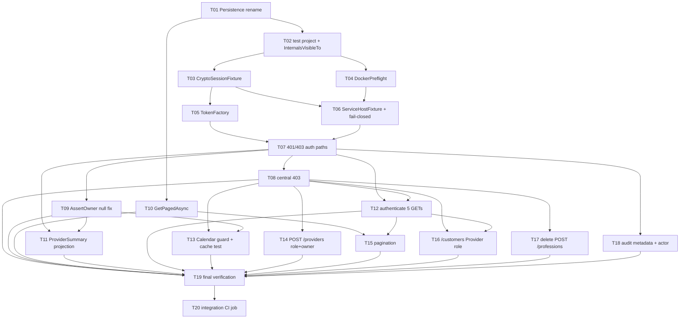

# Plan: Secure Public Endpoints

**Feature:** `secure-public-endpoints` (F-016) — first of the Platform Remediation program
**Date:** 2026-08-18
**PRD:** [`PRD_F-016_secure-public-endpoints_2026-08-18.md`](PRD_F-016_secure-public-endpoints_2026-08-18.md)
**Design:** [`docs/pdlc/design/secure-public-endpoints/`](../../archive/design/secure-public-endpoints/)
**Branch:** `feat/F-016-secure-public-endpoints` *(created at build pre-flight)*

**20 tasks · 8 waves · 26 acceptance criteria (19 from Define + 7 threat-derived `[security]`) · 9 user stories**

---

## Tasks

| Task ID | Title | Labels | Depends On | ACs |
|---|---|---|---|---|
| F-016-T01 | Rename `EventAndCommands/Persitency` → `Persistence` | `story:US-08`, `backend` | — | 1 |
| F-016-T02 | Create `AgendaBuddy.IntegrationTests`; `InternalsVisibleTo` × 7 | `story:US-08`, `backend`, `devops` | T01 | 2 |
| F-016-T03 | `CryptoSessionFixture` — session RSA keypair, in memory, never on disk | `story:US-08`, `backend`, `security` | T02 | 3 |
| F-016-T04 | `DockerPreflight` — actionable runtime diagnostics | `story:US-08`, `backend`, `devops` | T02 | 7 |
| F-016-T05 | `TokenFactory` — valid / expired / foreign-subject / **no-`sub`** | `story:US-08`, `backend`, `security` | T03 | 6 |
| F-016-T06 | `ServiceHostFixture` — real HTTP + Mongo container, **fail-closed guard** | `story:US-08`, `backend`, `security`, `devops` | T03, T04 | 4, 5, **20 `[security]` T-002** |
| F-016-T07 | Auth failure paths — 401 expired, 403 foreign subject, real routes | `story:US-08`, `backend`, `security` | T05, T06 | 6 |
| F-016-T08 | `AgendaBuddyExceptionHandler` — central 403, registered unconditionally | `story:US-05`, `backend`, `security` | T07 | 13, 14, **23 `[security]` T-004** |
| F-016-T09 | Fix `AssertOwner` null-claim pass | `story:US-02`, `backend`, `security` | T07 | **21 `[security]` T-001** |
| F-016-T10 | `GetPagedAsync` on `IRepository<T>` + both implementers | `story:US-06`, `backend` | T01 | 15 *(mechanism)* |
| F-016-T11 | Project provider reads → `ProviderSummary` for non-owners | `story:US-02`, `backend`, `security` | T07, T09 | 9 |
| F-016-T12 | Authenticate the **five** anonymous PII GETs | `story:US-01`, `backend`, `security` | T07, T08 | 8 |
| F-016-T13 | `OwnershipGuard` on both Calendar routes + guard-before-cache test | `story:US-03`, `backend`, `security` | T08, T09 | 10, **25 `[security]` T-006** |
| F-016-T14 | Role **and** ownership on `POST /api/v1/providers` | `story:US-04`, `backend`, `security` | T08 | 11 |
| F-016-T15 | Paginate both list endpoints — capped, clamped envelope | `story:US-06`, `backend` | T10, T12 | 15, 16 |
| F-016-T16 | Require the `Provider` role on `GET /api/v1/customers` | `story:US-01`, `backend`, `security` | T08, T12 | **22 `[security]` T-003** |
| F-016-T17 | **Delete** `POST /api/v1/professions` | `story:US-04`, `backend`, `security` | T08 | 18, **26 `[security]` T-007** |
| F-016-T18 | Query audit → metadata across **all ten** handlers + `Event.actor` | `story:US-07`, `backend`, `security` | T07 | 17, **24 `[security]` T-005** |
| F-016-T19 | Final verification — suite green, no test deleted, 26 ACs attested | `story:US-09`, `backend`, `devops` | T08–T18 | 19 |
| F-016-T20 | **Integration CI job** — separate, blocking, duration-enforced *(absorbed at the Plan gate)* | `story:US-09`, `devops` | T19 | — |

---

## Dependency Graph

---

## Implementation Order

**Wave 1 — 1 task.** `T01`
The `Persistence` rename, as its own commit. AC-1 requires it **before any integration test is authored**, so it gates everything. Also lifts CONSTITUTION §9's rename prohibition, whose stated condition ("until a dedicated refactor is planned") the approved PRD satisfies.

**Wave 2 — 1 task.** `T02`
The test project plus `InternalsVisibleTo` × 7. **The narrowest point in the plan** — no harness work can begin until it lands.

**Wave 3 — 3 tasks, parallel.** `T03` `T04` · and `T10` unblocks here too
`T03` (crypto) and `T04` (Docker preflight) both feed the central fixture. `T10` (`GetPagedAsync`) depends only on `T01`, so it runs in parallel with the entire harness build — it is unit-testable production code and deliberately kept off the harness critical path.

**Wave 4 — 2 tasks.** `T05` `T06`
`T05` (tokens) needs `T03`. `T06` (`ServiceHostFixture` + the fail-closed guard) needs both `T03` and `T04`. **`T06` is the second bottleneck and carries the CRITICAL security AC.**

**Wave 5 — 1 task.** `T07`
The 401/403 auth-failure proof. This is the task that demonstrates the harness can observe what nothing in the solution currently can. Everything in wave 6 depends on it directly or through `T08`.

**Wave 6 — 10 tasks, largely parallel.** `T08` `T09` `T11` `T12` `T13` `T14` `T15` `T16` `T17` `T18`
All the production behaviour. Internal ordering that matters: `T08` (central 403) precedes every endpoint task, because those endpoints rely on `ForbiddenException` reaching the client as 403. `T09` (the `AssertOwner` fix) precedes `T11` and `T13`, because both branch on ownership. `T15` needs `T10` **and** `T12`.

**Wave 7 — 1 task.** `T19`
Final verification and the 26-AC attestation.

**Wave 8 — 1 task.** `T20`
The integration CI job. **Absorbed from F-018's T18 at the Plan approval gate**, because the readiness party found the feature's central claim was otherwise unenforced. ⚠️ **Cannot be verified locally** — `main` is PR-protected and the pipeline is path-filtered, so it needs a real CI run on a throwaway branch pushed by the maintainer. Do not schedule it like an ordinary task.

### Critical path

`T01 → T02 → T03 → T06 → T07 → T08 → T12 → T15 → T19 → T20` — **10 tasks deep.** Bottlenecks are `T02` and `T06`. The wave-6 fan-out is wide, so wall-clock is dominated by the harness chain, not the endpoint work.

---

## Threat-derived security ACs

Seven "mitigate now" threats are materialized as structured `[security]` ACs, not task-body citations:

| Threat | Severity | PRD AC | Task | Enforcement |
|---|---|---|---|---|
| **T-002** | CRITICAL | 20 | `F-016-T06` | TDD gate demands a failing-first test; `tasks.cjs done` refuses to close without a linked test |
| **T-001** | HIGH | 21 | `F-016-T09` | same |
| **T-003** | HIGH | 22 | `F-016-T16` | same |
| **T-004** | MEDIUM | 23 | `F-016-T08` | same |
| **T-005** | MEDIUM | 24 | `F-016-T18` | same |
| **T-006** | MEDIUM | 25 | `F-016-T13` | same |
| **T-007** | MEDIUM | 26 | `F-016-T17` | same |

`tasks.cjs check` reports **7 `security-ac-untested`** findings for F-016 (plus 3 pre-existing for the paused F-018) — expected until Build links the tests. Recorded as ADR-029.

**Five of the eight threats were created or made newly reachable by this feature**, not inherited. Two changed the plan rather than annotating it: **T-001** moved PRD requirement 18 into this feature, and **T-003** added a scope item the PRD did not authorize.

---

## What the design settled before any code

| Question | Outcome |
|---|---|
| Can requirement 14 be met by editing the existing exception handler? | **No.** It is registered inside `if (IsDevelopment())` in all seven services, so a mapping there gives 403 in Development and a bare 500 in Production. ADR-022 replaces the approach with `IExceptionHandler` registered unconditionally. |
| Where does authorization sit? | **At the endpoint** — MediatR never dispatches, so there is no `IPipelineBehavior` seam below it. |
| Does `IRepository<T>` support pagination? | **No** — verified by reading it. One new primitive, and both implementers change (including `Identity.Tests`' `InMemoryRepository`, or that project stops compiling). |
| Is the pagination contract decided? | **Yes** — ADR-023, written before Build because F-015 consumes it. Clamp, don't reject; cap at 100; retire the `204`. |
| Container-per-test or per-class? | **Per class.** F-018's spike *measured* 4.45 s warm startup against the 1–3 s assumed. |

---

## Known gaps this plan carries into Construction

Stated rather than hidden, because each could surprise the implementer.

1. **✅ RESOLVED at the Plan approval gate — F-018's `T18` was absorbed as `F-016-T20`.** The gap as originally written: the integration suite had no CI enforcement, so the feature's central claim ("authorization you can demonstrate") ran on one laptop with nothing noticing if it stopped. The maintainer chose to pull T18 forward rather than accept local-only. **Eight F-018 tasks are now absorbed, not six** — T01, T05, T06, T07, T08, T09, T14, T18. ⚠️ Residual: `T20` cannot be verified locally and needs a maintainer-pushed throwaway branch. **`T04` (the 10-green-run counter gating the CONSTITUTION §7 amendment) is still NOT absorbed** — Integration stays unchecked in §7.
2. **CONSTITUTION §7 leaves Integration unchecked, and this feature deliberately does not tick it.** The amendment is gated on 10 consecutive green integration runs, tracked separately (inherited from F-018's T04, which is *not* absorbed). Do not check the box as a tidy-up.
3. **`tasks.cjs ready` returns F-018 tasks alongside F-016's.** F-018 is paused and unclaimed but its tasks remain open, so the Build loop's ready queue is not feature-scoped. **Filter by `epic:secure-public-endpoints` when selecting work**, or Build will happily start `F-018-T02`.
4. **The Rancher VM is the least-tested assumption** — 2 CPUs / 4.1 GB already running a k8s cluster, with container-per-class across a growing number of test classes. If it thrashes, the mitigation is fewer, larger test classes, not abandoning containers. Also: `docker` is not on `PATH` (`~/.rd/bin`), which is what `T04` exists to diagnose.
5. **`CacheAside` has no test at all** and returns `default!` on a 500 ms lock timeout, surfacing as a spurious 404/204. `T13`'s test must assert "**not** 200-with-data" rather than "exactly 403", or Build will chase phantom failures. F-016 does not fix `CacheAside`.
6. **`T09` must precede `T11`, and the reason is subtle.** The projection selects owner-vs-non-owner with `AssertOwner`, whose null-claim pass lands on the **owner** branch. Building `T11` first would ship the bypass. The dependency edge exists; do not "optimise" it away.
7. **The central 403 will be written twice.** It touches the error pipeline in all six domain services, and F-019/F-020 rewrite exactly those files. Accepted (ADR-022) — leaving 403s hand-written at 8 call sites until after a three-stage refactor is the worse trade.
8. **F-021's rate limiter can break this harness.** The harness authenticates repeatedly against `POST /api/v1/auth/login`. F-021 must ship its limiter with a test-environment escape. Recorded in both features.
9. **Deferred, not rejected:** owner-scoping `GET /api/v1/customers` to the caller's own `SubscribedCustomerCollection` (stronger than the role check chosen in ADR-026), and the nine other exception-to-status mappings ADR-022 leaves out — `FormatException` → 400 is the best next candidate, being the most likely live 500.
10. **The Atlas credential is still unrotated** (`ISSUE-002`). Human-only and outside this feature, but it is precisely what makes `T06`'s fail-closed guard load-bearing rather than pedantic.
