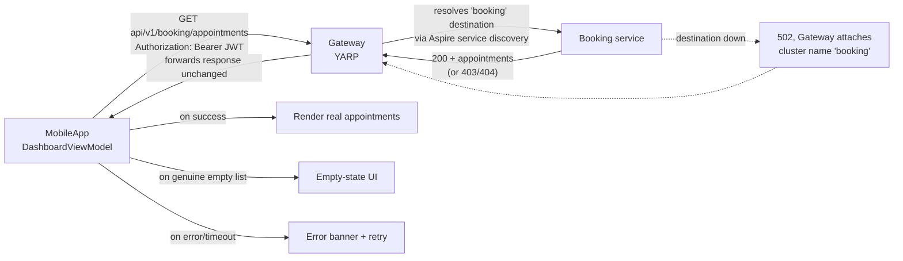

# Architecture — API Gateway and Mobile Contract (F-015)

**Date:** 2026-08-23 · **Feature ID:** F-015

---

## 1. Where this feature lives

This feature adds one new resource to the existing Aspire graph — a **gateway** — and corrects the client
half of a contract that has never worked. It touches:

- **`AgendaBuddy.AppHost`** — a new `Gateway` project resource, wired the same way `AppHostWiring.cs`
  already wires the seven services (`WithReference`/`WaitFor`).
- **A new `Gateway` project** — a thin ASP.NET Core Minimal API host, the eighth process in the graph.
- **`MobileApp`** — every `*ApiService`'s base address and route strings; `SeedDataProvider` removed;
  `AuthService`'s refresh/logout wiring; the route-building logic extracted into testable classes.
- **`scripts/run-ios.sh`** — extended to discover the gateway's address the same way it already discovers
  the seven services', and inject it into the simulator process.

No existing service (Booking, Calendar, Customer, Provider, Services, Profession, Identity) changes. The
gateway is a pure addition in front of them; the seven `Program.cs` route tables are untouched.

---

## 2. New component: the Gateway

**`Gateway/Program.cs`** — following the exact shape of the existing seven services:

```csharp
var builder = WebApplication.CreateBuilder(args);
builder.AddServiceDefaults();                    // same as all 7 services — health, telemetry, resilience
builder.Services.AddReverseProxy()
    .LoadFromMemory(BuildRoutes(builder.Configuration), BuildClusters(builder.Configuration));

var app = builder.Build();
app.UseAgendaBuddyTransportSecurity();            // same middleware-order requirement as the 7 services
app.MapDefaultEndpoints();                        // /health, /alive
app.MapReverseProxy();

app.Run();
```

`BuildRoutes`/`BuildClusters` are built **programmatically from `IConfiguration`**, reading the same
Aspire service-discovery keys (`services__<name>__http__0` / `services__<name>__https__0`) that
`AddServiceDefaults()` already resolves for every service's own outbound calls — **not** a static
`appsettings.json` YARP cluster file. This is the load-bearing decision from Design Round 2: the gateway's
routing table cannot drift from what the AppHost actually wires, because it reads the same source of truth
every other service already reads.

**Destination resolution is live, per request — pending the spike (§6).** Round 3 proposed reading each
destination's current address from Aspire service discovery on every request, rather than resolving once at
startup, so the gateway survives an AppHost restart that reassigns a service's dynamic port without itself
needing a restart. YARP supports this via a custom `IProxyConfigProvider` that re-reads `IConfiguration` on
each `GetConfig()` poll (YARP's built-in change-detection re-triggers destination resolution); the spike
confirms this is compatible with how Aspire's service-discovery `IConfiguration` values update.

**Route table:** the gateway forwards every `api/v1/{service}/**` path to its matching destination by
convention — `api/v1/booking/**` → `booking`, `api/v1/calendar/**` → `calendar`, and so on for all seven,
including `api/v1/auth/**` and the root-mapped `/device-token` → `identity`. No path rewriting: the gateway
adds no prefix and strips none: `MobileApp` already calls the correct `api/v1/...` paths once this feature
corrects them, and the seven services already expect exactly those paths.

**Failure translation (Round 3, Q1):** when a destination is unreachable, times out, or returns 5xx, the
gateway's error handler attaches the destination cluster's name (`booking`, `calendar`, etc.) to a
`ProblemDetails` body before returning it to the client — see `api-contracts.md` §2 for the exact shape.
This is a **single point of translation**; `MobileApp` never has to infer which service failed from the
route it called.

**Auth passthrough (Requirement 2):** the gateway does not parse, validate, or strip the `Authorization`
header — it forwards it byte-for-byte to the destination, which validates it exactly as it does today for a
direct call. YARP's default behavior already does this; the design decision is *not adding* any
authentication middleware to the gateway itself, so there is nothing to misconfigure into a bypass.

---

## 3. AppHost wiring

`AppHostWiring.cs` gains one resource, following the `AddApi<TProject>` helper already used for all seven
services (`:114` per the context catalog):

```csharp
var gateway = builder.AddProject<Projects.Gateway>("gateway", launchProfileName: null);
foreach (var service in new[] { booking, calendar, customer, provider, services, profession, identity })
{
    gateway.WithReference(service);
    gateway.WaitFor(service);
}
```

`WithReference` is what injects the `services__<name>__http__0` configuration keys the gateway's
`BuildRoutes`/`BuildClusters` read — the same mechanism that already lets any service call any other by
logical name. `WaitFor` on all seven means the gateway only reports healthy once every destination it could
route to is also healthy, so a client never gets routed to a service that isn't up yet.

---

## 4. Data flow — primary user journey (dashboard load)



Before this feature: step B/C never happens (wrong path, wrong host); `D`/`E`/`F` are dead code, and the
client always renders `SeedDataProvider`'s fixtures instead. After this feature: the real path executes, and
`E`/`F` become reachable for the first time since F-012 shipped.

---

## 5. Architectural decisions (with rationale)

| Decision | Rationale |
|---|---|
| **New resource, not folded into an existing service.** The gateway is its own project, not a route group added to (say) Booking. | A gateway that also serves its own domain traffic conflates two responsibilities and makes "gateway is down" indistinguishable from "Booking is down." Keeping it separate is what makes the failed-destination error (§2) meaningful. |
| **YARP, not a hand-rolled reverse proxy.** | First-party Microsoft NuGet, .NET-native, lowest addition to the dependency footprint per CONSTITUTION §9. |
| **Programmatic route config from Aspire service discovery, not a static YARP cluster file.** | A static file can drift from what `AppHostWiring.cs` actually wires (exactly the class of staleness `agenda-buddy-do5`-style bugs come from). Reading the same config keys every service already reads makes drift structurally impossible. |
| **No path rewriting.** | The client already calls `api/v1/{service}/...` once corrected; the seven services already expect exactly that. A rewrite layer would be one more place for a path to go stale. |
| **Auth passthrough, no gateway-side validation.** | Validating twice (gateway + service) doubles the places a JWT-handling bug could live; not validating at all avoids that without weakening anything, since every service already enforces its own auth. |
| **Live per-request destination resolution (pending spike).** | Aspire's dynamic ports (F-013) mean a cached destination can go stale on any AppHost restart. The spike (§6) confirms whether YARP's config-provider re-poll mechanism is fast enough to do this safely. |
| **`run-ios.sh` extended, not a new discovery mechanism invented.** | The exact problem (discover a dynamically-assigned port for a client that can't use Aspire service discovery itself) is already solved there for the seven services; extending it to the gateway is one more probe loop, not a new pattern. |

---

## 6. Gating risk — spike required before this design is final

**Risk (Adversarial finding #4):** YARP's default reverse-proxy configuration resolves destination
addresses once from its `IProxyConfigProvider` and does not automatically notice an Aspire AppHost restart
reassigning a service's port mid-session.

**Spike, to run before Construction commits to this shape:** build the `Gateway` project's `Program.cs`
against a custom `IProxyConfigProvider` that re-reads `IConfiguration` on each YARP config-reload cycle;
restart one backend service under a running AppHost; confirm the gateway starts routing to the new port
**without the gateway process restarting**. Measure and record the latency this per-request/per-poll
resolution adds (Non-Functional Requirements, PRD).

**If the spike fails** (YARP cannot re-resolve without a full gateway restart): the fallback is a
`WaitFor`-triggered gateway restart whenever a backend service resource transitions, which is uglier but
still correct for local development — recorded here so Design is not blocked waiting on the spike's outcome
to be written down.

---

## 7. Conformance to CONSTITUTION.md §3

- **Business logic in the service layer only, not in API handlers** — the gateway has no business logic; it
  is pure routing. Nothing to violate.
- **Async all the way** — YARP's proxying is async by default; no synchronous I/O introduced.
- **`[Required]`/`[EmailAddress]` at the API boundary** — unaffected; the gateway does not deserialize or
  revalidate request bodies, it forwards them.
- **New packages require discussion** — YARP (`Yarp.ReverseProxy`) is the one new package this feature adds;
  named explicitly here and in the PRD's NFRs, not silently introduced.
