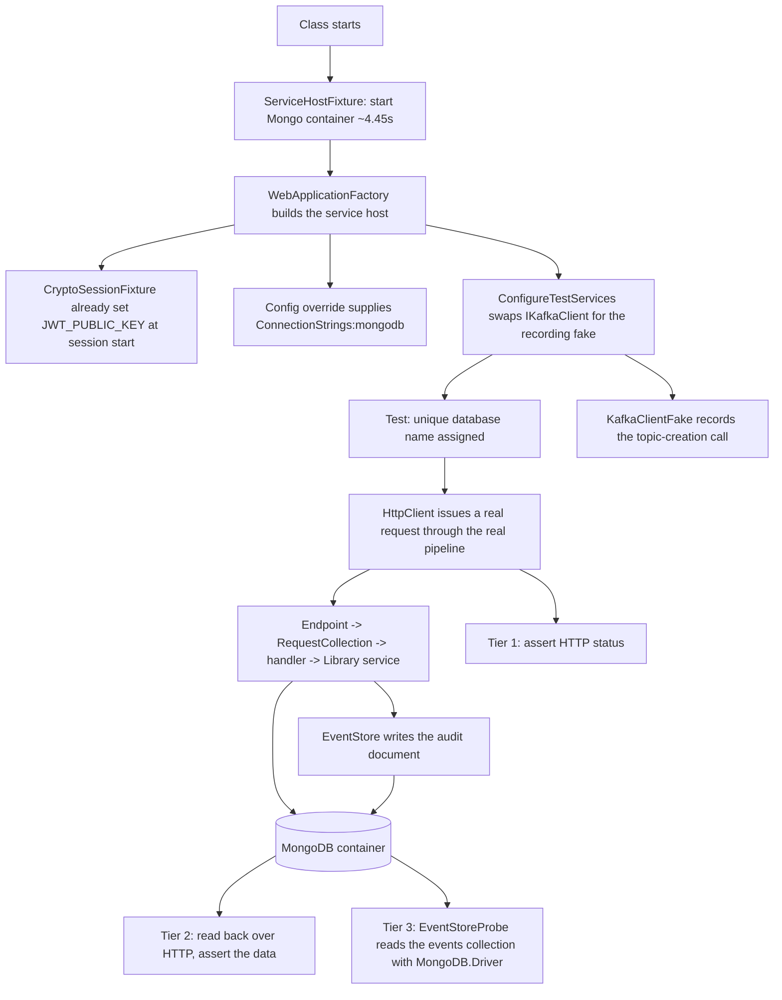
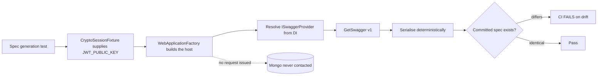

# Architecture — api-refactor-foundations (F-018)

**Date:** 2026-08-18 · **Author:** Neo (Architect) · **Feature:** F-018, stage 1 of 3
**PRD:** [PRD_F-018_api-refactor-foundations_2026-08-18.md](../../prds/PRD_F-018_api-refactor-foundations_2026-08-18.md)

> Every load-bearing claim below was **executed**, not reasoned. The two pre-Design spikes are recorded in the brainstorm log under *Pre-Design Spikes*. Where a number appears, it was measured.

---

## 1. Where this feature lives

F-018 is **almost entirely additive and test-only**. It introduces one new test project and touches production projects in exactly two non-behavioural ways.

| Change | Kind | Projects affected |
|---|---|---|
| `AgendaBuddy.IntegrationTests` | **new test project** | — |
| `<InternalsVisibleTo>` | csproj metadata only | all 7 services |
| `Persitency/` → `Persistence/` | directory + namespace rename | `EventAndCommands` + 6 consumers |
| `Identity/Program.cs` comment fix | comment only | `Identity` |
| `.editorconfig`, CI jobs, OpenAPI specs, ADRs | new files | — |

**A hard constraint, from the PRD's NFRs:** *no production code path may change behaviour.* The rename is behaviour-preserving (no collection name, config key, or serialized document changes); `InternalsVisibleTo` affects compile-time visibility only. Anything behavioural belongs to F-019.

---

## 2. New module: `AgendaBuddy.IntegrationTests`

Deliberately **one** project, not seven. Episode 001 already recorded the seven near-identical `ServiceCollectionMongoResolutionTest.cs` files (~150 lines each) as tech debt; repeating that shape for container setup would repeat the mistake.

```
AgendaBuddy.IntegrationTests/
├── Fixtures/
│   ├── CryptoSessionFixture.cs      # per-SESSION: RSA keypair + token factory
│   ├── ServiceHostFixture.cs        # per-CLASS: 1 Mongo container + 1 WebApplicationFactory
│   └── DockerPreflight.cs           # actionable failure when the daemon is unreachable
├── Support/
│   ├── TokenFactory.cs             # valid / expired / arbitrary-subject RS256 tokens
│   ├── KafkaClientFake.cs          # recording IKafkaClient substitute
│   └── EventStoreProbe.cs          # direct MongoDB.Driver read of the events collection
├── Contract/                       # tier 1 — route contract, per service
├── Persistence/                    # tier 2 — round-trip, per service
├── Audit/                          # tier 3 — audit fired (6 services; NOT Identity)
├── Auth/                           # 401 / 403 via the token factory
├── OpenApi/                        # spec generation + drift check
└── Harness/                        # the harness's own guarantees (reaping, isolation, diagnostics)
```

### Two fixture lifetimes — the central design decision

The lifetimes are **deliberately different**, and conflating them is the main thing to get wrong:

| Fixture | Scope | Owns | Why this scope |
|---|---|---|---|
| `CryptoSessionFixture` | **Session** (xUnit assembly fixture) | One in-memory RSA keypair; the token factory | RSA generation is pure CPU and the key is stateless. Generating per test would waste time for no isolation gain. **Never written to disk** — the Atlas credential incident is still unremediated, and a committed test keypair would be a second secret-shaped artifact that F-017's future scanner would flag. |
| `ServiceHostFixture` | **Class** (`IClassFixture`) | One MongoDB container; one `WebApplicationFactory` per service under test | Measured cost is **4.45 s per container** (4436 / 4471 / 4475 ms, σ≈20 ms). Per-test would spend that on every test; per-class amortises it. The connection string is then known once, so the host builds once. |

**Isolation is preserved without per-test containers** by giving each test a **unique database name** inside the shared container. This is the substitution that made the reversal safe: the original argument for container-per-test was isolation, and a unique database delivers the same isolation for effectively zero cost.

> **This reverses a Discover decision, on evidence.** Discover chose container-per-**test** against an *assumed* 1–3 s startup. The spike measured 4.45 s — 2–3× the estimate — and the decision was reversed at Design. It converges on what Echo argued in Progressive Thinking Conflict A, now settled by measurement rather than debate. Recorded as **ADR-017**.

---

## 3. The three prerequisites — all spike-confirmed

Nothing in the harness runs until all three hold. This is the critical path, and each was verified by execution:

| # | Prerequisite | Mechanism | Evidence |
|---|---|---|---|
| 1 | `Program` reachable | `<InternalsVisibleTo Include="AgendaBuddy.IntegrationTests" />` in each of the 7 service csproj files. Services use top-level statements, so `Program` is internal, and no service csproj had this | **Spike 2:** `WebApplicationFactory<Program>` booted `Booking` once added |
| 2 | JWT public key present **before** host build | `CryptoSessionFixture` sets `JWT_PUBLIC_KEY` at session start | **Spike 2:** without it, `AddAgendaBuddyAuthentication()` threw `ApplicationException: Required environment variable 'JWT_PUBLIC_KEY' is not set…` (`Library.ServerAuth/AuthenticationExtensions.cs:18-22`) |
| 3 | Mongo connection injected | Configuration override supplying `ConnectionStrings:mongodb`, which `MongoConnectionResolver` reads first. **No production change** | **Spike 2:** host booted with the value supplied |

**A fourth prerequisite was assumed and proved unnecessary.** Discover inferred that OpenTelemetry export would need suppressing in tests. It does not: `AgendaBuddy.ServiceDefaults/Extensions.cs:115-117` only calls `UseOtlpExporter()` when `OTEL_EXPORTER_OTLP_ENDPOINT` is non-empty, which is unset in a test host. Telemetry is inert by construction.

**A property worth keeping, not suppressing:** `WebApplicationFactory` defaults to the **`Development`** environment, so DI scope validation is **on** — the exact check that caught F-013's captive `IRequestCollection` dependency. The harness should not override the environment away from Development without a stated reason.

---

## 4. Integration with existing modules

| Existing module | How F-018 relates |
|---|---|
| `MongoConnectionResolver` (`Library`) | Consumed unchanged. The harness injects `ConnectionStrings:mongodb`, the key the resolver checks first |
| `AddAgendaBuddyAuthentication` (`Library.ServerAuth`) | Consumed unchanged. Its fail-fast is a prerequisite the harness satisfies, not a problem to work around |
| `IEventStore` / `EventStore` (`EventAndCommands`) | **Not used for assertions.** Tier 3 reads the persisted document with `MongoDB.Driver` directly, so the assertion survives F-019/F-020 refactoring this abstraction |
| `IKafkaClient` (`Kafka`) | **Substituted** with a recording fake via `ConfigureTestServices`. Clean because it is an interface registered `AddSingleton<IKafkaClient, KafkaClient>()` (`Booking/Program.cs:29`, `Provider/Program.cs:33`) |
| `AddSwaggerGen` / `ISwaggerProvider` (Swashbuckle) | The OpenAPI source of truth. Registered **unconditionally** (`Booking/Program.cs:48` — only `UseSwagger()` is Development-gated), so the document resolves from host DI |
| `AgendaBuddy.ServiceDefaults` | Untouched. Its conditional OTLP export is why no telemetry suppression is needed |
| `agenda-buddy-backend.slnf` | **Deliberately NOT extended.** See §6 |

---

## 5. Data flow

### 5a. A tier-2 / tier-3 test



### 5b. OpenAPI spec generation — **no containers involved**



**Spike-confirmed and architecturally significant:** the host boots against an **unreachable** MongoDB because no request is issued. Spec generation therefore needs **no container**, so AC-17/18/19 are **decoupled from the harness** and can be built in parallel with it rather than queued behind it. Booking yields 1 path / **3 operations** with operation IDs (`BookAppointment`, `UpdateAppointment`, `CancelAppointment`); the trailing-slash route variants normalise into one path. `/health` and `/alive` are absent — health-check endpoints are not API-explorer visible, which is expected.

---

## 6. Architectural decisions

| # | Decision | Rationale | Rejected alternative |
|---|---|---|---|
| D1 | **One container per test class**, unique database per test | Measured 4.45 s startup makes per-test cost 2–3× the estimate it was chosen against. Unique databases retain isolation for free | Container per test — the original Discover choice, reversed on measurement |
| D2 | **Session-scoped RSA keypair, in memory, never on disk** | RSA generation is stateless CPU work; per-test buys nothing. On-disk keys would be a second secret-shaped artifact while the Atlas credential remains unrotated | Committed fixed test keypair — would trip F-017's future scanner and teach the wrong habit |
| D3 | **Stub `IKafkaClient`; start no Kafka container** | Kafka here only creates topics — nothing is produced or consumed. A real broker adds the slowest container in the suite while proving almost nothing. The wiring is still asserted via the fake | Real Kafka container — highest cost, lowest marginal proof |
| D4 | **Tier 3 reads the persisted document directly with `MongoDB.Driver`** | F-019/F-020 refactor `IEventStore`; an assertion routed through it could pass while the persisted data is wrong | Read through `IEventStore` — less setup, couples the assertion to the thing being refactored |
| D5 | **`AgendaBuddy.IntegrationTests` stays OUT of `agenda-buddy-backend.slnf`** | Structural separation. The unit job cannot accidentally start containers, and correctness does not depend on remembering a `--filter` flag. Mirrors the existing `MobileApp.Tests` precedent | In-slnf with `--filter Category!=Integration` — one forgotten flag silently makes the unit job run containers |
| D6 | **OpenAPI via `ISwaggerProvider` from host DI** | Deterministic, no HTTP, no Development override, and **no sixth NuGet package**. Spike-proven | `Microsoft.Extensions.ApiDescription.Server` (a sixth dependency) or `dotnet swagger tofile` (a global tool) |
| D7 | **Permanent guard test for the audit invariant**, not only a one-time mutation check | A mutation check proves the test worked once on one machine, then rots. §3 says the audit pattern must never be removed, so it needs a standing guard | Manual mutation check alone — the discipline episode 001 explicitly criticised |
| D8 | **A single test project, not seven** | Episode 001 recorded seven near-identical resolution-test files as debt; seven container setups would repeat it | Per-service test projects mirroring the existing `*.Tests` layout |

---

## 7. Conformance with CONSTITUTION §3

| §3 constraint | How F-018 conforms |
|---|---|
| **Service isolation** — each domain an independent Minimal API | Unchanged. No service gains a dependency on another; the test project depends on all seven, which is a test-only edge |
| **Shared Library pattern** | Unchanged. The harness consumes `MongoConnectionResolver` and the repositories as they are |
| **CQRS via MediatR** | Unchanged **and newly protected**. F-018 does not alter dispatch; tier 3 makes the audit side effect observable, so F-019's switch to `mediator.Send` cannot silently drop it |
| **Event sourcing (audit trail) — "do not remove this pattern"** | **This is the constraint F-018 exists to defend.** It is currently unguarded: no test asserts an audit write. Tier 3 plus the D7 guard test close that gap |
| **Cache-aside — "do not bypass"** | ⚠️ **Not guarded by F-018.** Acknowledged asymmetry: §3 protects both invariants equally, but only the audit one gets a guard here. Deferred on the grounds that a cache-aside failure degrades performance while an audit failure destroys the only audit record. **Recorded as a known risk to revisit in F-019** |
| **Kafka per-provider topics** | Convention unchanged. The fake records that `CreateTopicIfNotExist` was called, so the convention stays asserted |

---

## 8. What this architecture deliberately does not do

- **No production behaviour changes.** If a change to a `.cs` file under a service alters runtime behaviour, it is out of scope and belongs to F-019.
- **No broad endpoint coverage.** ~1 test per tier per service — a smoke test proving the harness works, explicitly *not* a regression net. Building the net is F-019's job, and F-019 must size it against the 4.45 s-per-class figure.
- **No shared-abstraction extraction.** Whether the harness's fixtures generalise is an F-020 question, answerable only after F-019 shows what the pattern actually needs.
- **No clock abstraction.** The 401 path is tested by minting a backdated token, not by manipulating time.

---

## 9. Open items carried into Plan

1. **Spec output location and naming** are not yet fixed (e.g. `docs/api/<service>.openapi.json`). Needs deciding before AC-17 can be written.
2. **Deterministic serialisation** must be pinned to a specific writer and settings — the spike proved *path sets* were stable, not that a full document serialises byte-identically. AC-19's drift check depends on this, so it needs its own verification.
3. **Container reaping** (AC-13) relies on Testcontainers' resource reaper. Confirmed unverified — it must be proven by an actual mid-flight kill, not assumed from documentation.
4. **The seven skipped MobileApp tests** remain unexplained. Cheap to investigate; should not reach Construction unexamined.
