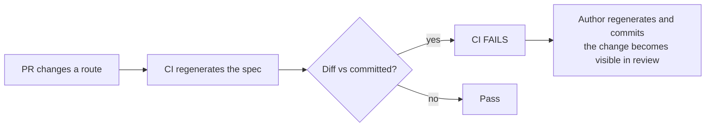

# API Contracts — api-refactor-foundations (F-018)

**Date:** 2026-08-18 · **Author:** Neo (Architect)

---

## No new API endpoints

**F-018 adds, removes and modifies zero HTTP endpoints.** It is test, CI and governance work. The PRD's NFR is explicit: *"No production code path may change behaviour."*

Its relationship to the API surface is the reverse of the usual one: rather than *adding* contracts, F-018 **captures the existing surface as a committed artifact** so that F-019 and F-020 cannot change it unnoticed.

---

## What F-018 does to the API surface: records it

Today the API contract exists only as code plus a Swagger UI available in `Development`. There is **no committed OpenAPI specification**, which means:

- A route change is invisible in review unless a reviewer reads the endpoint code.
- The mobile client's route mismatch (**F-015**) — every `MobileApp` path omits the `api/v1/` prefix and some target verbs the backend does not expose — went undetected for the life of the project because no artifact ever made the contract diffable.

F-018 fixes the *visibility*, not the routes.

### Generation mechanism (spike-proven)

```
host = WebApplicationFactory<Program>            // needs JWT_PUBLIC_KEY set first
doc  = host.Services.GetRequiredService<ISwaggerProvider>().GetSwagger("v1")
```

| Property | Value |
|---|---|
| Requires HTTP request | **No** |
| Requires `Development` environment | **No** |
| Requires a running container / database | **No** — the host boots against an unreachable Mongo because no request is issued |
| Requires a new NuGet package | **No** — `AddSwaggerGen()` is already registered unconditionally (`Booking/Program.cs:48`; only `UseSwagger()` is Development-gated) |
| Deterministic | Yes for path sets, verified across consecutive generations. **Full-document byte-stability is still to be pinned** — see Open Items |

Rejected: `Microsoft.Extensions.ApiDescription.Server` (would be a sixth dependency) and `dotnet swagger tofile` (a global tool, and it would still need the JWT key).

### Verified output shape

For `Booking`, the generated document contains **1 path with 3 operations**:

| Verb | Path | Operation ID |
|---|---|---|
| POST | `/api/v1/booking/appointments` | `BookAppointment` |
| PUT | `/api/v1/booking/appointments` | `UpdateAppointment` |
| DELETE | `/api/v1/booking/appointments` | `CancelAppointment` |

Two things this confirms, both worth recording so neither is later mistaken for a gap:

1. **The trailing-slash route variants normalise into one path.** `Booking/Program.cs` maps `POST /appointments`, `PUT /appointments/` and `DELETE /appointments/`; the spec collapses these to a single path with three operations. Complete, not lossy.
2. **`/health` and `/alive` are absent.** Health-check endpoints are not API-explorer visible. Expected — the spec describes the API surface, not the operational surface. F-013's `verification.md` remains the record for those two.

---

## The contract the harness exercises (existing, unchanged)

Recorded because the harness asserts against it, so it is the effective contract-under-test.

| Service | Endpoints | Auth | Tiers applied |
|---|---|---|---|
| **Booking** | `POST` / `PUT` / `DELETE /api/v1/booking/appointments` | `RequireAuthorization` + `OwnershipGuard.AssertOwnerAny` | 1, 2, 3 |
| **Calendar** | `GET /api/v1/calendar/availability/{email}`, `GET /api/v1/calendar/appointments/{email}` | Authenticated, **not ownership-guarded** (an IDOR that **F-016** fixes) | 1, 2 (seed-then-read), 3 |
| **Customer** | writes + reads | `OwnershipGuard.AssertOwner` | 1, 2, 3 |
| **Provider** | writes + reads | `OwnershipGuard.AssertOwner` | 1, 2, 3 |
| **Services** | writes + reads | `OwnershipGuard.AssertOwner` ×2 | 1, 2, 3 |
| **Profession** | reads + seeded reference data | mixed | 1, 2, 3 |
| **Identity** | `POST /register`, `/login`, `/refresh`, `/logout`, `/device-token` | mixed; `/device-token` requires JWT | 1, 2 — **no tier 3** |

> **Identity has no tier 3, and this corrected a factual error.** The first PRD draft asserted the audit tier applied to all seven services. Identity registers `AddEventStore` **zero** times (each of the other six registers it once) and uses its own `IdentityDb`. Tier 3 is **inapplicable**, not merely unwritten.

### Status codes the harness asserts

Tier 1 pins **status codes**, deliberately **not** response envelopes — F-019 introduces `DataResponse<T>`, which changes every envelope by design. Asserting the envelope now would produce tests that must be rewritten in F-019 and could not distinguish "F-019 broke behaviour" from "F-019 changed the shape as intended."

| Case | Expected | Notes |
|---|---|---|
| Authenticated, valid, owned resource | 200 / 201 / 202 / 204 per endpoint | Exact code per route |
| No token | **401** | |
| **Expired** token | **401** | Only testable because the token factory can backdate — `ClockSkew = TimeSpan.Zero` |
| Token for a **different** subject on an ownership-guarded route | **403** | Real targets exist: Booking ×3, Provider, Services ×2, Customer |
| Invalid body | 400 / `ValidationProblem` | Currently via `MiniValidator`; `Validot` replaces it in F-019 |

⚠️ **A caveat on durability, carried from Progressive Thinking Conflict B.** "Assert status codes, not envelopes" assumes F-019 preserves status codes. If F-019 changes e.g. `Created` → `Ok` with an envelope, these assertions break too — and F-019's design does not exist yet. The mitigation is that such a break is then a *deliberate, visible* contract change appearing in both the failing test and the spec diff, which is the outcome we want.

---

## Contract drift enforcement



The point is **review visibility**, not immutability. Routes may change; they may not change *silently*. This carries an obligation onto F-019/F-020: **an unreviewed spec diff is a defect.** A regenerated spec nobody reads defeats the reason the spec was adopted.

---

## Open items for Plan

1. **Spec file location and naming** are unfixed — e.g. `docs/api/<service>.openapi.json`. AC-17 cannot be written until decided.
2. **Byte-level determinism must be pinned and proven.** The spike verified stable *path sets*, not that a full document serialises identically across runs. AC-19's drift check produces false failures otherwise, so this needs its own verification — the same "reasoned, not observed" trap that made threat T-004 wrong in F-013.
3. **Whether the drift check covers all seven services or starts with Booking.** Seven multiplies the surface; one leaves six services undefended.
