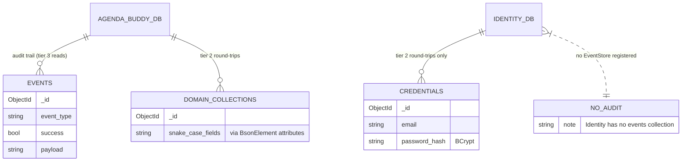

# Data Model — api-refactor-foundations (F-018)

**Date:** 2026-08-18 · **Author:** Neo (Architect)

---

## No data model changes

**This feature operates entirely on the existing schema.** F-018 adds an integration-test harness, renames a namespace, generates OpenAPI specs, and amends governance documents. It creates no collection, adds no field, changes no `[BsonElement]` mapping, and alters no serialized document.

**Why there is genuinely nothing here, rather than nothing yet:**

- The harness's purpose is to **observe** existing persistence, not extend it. Tier 2 asserts that a write followed by a read returns the same data through the current schema; tier 3 asserts that the existing `events` document is written.
- The `Persitency` → `Persistence` rename is a **directory and namespace** change. It touches no MongoDB collection name, no configuration key, and no BSON attribute. Verified: `git grep Persitency` returns matches in exactly 11 `.cs` files and **zero** in any `.json`, `.yml`, `.csproj` or `.slnf`, so nothing serialized or configured depends on the spelling.
- The PRD's NFR is explicit: *"The rename MUST be behaviour-preserving: no collection name, configuration key, or serialized document changes."*

---

## Existing schema the harness depends on

F-018 changes none of this, but the harness **reads** it, so a change here would break the harness. Recorded so the coupling is visible.

| Database | Owner | Used by the harness for |
|---|---|---|
| `agenda_buddy` | Booking, Calendar, Customer, Provider, Services, Profession | Tier 2 round-trips and tier 3 audit reads |
| `IdentityDb` | Identity only | Tier 2 round-trips. **No tier 3** — Identity registers `AddEventStore` zero times and has no audit trail |

| Collection | Read by | Notes |
|---|---|---|
| `events` | **Tier 3**, via a direct `MongoDB.Driver` query | The audit trail. Read directly rather than through `IEventStore`, because F-019/F-020 refactor that abstraction |
| Domain collections (appointments, providers, customers, services, professions) | Tier 2 | Names come from configuration; the harness must read them from config, not hardcode them |

> The `events` field list above is indicative, not authoritative — it is not asserted anywhere in F-018 beyond "a document was written for this command". Pinning the exact audit document shape would couple the harness to a structure F-019/F-020 may legitimately change.

---

## Test-time data, and why none of it is persisted

The harness creates transient data that must never reach a real database:

| Artifact | Lifetime | Persisted? |
|---|---|---|
| RSA keypair | Test session, in memory | **No — explicitly never written to disk.** The Atlas credential remains unrotated and in git history; a committed test keypair would be a second secret-shaped artifact and would trip F-017's future secret scanner |
| JWT tokens (valid / expired / foreign-subject) | Per assertion, in memory | No |
| MongoDB container | One per test **class** | No — the container is discarded, and Testcontainers' resource reaper must remove it even on an abnormal exit (AC-13) |
| Per-test database | One per test, inside the shared container | No — this is the isolation mechanism that replaced container-per-test |
| Recorded Kafka calls | Per test, in the `KafkaClientFake` | No — no broker exists to write to |

**Nothing in F-018 writes to the real Atlas cluster.** Worth stating plainly: that cluster is a **live** cluster with **no backups**, still reachable with a credential that remains valid in public git history. *(It holds only synthetic/development data — confirmed 2026-08-18 — so the risk is destroying the dev dataset, not exposing real people.)* Every connection string the harness uses comes from a Testcontainer.

---

## Migration notes

**No migrations required.** MongoDB is schemaless here and no document shape changes.

One near-miss worth recording: the `Persitency` → `Persistence` rename *looks* like it could affect persistence and does not. The type is `EventAndCommands.Persitency.EventStore`; its collection name comes from configuration (`EventsCollection`), not from the namespace. Renaming the namespace changes the CLR type's full name only. Nothing serialized stores a type name, so no document becomes unreadable.

---

## A stale artifact this touches on but does not fix

`scripts/seed/seed-mongo.sh` hardcodes `mongo:27017` and seeds `ProviderDb` / `CustomerDb` — **databases no service reads** (every service reads `agenda_buddy`; Identity reads `IdentityDb`). It is dead and misleading, and someone could reasonably mistake it for a way to seed the harness.

**Out of scope for F-018** — the harness seeds through its own fixtures and never invokes this script. Carried forward as existing tech debt (already recorded in OVERVIEW.md), noted here only so a future reader does not wire it into the harness by mistake.
