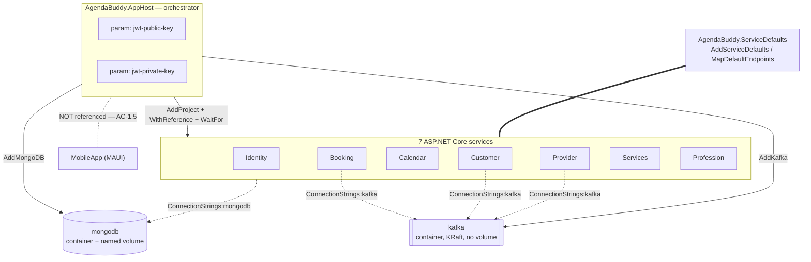
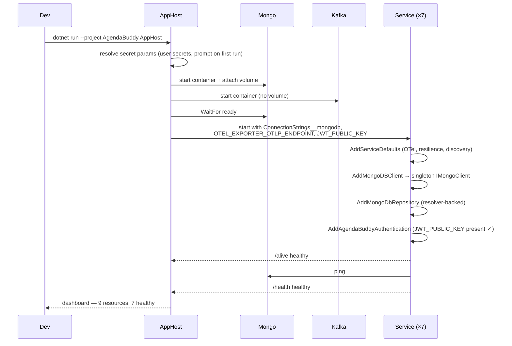

# Architecture — Aspire Wiring (F-013)

**Author:** Neo (Architect)
**Date:** 2026-08-15
**Status:** Approved (pre-approved by user instruction)
**PRD:** [PRD_aspire-wiring_2026-08-15.md](../../prds/PRD_aspire-wiring_2026-08-15.md)
**Context catalog:** `docs/pdlc/context/` @ `997e933`

> **Verification caveat (OQ-3 / A-5).** No network lookup was performed this session, so **exact Aspire package names, versions, and API signatures below are unverified** and written against the Aspire 9.x-line conventions. Task **T-01** resolves them empirically *before* any other code is written. Treat every `Aspire.*` identifier here as a placeholder to be confirmed, not as a citation.

---

## 1. Design constraint that shapes everything

`PRD` **AC-5.3**: the diff must touch **no file** under `EventAndCommands/Commands/`, `EventAndCommands/Queries/`, or `Library/Services/`.

That rules out the obvious approach (inject `IMongoDatabase` into services, adopt `IOptions<T>`, refactor the handler graph). The design is therefore confined to three seams:

1. **Composition root** — the 7 `Program.cs` files and their `Extensions/ServiceCollectionExtension*.cs`.
2. **Infrastructure adapters** — the 7 `Configuration/MongoDbConfiguration.cs` classes, `EventAndCommands/Persitency/EventStore.cs`, and `Kafka/KafkaClient.cs`.
3. **New projects** — `AgendaBuddy.AppHost`, `AgendaBuddy.ServiceDefaults`.

Everything else is untouched. `IRepository<T>`, `MongoDbRepository<T>`, all 13 domain services, all 21 command/query handlers, `RequestCollection`, `EventsHelper`, `CacheAside`, and every entity keep their current signatures.

## 2. Target topology



**Resource inventory: 9** (7 services + mongodb + kafka), matching AC-1.2.

**Kafka references only on Booking, Customer, Provider** (A-3) — the three services that register `IKafkaClient` (`Booking/Program.cs:17`, `Customer/Program.cs:20`, `Provider/Program.cs:21`).

**No Kafka volume** (E-10): `KafkaClient.CreateTopicIfNotExist` treats an already-existing topic as failure (`Kafka/KafkaClient.cs:35-36`), returning HTTP 400 from provider/customer registration. A persisted volume would make that pre-existing defect fire on every restart. Ephemeral Kafka keeps registration idempotent across runs. **Mongo does get a volume** — losing seeded data every restart would be worse.

## 3. Component design

### 3.1 `AgendaBuddy.ServiceDefaults`

A plain class library (`Microsoft.NET.Sdk`, `net10.0`) referenced by all 7 API projects. Two public extension methods.

```csharp
public static class Extensions
{
    /// <summary>
    /// Registers OpenTelemetry (traces, metrics, logs) with OTLP export, default
    /// health checks, service discovery, and standard HttpClient resilience.
    /// Call immediately after WebApplication.CreateBuilder.
    /// </summary>
    public static TBuilder AddServiceDefaults<TBuilder>(this TBuilder builder)
        where TBuilder : IHostApplicationBuilder;

    /// <summary>
    /// Maps /health (readiness — runs all checks) and /alive (liveness — the
    /// "live" tag only). Both are mapped unconditionally; see §7 Security.
    /// </summary>
    public static WebApplication MapDefaultEndpoints(this WebApplication app);
}
```

Contents:
- **OpenTelemetry** — ASP.NET Core, `HttpClient`, and runtime instrumentation; OTLP exporter driven by `OTEL_EXPORTER_OTLP_ENDPOINT`, which the AppHost injects automatically. Logs include formatted message and scopes.
- **Health checks** — a default `self` check tagged `live`. Mongo readiness is added *per service* (§3.3), not here, because ServiceDefaults must not depend on `MongoDB.Driver`.
- **Service discovery** + **`HttpClient` standard resilience** as the default for all clients.

> **Deliberate omission:** ServiceDefaults takes **no dependency on `MongoDB.Driver`**. Keeping it storage-agnostic means the R-1 escape hatch (§8) does not touch this project at all.

Per `CONSTITUTION.md` §5, both public methods carry XML doc comments.

### 3.2 `AgendaBuddy.AppHost`

An Aspire AppHost project (`Aspire.AppHost.Sdk`, `net10.0`, `IsAspireHost`).

**Versions and package names, verified in T-01** against SDK 10.0.400. Aspire's current stable line is **13.4.6**:

| Where | Reference |
|---|---|
| `AgendaBuddy.AppHost` | `<Sdk Name="Aspire.AppHost.Sdk" Version="13.4.6" />` + `Aspire.Hosting.AppHost` 13.4.6 |
| `AgendaBuddy.AppHost` | `Aspire.Hosting.MongoDB` 13.4.6, `Aspire.Hosting.Kafka` 13.4.6 |
| `AgendaBuddy.ServiceDefaults` | `Microsoft.Extensions.Http.Resilience` 10.9.0, `Microsoft.Extensions.ServiceDiscovery` 10.9.0, `OpenTelemetry.Exporter.OpenTelemetryProtocol` / `.Extensions.Hosting` / `.Instrumentation.AspNetCore` / `.Instrumentation.Http` / `.Instrumentation.Runtime` 1.17.0 |
| The seven services | **no Aspire package** — project reference to ServiceDefaults only (§3.4) |

T-01 also confirmed the ServiceDefaults set restores cleanly alongside `MongoDB.Driver` 2.25.0, which matters because all seven services reference it. `Aspire.Hosting.Kafka` sits in the AppHost only, so it never meets the `KafkaFlow` 3.0.7 graph the `Kafka` project uses.

```csharp
var builder = DistributedApplication.CreateBuilder(args);

// JWT keys as parameters — AppHost supplies them so AC-1.1 (zero env vars) holds.
var jwtPublicKey  = builder.AddParameter("jwt-public-key",  secret: true);
var jwtPrivateKey = builder.AddParameter("jwt-private-key", secret: true);

// Mongo: persistent volume so seeded data survives restarts.
var mongo = builder.AddMongoDB("mongodb")
                   .WithDataVolume();
// Resource name is hyphenated (ASPIRE006); the second argument keeps the physical DB name.
var agendaDb   = mongo.AddDatabase("agenda-buddy", "agenda_buddy");
var identityDb = mongo.AddDatabase("IdentityDb");

// Kafka: NO volume — see E-10.
var kafka = builder.AddKafka("kafka");

void AddApi<TProject>(string name, IResourceBuilder<IResourceWithConnectionString> db,
                      bool needsKafka = false, bool needsPrivateKey = false)
    where TProject : IProjectMetadata, new()
{
    var svc = builder.AddProject<TProject>(name)
        .WithReference(db).WaitFor(mongo)
        .WithEnvironment("JWT_PUBLIC_KEY", jwtPublicKey);

    if (needsPrivateKey) svc.WithEnvironment("JWT_PRIVATE_KEY", jwtPrivateKey);
    if (needsKafka)      svc.WithReference(kafka).WaitFor(kafka);
}

AddApi<Projects.Identity>  ("identity",   identityDb, needsPrivateKey: true);
AddApi<Projects.Booking>   ("booking",    agendaDb,   needsKafka: true);
AddApi<Projects.Customer>  ("customer",   agendaDb,   needsKafka: true);
AddApi<Projects.Provider>  ("provider",   agendaDb,   needsKafka: true);
AddApi<Projects.Calendar>  ("calendar",   agendaDb);
AddApi<Projects.Services>  ("services",   agendaDb);
AddApi<Projects.Profession>("profession", agendaDb);

builder.Build().Run();
```

Design notes:
- **Two logical databases on one Mongo resource.** The catalog records `agenda_buddy` for the six domain services and `IdentityDb` for Identity (`05-data-model.md`). Modelling both preserves that split rather than silently merging it.
- **`WaitFor(mongo)`** addresses E-6. It narrows but does not close the readiness window — the health check covers the remainder.
- **JWT keys are `secret: true` parameters.** Aspire stores them in user secrets on first prompt, so they are supplied once per machine and never committed. This is what makes AC-1.1 achievable without an `.env` file (E-9).
- **No port pinning** (E-4) — Aspire assigns host ports dynamically, which resolves AC-1.4. Consequence: `scripts/seed/seed-mongo.sh` assumes `mongo:27017` and will need the assigned port. Documented, not fixed (E-8).
- **`MobileApp` is absent** by construction (AC-1.5).
- **Resource names accept only ASCII letters, digits, and hyphens** — an underscore is a build **error** (`ASPIRE006`), not a warning. `AddDatabase("agenda_buddy")` therefore fails. `AddDatabase(name, databaseName)` separates the two: the resource is `agenda-buddy`, the physical Mongo database stays `agenda_buddy`, so nothing downstream changes. `IdentityDb` needs no change — mixed case is legal. Verified empirically in T-01.

### 3.3 Configuration resolution — the core change

**Current state.** Two incompatible shapes, and the code reads the one that only exists in Development:

| Consumer | Reads | Present in |
|---|---|---|
| 6 × `MongoDbConfiguration` (`Booking/Configuration/MongoDbConfiguration.cs:7`) | root `MongoDB:ConnectionString` | `appsettings.Development.json` **only** |
| 6 × `ServiceCollectionExtension` (`Booking/Extensions/ServiceCollectionExtension.cs:10,14,18,22`) | root `MongoDB:*` | `appsettings.Development.json` **only** |
| `EventStore` (`EventAndCommands/Persitency/EventStore.cs:9-11`) | root `MongoDB:*` | `appsettings.Development.json` **only** |
| Identity (`Identity/Configurations/MongoDbConfiguration.cs:7`) | root `MongoDbSettings:*` | `appsettings.json` ✅ |
| `ConfigurationLoader` (dead) | `LibrarySettings:MongoDB:*` | `appsettings.json` |

**Target state.** A single shared resolver with an ordered fallback chain, added to `Library` (new file — permitted, since `Library/Services/` is what AC-5.3 protects, not all of `Library`):

```csharp
// Library/Configuration/MongoConnectionResolver.cs — NEW
namespace Library.Configuration;

public static class MongoConnectionResolver
{
    /// <summary>Resolution order, first non-empty wins.</summary>
    private static readonly string[] Keys =
    [
        "ConnectionStrings:mongodb",              // Aspire-injected (primary)
        "MongoDbSettings:ConnectionString",       // Identity's existing shape
        "MongoDB:ConnectionString",               // legacy Development shape
        "LibrarySettings:MongoDB:ConnectionString" // legacy appsettings.json shape
    ];

    /// <summary>
    /// Resolves the MongoDB connection string, or throws with an actionable
    /// message naming every key that was tried. Never returns null.
    /// </summary>
    public static string Resolve(IConfiguration configuration)
    {
        foreach (var key in Keys)
        {
            var value = configuration[key];
            if (!string.IsNullOrWhiteSpace(value)) return value;
        }

        throw new InvalidOperationException(
            "No MongoDB connection string found. Set one of: " +
            string.Join(", ", Keys) +
            ". When running under AgendaBuddy.AppHost this is injected automatically; " +
            "to run this service standalone set ConnectionStrings__mongodb.");
    }

    /// <summary>
    /// Resolves a named setting (database or collection name) with the same fallback
    /// discipline, returning <paramref name="default"/> when no prefix yields a value.
    /// </summary>
    public static string ResolveSetting(IConfiguration configuration, string name, string @default)
    {
        foreach (var prefix in SettingPrefixes)          // "MongoDbSettings", "MongoDB",
        {                                               // "LibrarySettings:MongoDB"
            var value = configuration[$"{prefix}:{name}"];
            if (!string.IsNullOrWhiteSpace(value)) return value;
        }
        return @default;
    }
}
```

**`ResolveSetting`'s signature is pinned here because it is the contract T-04 tests and T-05 consumes** (standup finding — it was previously elided). Three rules it must honor:

1. **`name` is per-call, never a fixed convention.** Identity reads `MongoDbSettings:CollectionName` (`Identity/Extensions/ServiceCollectionExtension.cs:12`) while the domain services read per-entity names such as `ProvidersCollection` and `ProfessionsCollection` (`Profession/Extensions/ServiceCollectionExtensions.cs:14`). A single hardcoded naming scheme breaks Identity and Profession.
2. **It returns `@default`, it does not throw.** Only `Resolve` throws — a missing collection name has a sane default, a missing connection string does not.
3. **Argument order is `(configuration, name, @default)`** — fixed, so T-04 and T-05 cannot diverge.

This single class satisfies **AC-2.5** (named-key failure, never a null throw), **AC-4.1** (works in any environment), and **AC-4.2** (no possibly-null `MongoClient` construction) for all seven services at once.

Each `MongoDbConfiguration` gains an **additive** `IMongoClient` constructor. The existing `IConfiguration` constructor stays, body unchanged:

```csharp
public class MongoDbConfiguration : IMongoDbConfiguration
{
    private readonly MongoClient _client;

    /// <summary>Injected path — the process-wide singleton client (new).</summary>
    public MongoDbConfiguration(IMongoClient client) => _client = (MongoClient)client;

    /// <summary>
    /// Legacy path, retained verbatim so the three existing tests that construct this
    /// class with a mocked IConfiguration keep compiling AND passing (AC-5.2).
    /// </summary>
    public MongoDbConfiguration(IConfiguration configuration)
        => _client = new MongoClient(configuration.GetSection("MongoDB")["ConnectionString"]!);

    public MongoClient MongoClient() => _client;   // signature preserved
}
```

⚠️ **Corrected at the Wave 2 standup (2026-08-17) — the earlier version of this section was wrong.** It replaced the primary constructor with `MongoDbConfiguration(IMongoClient client)` and claimed "the six `MongoDbConfigurationTest.cs` files continue to compile." They do not. The coupling was never the interface — it is the **concrete constructor**. Three tests instantiate the class directly with a mocked `IConfiguration`: `Booking.Tests/Configuration/MongoDbConfigurationTest.cs:17`, `Customer.Tests/Configurations/MongoDbConfigurationTest.cs:17`, `Profession.Tests/Configurations/MongoDbConfigurationTest.cs:17`. (Calendar/Provider/Services' equivalents are empty `METHOD(){}` stubs that never instantiate it, so 3 of 6 are affected.) Swapping the ctor breaks their compile, which AC-5.2 forbids.

Two further traps, both load-bearing for T-05:

- **Do not route the legacy ctor through `MongoConnectionResolver`.** It would compile and still fail at runtime: those mocks stub only `GetSection("MongoDB")`, whereas the resolver uses indexer lookups (`configuration["MongoDB:ConnectionString"]`), which a bare `Mock<IConfiguration>` returns null for — so `Resolve` throws by design. The legacy body must keep its `GetSection` form character-for-character.
- **`MongoClient()` still returns the concrete type**, so the `(MongoClient)` cast remains. Registering an `IMongoClient` test double anywhere in the DI graph would make it throw `InvalidCastException`. Accepted as debt (changing the return type to `IMongoClient` touches the interface and its dependents); T-04 must therefore inject a real `MongoClient`, not a mock, wherever it exercises this class.

Each `ServiceCollectionExtension` changes only how it obtains the client and database:

```csharp
public static IServiceCollection AddMongoDbRepository(this IServiceCollection services, IConfiguration configuration)
{
    // Shared client — registered once by AddMongoDbClient (§3.4), no longer constructed here.
    var dbName = MongoConnectionResolver.ResolveSetting(configuration, "DatabaseName", "agenda_buddy");

    services.AddScoped<IRepository<ProviderEntity>>(sp =>
        new MongoDbRepository<ProviderEntity>(
            sp.GetRequiredService<IMongoClient>().GetDatabase(dbName),
            MongoConnectionResolver.ResolveSetting(configuration, "ProvidersCollection", "providers")));
    // … same for the service's other repositories, unchanged in count and lifetime
}
```

The `MongoDbRepository<T>(IMongoDatabase, string)` constructor (`Library/Repositories/MongoDbRepository.cs:15`) is already the one in use, so its signature is untouched.

⚠️ **`Profession` is not a mechanical case — surfaced at the Wave 2 standup.** `Profession/Extensions/ServiceCollectionExtensions.cs:24` ends with `SeedDataAsync(database, configuration).Wait()` — a blocking sync-over-async seed executed at **DI-registration time**, against the eagerly-constructed `database`. Once the client is a lazily-resolved singleton there is no `IServiceProvider` in scope at that point, so the call cannot simply be rewritten in place. T-05 must relocate it. Options, in preference order:

1. **Hosted service** (`IHostedService`/`BackgroundService`) registered here and run after `builder.Build()` — resolves `IMongoClient` from DI properly and makes the seed genuinely async. Preferred.
2. **Explicit post-`Build()` call** in `Profession/Program.cs`, awaited before `app.Run()`. Simpler, but moves logic into the entry point.

Either way the `.Wait()` disappears, which is an incidental fix to a real deadlock risk. This is the one place in T-05 where the refactor is a design decision rather than a substitution — budget for it.

### 3.4 Shared `IMongoClient` and the `EventStore` fix

**Today** `EventStore` is `Scoped` (`EventAndCommands/ServiceCollectionExtensions.cs:9`) and its constructor builds a **new `MongoClient` per request scope** (`EventStore.cs:9`). Since every command and query handler writes an audit event, that is one client — with its own connection pool and monitoring threads — **per HTTP request**. The catalog names this the most significant resource leak in the codebase (`15-cqrs-and-messaging.md`).

**Target:**

```csharp
public class EventStore : IEventStore
{
    private readonly IMongoCollection<Event> _eventCollection;

    public EventStore(IMongoClient client, IConfiguration configuration)   // ← injected
    {
        var database = client.GetDatabase(
            MongoConnectionResolver.ResolveSetting(configuration, "DatabaseName", "agenda_buddy"));
        _eventCollection = database.GetCollection<Event>(
            MongoConnectionResolver.ResolveSetting(configuration, "EventsCollection", "events"));
    }
    // SaveAsync / GetEventsAsync unchanged
}
```

`EventStore` stays `Scoped` (lifetime unchanged, so no behavioural surprise) but now receives the process-wide singleton client. This satisfies **AC-4.3**.

> This is the single highest-value line in the feature. It is also the only change inside `EventAndCommands/` — and it is in `Persitency/`, **not** `Commands/` or `Queries/`, so AC-5.3 holds.

Client registration, per service `Program.cs`:

```csharp
builder.AddServiceDefaults();                       // NEW — first
builder.Services.AddSingleton<IMongoClient>(_ =>    // NEW — R-1 escape hatch (see below)
    new MongoClient(MongoConnectionResolver.Resolve(builder.Configuration)));
builder.Services.AddMongoDbRepository(builder.Configuration);   // existing call, new internals
```

> **R-1 RESOLVED (T-01, 2026-08-17) — the escape hatch is taken. `Aspire.MongoDB.Driver` is not used.**
>
> The Aspire client integration is incompatible with the pinned driver, empirically and unambiguously:
>
> - `Aspire.MongoDB.Driver` **13.4.6** (latest) depends on `MongoDB.Driver >= 3.9.0` on every target framework group (`net8.0`/`net9.0`/`net10.0`). Referencing it alongside the pinned 2.25.0 **fails restore**: `error NU1605: Detected package downgrade: MongoDB.Driver from 3.9.0 to 2.25.0` — warning-as-error, so it is a hard stop, not a nuisance.
> - The 2.x-era alternative does not rescue it. `Aspire.MongoDB.Driver` **9.5.2** requires `MongoDB.Driver [2.30.0, 3.0.0)` — still a downgrade conflict with 2.25.0 — and would mean pinning Aspire to a 9.x release under a .NET 10 SDK.
> - `Aspire.MongoDB.Driver.v3` is retired (last version 9.5.2); the 3.x driver is now the mainline package's only supported target.
>
> Per the T-01 decision gate, the driver stays at **2.25.0** and the three CVE pins in `Directory.Build.props` remain load-bearing. `AddMongoDBClient` is therefore never called; the singleton above is the only registration path, and `MongoHealthCheck` (§3.5) replaces the integration's built-in check. **The single-path outcome is simpler than the conditional design it replaces** — there is no longer an "either/or" for reviewers to hold in mind.
>
> **What Aspire is *not* losing:** the *hosting* side is unaffected. `Aspire.Hosting.MongoDB` also lists `MongoDB.Driver 3.9.0`, but it resolves only inside the AppHost's own dependency graph. A probe with the repo's real `Directory.Build.props` resolved **3.9.0 in the AppHost and 2.25.0 in the referenced service**, with no `NU1605` and a **0-warning build**. So `AddMongoDB`/`AddKafka` container resources, `WithReference` connection-string injection, and the dashboard all remain available exactly as §3.2 describes.

`IMongoClient` is a process-wide singleton, which is what makes AC-4.3 meaningful.

### 3.5 Health checks

In each service's `Program.cs`, after the `IMongoClient` registration:

```csharp
builder.Services.AddHealthChecks()
    .AddCheck<MongoHealthCheck>("mongodb", tags: ["ready"]);
```

and after `builder.Build()`:

```csharp
app.MapDefaultEndpoints();   // /health (all checks) + /alive (live-tagged only)
```

`MongoHealthCheck` (new, in `Library/Diagnostics/`) issues `db.adminCommand("ping")` via the injected `IMongoClient`.

**Caching (threat T-002) — specified here, previously unspecified.** An unthrottled probe endpoint lets an anonymous caller drive one Mongo round-trip per request. The check therefore caches its last result for a **5-second** window. Constraints the standup established:

- **Register it as a singleton** so the cache is process-wide. A per-request instance caches nothing.
- **Do not use a `static` field and do not read the wall clock directly.** Take an injected `TimeProvider` (defaulting to `TimeProvider.System`) so the window is deterministic under xUnit's parallel execution.
- **Fail open on the cache, not the probe:** a cached *unhealthy* result must still expire after 5s, or a recovered database keeps reporting unhealthy for as long as traffic continues.
- **T-03 owns its test**, asserting via call-count that two probes inside the window produce exactly one `RunCommandAsync` — never by sleeping. Wall-clock assertions are what made `AvailabilityScheduleTest` timezone-fragile (`11-testing.md:105`).

Separation matters (R-6, AC-3.2/3.3): `/alive` must stay healthy when Mongo is down, or an orchestrator would restart a process that is running correctly and merely waiting on its database. `/health` must go unhealthy so it stops receiving traffic.

### 3.6 `KafkaClient` configuration (AC-5.5)

**Today** (`Kafka/KafkaClient.cs:12`): `BootstrapServers = "localhost:9092"` — hardcoded, in a parameterless class. `CONSTITUTION.md` §9 flags this as blocking non-local deployment.

**Target** — minimal, preserving `IKafkaClient`:

```csharp
public class KafkaClient(IConfiguration? configuration = null) : IKafkaClient
{
    private string BootstrapServers =>
        configuration?["ConnectionStrings:kafka"]
        ?? configuration?["Kafka:BootstrapServers"]
        ?? "localhost:9092";
    // CreateTopicIfNotExist unchanged apart from using the property
}
```

The optional parameter keeps `new KafkaClient()` valid, so `Kafka.Tests/KafkaClientTest.cs` and the `AddSingleton<IKafkaClient, KafkaClient>()` registrations continue to work unchanged (AC-5.2).

⚠️ **Deliberately not fixed here** (all pre-existing, all out of scope): the topic-name collision across email domains (`KafkaHelper.cs:17`), the already-exists-treated-as-failure branch (`KafkaClient.cs:35-36`), the unguarded `e.Results[0]` (`:35`), the per-call `AdminClient` construction (`:15`), and the fact that no message is ever produced or consumed.

### 3.7 CI (AC-5.4, R-8)

`.github/workflows/dotnet.yml` — extend the `api` filter (`:34-48`) with:

```yaml
- 'AgendaBuddy.AppHost/**'
- 'AgendaBuddy.ServiceDefaults/**'
- 'global.json'
- 'Directory.Build.props'
- 'Dockerfile*'
- '*/Dockerfile'
- 'docker-compose*.yml'
- '.github/workflows/**'
```

Add to `build-and-test`:

```yaml
- name: Build AppHost
  run: dotnet build AgendaBuddy.AppHost/AgendaBuddy.AppHost.csproj -c Release /p:MobileWorkloads=false

- name: Assert AppHost does not reference MobileApp        # AC-1.5
  run: |
    if dotnet list AgendaBuddy.AppHost/AgendaBuddy.AppHost.csproj reference | grep -q MobileApp; then
      echo "AppHost must not reference MobileApp"; exit 1
    fi

- name: Assert no committed credentials                     # AC-2.1 / AC-2.2
  run: |
    if git grep -n 'mongodb+srv://[^ ]*:[^@]*@' -- . ; then
      echo "Credential found in tracked files"; exit 1
    fi
```

**No workload install is needed on the runner — resolved at T-01.** Aspire has been NuGet-only since 9.0: `dotnet workload search aspire` returns an empty list on SDK 10.0.400, and the AppHost probe built with nothing installed beyond the SDK. The AppHost acquires everything it needs from `<Sdk Name="Aspire.AppHost.Sdk" Version="13.4.6" />` plus its `PackageReference`s, so `dotnet restore` is the only prerequisite. Do **not** add a `dotnet workload install aspire` step; it would fail (no such workload) and slow every run.

> Note: this does **not** add the `CONSTITUTION.md` §7 mandatory secret/dependency scan. The credential assertion above is narrow (one URI pattern), not a scanner. The §7 gap remains open and is deferred to F-017.

## 4. Data model impact

**None.** No entity changes, no new collection, no index change, no migration. The `agenda_buddy` / `IdentityDb` split is preserved exactly as `05-data-model.md` records it.

The pre-existing data-model defects — `seed-mongo.sh` writing to `ProviderDb`/`CustomerDb` that no service reads (E-8), the absent TTL index, the four entities with no collection mapping — are unchanged.

## 5. API contract impact

**No change to any existing route.** Two new endpoints per service, from `MapDefaultEndpoints()`:

| Route | Purpose | Auth | Response |
|---|---|---|---|
| `GET /health` | Readiness — all checks incl. Mongo ping | ❌ anonymous | `200 Healthy` / `503 Unhealthy` |
| `GET /alive` | Liveness — `live`-tagged checks only | ❌ anonymous | `200 Healthy` / `503 Unhealthy` |

No `api-contracts.md` is emitted: the existing contract is unchanged, and the full route inventory already lives in `docs/pdlc/context/01-api-surface.md`. Duplicating it would create a second source of truth.

## 6. Startup sequence (target)



## 7. Security considerations

Full analysis in [threat-model.md](./threat-model.md). Architecture-level decisions:

- **Secrets** — JWT keys become Aspire `secret: true` parameters (user secrets, never committed). The Mongo connection string becomes an injected resource reference. This is what deletes the credential from 14 files.
- **`/health` and `/alive` are anonymous.** Standard for orchestrator probes, but `/health` reveals dependency state to unauthenticated callers. Accepted: the response is a bare status string with no detail. ⚠️ Note the far larger pre-existing exposure — six **anonymous PII endpoints** including `GET /api/v1/providers` returning every provider's embedded appointments and customer emails (`13-security.md`). Deferred to F-016; this feature adds nothing comparable.
- **OTLP export** — traces and metrics leave the process. Locally the Aspire dashboard is the only collector. No PII should reach telemetry: the default instrumentation records route templates, not bodies. ⚠️ `MongoDB.Driver` 2.25.0 has no OTel instrumentation and none is added, so query text is not exported either.
- **Unchanged, and still wrong:** HTTPS is not configured; `UseHttpsRedirection` still sits after `UseAuthentication`; no HSTS; no rate limiting. All pre-existing, all out of scope.

## 8. Alternatives considered

| Option | Why rejected |
|---|---|
| **Fix Docker Compose instead** | Cheapest path to "one command", but delivers none of health checks, OpenTelemetry, resilience, or connection-string injection. The Development-only config defect would survive untouched, so AC-4.1 fails. Documented as the primary rejected alternative in ADR-013. |
| **Project Tye** | Archived. |
| **Shell script wrapping 7 `dotnet run`s** | No dependency provisioning, no health model, no telemetry; keeps every hardcoded port. |
| **Adopt `IOptions<T>` throughout** | The correct long-term fix for stringly-typed config, but touches far more than the three seams and would violate AC-5.3's spirit. Deferred. |
| **Upgrade `MongoDB.Driver` to 3.x** | Would likely retire three CVE pins — genuinely attractive — but it is **a second migration hiding inside this one**. Explicitly excluded; revisit as its own feature. |
| **`Aspire.MongoDB.Driver` client integration** | **Rejected on evidence (T-01, R-1 resolved).** Every available version demands a driver newer than the pinned 2.25.0 — 13.4.6 wants `>= 3.9.0` and fails restore with `NU1605`; 9.5.2 wants `[2.30.0, 3.0.0)` and also conflicts; the `.v3` variant is retired. Taking it would smuggle the excluded driver upgrade (row above) into this feature and invalidate three CVE pins. Replaced by `AddSingleton<IMongoClient>` + the custom `MongoHealthCheck` (§3.4, §3.5). Every acceptance criterion remains satisfiable, and the *hosting* integration is unaffected. |
| **Pin Aspire to 9.5.2 to stay on the 2.x driver line** | Would still require 2.30.0 (a driver bump we excluded), and pins the whole orchestration stack to a release two majors behind on a .NET 10 SDK. Rejected in T-01. |

## 9. Files touched

| File | Change | Protected by AC-5.3? |
|---|---|---|
| `AgendaBuddy.AppHost/**` | **new** | — |
| `AgendaBuddy.ServiceDefaults/**` | **new** | — |
| `Library/Configuration/MongoConnectionResolver.cs` | **new** | ✅ not under `Library/Services/` |
| `Library/Diagnostics/MongoHealthCheck.cs` | **new** | ✅ |
| `{7}/Program.cs` | +3 lines each | ✅ |
| `{6}/Configuration|Configurations/MongoDbConfiguration.cs` | ctor takes `IMongoClient` | ✅ |
| `Identity/Configurations/MongoDbConfiguration.cs` | same | ✅ |
| `{7}/Extensions/ServiceCollectionExtension*.cs` | resolver + injected client | ✅ |
| `EventAndCommands/Persitency/EventStore.cs` | injected `IMongoClient` | ✅ `Persitency/`, not `Commands/`/`Queries/` |
| `Kafka/KafkaClient.cs` | optional `IConfiguration` | ✅ |
| `{14} appsettings*.json` | **credential value deleted**, keys retained | ✅ |
| `agenda-buddy.sln` | +2 projects | ✅ |
| `.github/workflows/dotnet.yml` | filters + 3 steps | ✅ |
| `{7} *.csproj` | +ServiceDefaults project reference (no Aspire client package — R-1, §3.4) | ✅ |
| New tests in `{7} *.Tests/` | **new only** — no existing test edited | ✅ AC-5.2 |

**Untouched:** all of `EventAndCommands/Commands/`, `EventAndCommands/Queries/`, `EventAndCommands/Events/`, `Library/Services/`, `Library/Entities/`, `Library/Repositories/`, `Library/Tools/`, `Library.ServerAuth/`, `MobileApp/`, all `Dockerfile`s, both `docker-compose*.yml`.

## 10. Design-Laws Audit (Step 10.6)

**Triage: Skip.** No UI surface. `aspire-wiring` adds two machine-consumed endpoints and a vendor-provided dashboard this team does not design. Nielsen heuristics, the 8-state matrix, and the UX-writing pass have no applicable surface.

One UX-adjacent element **is** in scope and was reviewed by Muse in Progressive Thinking Round 1: the failure message in `MongoConnectionResolver.Resolve`. It names every key tried and tells the reader what to set (§3.3) — a developer-facing error string, and the only human-readable text this feature adds.

**Step 10.7 Variant Convergence: skipped** — gate requires Step 10.6 to have run Full.
