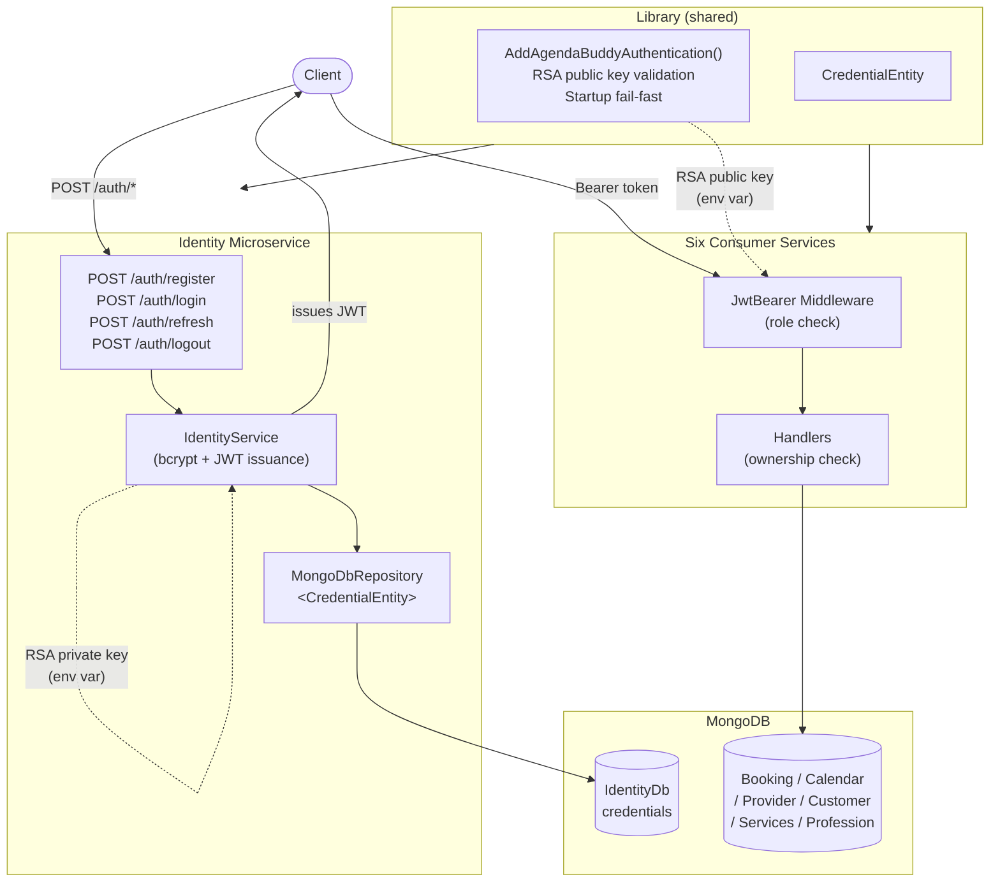

# Architecture: auth-and-identity

**Feature:** F-001
**Date:** 2026-07-30
**Status:** Draft
**PRD:** docs/pdlc/prds/PRD_auth-and-identity_2026-07-30.md

---

## Where This Feature Lives

Auth and identity spans two layers:

1. **Identity microservice** (new) — the sole issuer of credentials and tokens. Owns `POST /auth/register`, `POST /auth/login`, `POST /auth/refresh`, and `POST /auth/logout`. Backed by its own MongoDB database and credentials collection.
2. **Library shared project** (extended) — gains `AddAgendaBuddyAuthentication()`, `CredentialEntity`, and `MongoDbRepository<CredentialEntity>`. The extension method is the single integration point that all six consumer services call.

No new endpoints are added to the six existing services. Auth is enforced at the middleware layer (role) and the handler layer (entity ownership).

---

## System Integration

### New: Identity Microservice

- ASP.NET Core 8 Minimal API, same pattern as the existing six services
- Own MongoDB database (`IdentityDb`), own `appsettings.json` section (`MongoDbSettings:Identity`)
- Own Docker service in `docker-compose.yml` / `docker-compose.override.yml`
- Depends on: Library (entities + repository), `Microsoft.AspNetCore.Authentication.JwtBearer`, `BCrypt.Net-Next`
- Exposes no Kafka topics — auth is synchronous request/response only

### Extended: Library Shared Project

Three additions:

| Addition | Location | Purpose |
|----------|----------|---------|
| `CredentialEntity` | `Library/Entities/CredentialEntity.cs` | Domain entity for the credentials document |
| `MongoDbRepository<CredentialEntity>` | Reuses existing generic | No new repository class needed |
| `AddAgendaBuddyAuthentication()` | `Library/Extensions/AuthenticationExtensions.cs` | JWT Bearer DI + RSA public key + startup validation |

### Modified: Six Consumer Services

Each service's `Program.cs` gains two changes:

```csharp
// 1. After builder.Services calls:
builder.Services.AddAgendaBuddyAuthentication();

// 2. In the middleware pipeline, after UseRouting(), before MapXxx():
app.UseAuthentication();
app.UseAuthorization();
```

Antiforgery: Identity service removes `UseAntiforgery()` entirely. The other five services keep it but exempt Bearer-authenticated endpoints using `.RequireAuthorization()` — CSRF protection is redundant when credentials are sent as Bearer tokens, not cookies.

Handler-level ownership checks are added to four services:

| Service | Check |
|---------|-------|
| Booking | JWT `sub` must match `AppointmentEntity.EmailProvider` or `AppointmentEntity.EmailCustomer` |
| Calendar | JWT `sub` must match provider email on availability mutations |
| Provider | JWT `sub` must match `ProviderEntity.Email` on profile updates |
| Customer | JWT `sub` must match `CustomerEntity.Email` on profile updates |

---

## Data Flow

### Registration

```
Client
  → POST /auth/register {email, password, role}
  → Identity service
      → validate email format, password length
      → check credentials collection: email unique (409 if exists)
      → bcrypt.Hash(password, workFactor: 12)
      → insert CredentialEntity {email, passwordHash, role}
      → generate RSA-signed JWT (sub=email, role, jti, exp=+60min)
      → generate opaque refresh token → SHA-256 hash → store in embedded sub-doc (exp=+24hr)
  → 201 {accessToken, refreshToken}
```

### Login

```
Client
  → POST /auth/login {email, password}
  → Identity service
      → find credentials by email (404→401 to prevent user enumeration)
      → bcrypt.Verify(password, storedHash) (401 if false)
      → generate access token + refresh token (same as register)
      → upsert refresh token sub-doc (overwrites prior session)
  → 200 {accessToken, refreshToken}
```

### Authenticated Request (consumer service)

```
Client
  → GET /bookings/{id}  Authorization: Bearer <accessToken>
  → JwtBearer middleware (in Library)
      → decode header → assert alg == RS256 (reject alg:none, HS256)
      → verify signature with RSA public key
      → assert exp not elapsed
      → populate HttpContext.User (sub, role claims)
  → [RequireAuthorization] attribute / policy check (role)
  → Booking handler
      → fetch AppointmentEntity
      → assert HttpContext.User sub == EmailProvider || EmailCustomer (403 if not)
  → 200 {appointment}
```

### Token Refresh

```
Client
  → POST /auth/refresh {refreshToken}
  → Identity service
      → SHA-256 hash incoming token
      → FindOneAndDeleteAsync credentials where {refreshTokenHash == hash, refreshTokenExpiry > now}
      → null result → 401 (expired, already used, or not found)
      → generate new access token + refresh token
      → insert new refresh token sub-doc
  → 200 {accessToken, refreshToken}
```

### Logout

```
Client
  → POST /auth/logout {refreshToken}
  → Identity service
      → SHA-256 hash incoming token
      → UpdateOneAsync: unset refreshTokenHash, refreshTokenExpiry (idempotent — no-match is fine)
  → 204
```

---

## Architectural Decisions

| Decision | Rationale |
|----------|-----------|
| Local JWT validation on consumer services | No per-request network hop to Identity. Scales horizontally. RSA asymmetric signing means consumers never need the private key. |
| Embedded refresh token sub-document | One document per user, no join. Supports single active session (v1 scope). Rotation via `FindOneAndDeleteAsync` + insert is atomic enough for the race window we accept. |
| SHA-256 hash of opaque refresh token | Raw token never touches the DB. If the credentials collection is breached, refresh tokens cannot be replayed without the raw value. |
| Library as shared middleware host | Six services share one JWT config path. A single version bump propagates to all services at compile time — no partial deploy risk in this monorepo. |
| RS256 algorithm pinning | `alg: none` and HS256 downgrade attacks are rejected at token validation. `TokenValidationParameters.ValidAlgorithms = ["RS256"]` enforces this explicitly. |
| Startup fail-fast on missing RSA key | Catching a missing key at startup (not at first request) surfaces misconfiguration immediately. `ApplicationException` message includes the env var name so operators know exactly what to set. |
| 503 on MongoDB unavailable | Returns a structured safe error body. No stack trace, no PII. Client is responsible for backoff and retry. No in-process circuit breaker in v1. |
| Single role per account | Simplifies the claim model and ownership checks for v1. Multi-role (Provider + Customer) deferred — only a schema addition when needed. |

---

## Conformance with CONSTITUTION.md

| Constraint | How this feature satisfies it |
|------------|------------------------------|
| Service isolation | Identity owns its own MongoDB database; no cross-service DB calls |
| Shared Library pattern | `AddAgendaBuddyAuthentication()` and `CredentialEntity` live in Library; no auth logic in service projects |
| Repository pattern | `MongoDbRepository<CredentialEntity>` used for all credential DB access |
| Async all the way | All auth service methods return `Task<T>`; no blocking calls |
| BSON field names | `CredentialEntity` uses `[BsonElement("snake_case")]` attributes |
| PascalCase / `_camelCase` | Followed for all new classes and private fields |
| No PII in logs | Email and password hash never written to application logs |

---

## Component Interaction Diagram



---

## Failure Modes

| Failure | Behavior |
|---------|---------|
| MongoDB down during login/register | 503, safe error body, no retry in Identity |
| Missing `JWT_PRIVATE_KEY` at Identity startup | `ApplicationException` — service refuses to start |
| Missing `JWT_PUBLIC_KEY` at consumer startup | `ApplicationException` — service refuses to start |
| Expired access token | JwtBearer middleware → 401 |
| `alg: none` or HS256 token | `ValidAlgorithms` check → 401 |
| Concurrent refresh with same token | Second `FindOneAndDeleteAsync` returns null → 401 |
| Logout with already-deleted token | `UpdateOneAsync` matches nothing → idempotent 204 |
| Cross-provider ownership violation | Handler ownership check → 403 |

---

## Migration Notes

A one-time migration script (`Library/Tools/Migrations/SeedAuthCredentials.cs`) runs before the Identity service is first deployed. For each existing `ProviderEntity` and `CustomerEntity` record, it inserts a `CredentialEntity` with:
- `email` from the entity
- `passwordHash` = `BCrypt.HashPassword(Guid.NewGuid().ToString(), workFactor: 12)` (random, unknown to anyone)
- `role` derived from entity type (`Provider` or `Customer`)
- `mustResetPassword = true`
- No refresh token sub-document (no active session)

The script is idempotent — it skips email addresses that already have a credentials document.

---

## Out of Scope (Architecture)

- jti blocklist / immediate access token revocation — deferred
- Multi-session refresh tokens (separate collection) — deferred
- Rate limiting / brute-force protection on auth endpoints — deferred
- Auth enforcement inside EventAndCommands MediatR handlers — deferred
- OAuth / external identity providers — deferred
