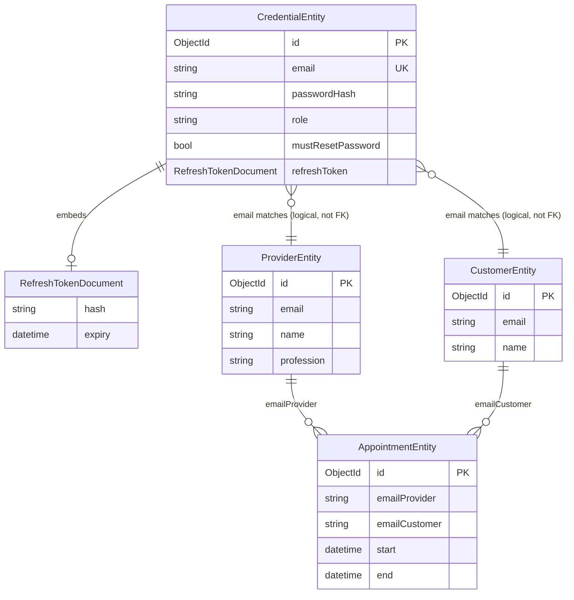

# Data Model: auth-and-identity

**Feature:** F-001
**Date:** 2026-07-30
**PRD:** docs/pdlc/prds/PRD_auth-and-identity_2026-07-30.md

---

## New Collection: `credentials`

Database: `IdentityDb`
Owner: Identity microservice

### Document Schema

```csharp
// Library/Entities/CredentialEntity.cs
public class CredentialEntity
{
    [BsonId]
    [BsonRepresentation(BsonType.ObjectId)]
    public string Id { get; set; } = null!;

    [BsonElement("email")]
    [Required]
    [EmailAddress]
    public string Email { get; set; } = null!;

    [BsonElement("password_hash")]
    [Required]
    public string PasswordHash { get; set; } = null!;

    [BsonElement("role")]
    [Required]
    public string Role { get; set; } = null!;          // "Provider" | "Customer"

    [BsonElement("must_reset_password")]
    public bool MustResetPassword { get; set; } = false;

    [BsonElement("refresh_token")]
    public RefreshTokenDocument? RefreshToken { get; set; }
}

public class RefreshTokenDocument
{
    [BsonElement("hash")]
    public string Hash { get; set; } = null!;          // SHA-256 of opaque token

    [BsonElement("expiry")]
    public DateTime Expiry { get; set; }               // UTC; TTL index target
}
```

### Field Reference

| Field | BSON Name | Type | Required | Notes |
|-------|-----------|------|----------|-------|
| `Id` | `_id` | ObjectId | Yes | Auto-generated |
| `Email` | `email` | string | Yes | Unique index; lowercase normalized |
| `PasswordHash` | `password_hash` | string | Yes | bcrypt hash, cost factor ≥ 12 |
| `Role` | `role` | string | Yes | `"Provider"` or `"Customer"` |
| `MustResetPassword` | `must_reset_password` | bool | No | `true` for migration-seeded stubs |
| `RefreshToken` | `refresh_token` | embedded doc | No | Null when no active session |
| `RefreshToken.Hash` | `refresh_token.hash` | string | — | SHA-256 hex of the opaque token |
| `RefreshToken.Expiry` | `refresh_token.expiry` | DateTime (UTC) | — | 24 hr from issuance; TTL index |

### Indexes

```javascript
// Unique index on email — enforces 409 on duplicate registration
db.credentials.createIndex({ "email": 1 }, { unique: true })

// TTL index on refresh token expiry — MongoDB auto-deletes expired sub-documents
// Note: MongoDB TTL only deletes whole documents. Expiry is enforced in application
// logic (FindOneAndDeleteAsync checks expiry > now). This index supports the query.
db.credentials.createIndex({ "refresh_token.expiry": 1 }, { expireAfterSeconds: 0 })

// Sparse index on refresh token hash for refresh/logout lookups
db.credentials.createIndex({ "refresh_token.hash": 1 }, { sparse: true })
```

> **Note on TTL behavior:** MongoDB TTL indexes delete whole documents, not sub-documents. The application enforces refresh token expiry in the `FindOneAndDeleteAsync` query predicate (`expiry > DateTime.UtcNow`). The TTL index on `refresh_token.expiry` is a performance index for that query, not the expiry mechanism.

---

## No Changes to Existing Collections

The six existing domain collections (`bookings`, `calendar`, `customers`, `providers`, `services`, `professions`) are not modified by this feature. Auth is enforced at the middleware and handler layers — no schema changes to domain entities.

The `AppointmentEntity.EmailProvider` and `AppointmentEntity.EmailCustomer` fields (already present) are used as the ownership check target in Booking handlers. No migration needed.

---

## Entity-Relationship Diagram



> Relationships between `CredentialEntity` and domain entities are logical — email is the join key at the application layer. MongoDB has no foreign key constraints. Email uniqueness across the `credentials` collection is enforced by the unique index.

---

## Migration: Seed Stub Credentials

**Script location:** `Library/Tools/Migrations/SeedAuthCredentials.cs`

**Runs:** Once, before first Identity service deployment. Idempotent — skips emails that already have a credentials document.

**Logic:**

1. Load all `ProviderEntity` records → for each, insert `CredentialEntity { email, passwordHash = BCrypt(random GUID), role = "Provider", mustResetPassword = true }`
2. Load all `CustomerEntity` records → for each, insert `CredentialEntity { email, passwordHash = BCrypt(random GUID), role = "Customer", mustResetPassword = true }`
3. Skip any email already present in `credentials` (unique index violation caught and ignored)
4. Log count of inserted vs. skipped records

No plaintext password is generated, stored, or logged at any point.

---

## Data Not Persisted

| Data | Why not persisted |
|------|------------------|
| Plaintext password | Never stored — only bcrypt hash |
| Raw refresh token | Only SHA-256 hash stored — raw token sent to client only |
| JWT access token | Stateless — validated by signature, not lookup |
| jti (JWT ID) | Not tracked server-side in v1; blocklist deferred |
| Login attempt count | Brute-force protection out of scope for v1 |
