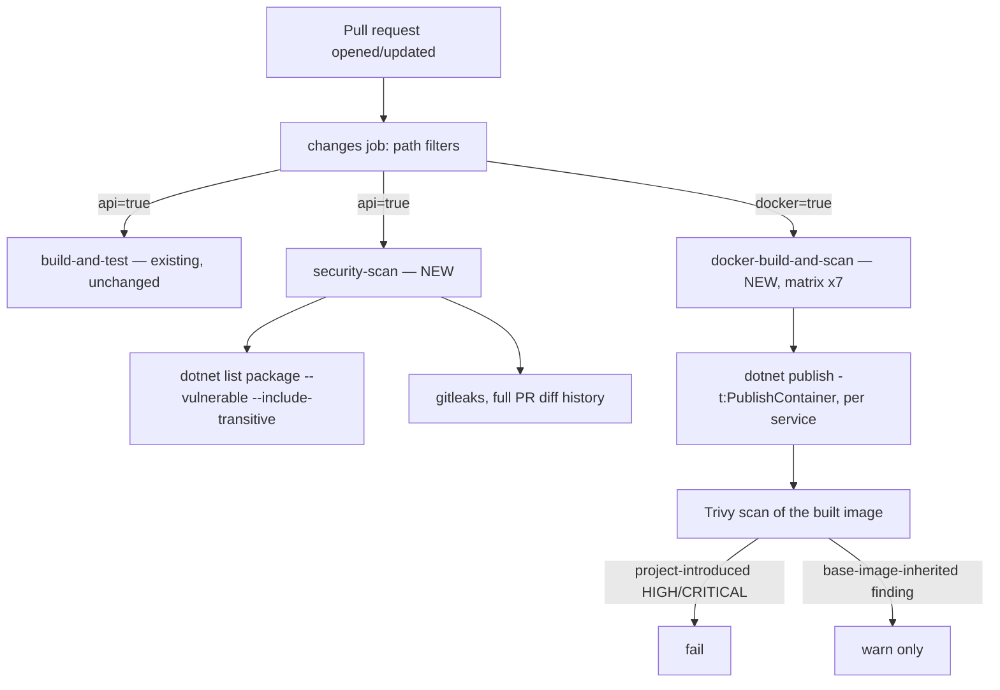

# Architecture: container-and-cd-hardening (F-017)
<!-- pdlc-template-version: design-doc -->

## Where this feature lives

This feature touches no application code, no domain layer, and no runtime request path. It lives entirely in two places:

1. **The build/publish configuration** — `EventAndCommands/EventAndCommands.csproj` (removing one `<None Update>` item's `CopyToOutputDirectory` metadata) and the deletion of three whole projects' worth of container tooling (`Library/Dockerfile`, `Kafka/Dockerfile`, `EventAndCommands/Dockerfile`, and their `docker-compose.yml`/`docker-compose.override.yml` service blocks).
2. **CI** — `.github/workflows/dotnet.yml`, the only workflow file in the repository, gains two new jobs.

No existing microservice, the `Library` shared layer, `EventAndCommands`'s CQRS kernel, or the Gateway is modified in behavior. The seven ASP.NET Minimal API services and the Gateway are unaffected at runtime; this feature only changes what happens to their source and build artifacts before and during CI.

## What exists today and why it's the wrong artifact to secure

Two container-image mechanisms coexist in this repository, serving different purposes:

- **The eight hand-written Dockerfiles** (one per API service, plus `Library`, `Kafka`, `EventAndCommands`) serve `docker-compose.yml`/`docker-compose.override.yml` — CLAUDE.md's documented "legacy" local-dev fallback. Only 1 of 7 API services (`identity`) is actually wired into Compose today; the topology was already broken before this feature and stays broken after it (out of scope, see the PRD).
- **This project's actual cloud deployment path** — `AgendaBuddy.AppHost/AppHostWiring.cs`'s `DeploymentTarget.Cloud` branch, which calls `builder.AddAzureContainerAppEnvironment("agenda-buddy-env")` and is exercised by `azd`/`aspire deploy` — builds container images **directly from each service's project file** using .NET SDK container support (`dotnet publish -t:PublishContainer`). It reads no Dockerfile at all for any `AddProject`-based resource. Confirmed against Aspire's own deployment documentation (`aspire.dev/deployment/`, `aspire.dev/deployment/azure/container-apps/`): `aspire deploy` "builds container images for the compute resources in the environment" itself.

Wave 3's new CI job therefore targets the second mechanism, not the first. Building and scanning the hand-written Dockerfiles in CI would give a green check on an artifact this project would never actually ship if the ADR-035 cloud deferral lifts — a false sense of security on the wrong path.

## A shared defect blocking both paths, found at Design

While verifying the SDK-container-support path, `dotnet publish -t:PublishContainer` on `Booking.csproj` failed with `NETSDK1152` — a file-conflict error between `EventAndCommands/appsettings.json` and `Booking/appsettings.json`, both landing at the same relative output path. `EventAndCommands.csproj` marks its own `appsettings.json` `CopyToOutputDirectory: Always`, which every one of the seven services' publish output inherits via the `ProjectReference`, colliding with each service's own file.

This is not specific to SDK container support — a plain `dotnet publish` reproduces it, and so does `docker build -f Booking/Dockerfile .` at its `RUN dotnet publish` step (verified live: the build fails at that exact step with the identical error). **Every service, not just the three already-known-broken ones, currently cannot be published at all** — invisible for the same root reason as the `runtime:8.0` defect: CI never runs `dotnet publish` or builds any container image, so nothing exercises this path.

**The fix:** remove the `CopyToOutputDirectory` metadata from `EventAndCommands.csproj`'s `appsettings.json` item. `EventAndCommands.ConfigurationLoader.LoadConfiguration()` reads `"appsettings.json"` from its own executing assembly's directory — which, after the fix, resolves to whichever service's `appsettings.json` is already present in that same output folder (every service already ships its own). Verified end-to-end during Design: with the metadata removed, `dotnet publish Booking/Booking.csproj -t:PublishContainer` completed successfully and produced a real, loadable image (`booking:test-scan`, entrypoint `dotnet /app/Booking.dll`, port `8080` exposed) in the local Docker daemon. The experimental change was reverted after verification; Construction lands it for real, test-first.

## New CI jobs

Two new jobs are added to `.github/workflows/dotnet.yml`, both gated on the existing `changes` job's path-filter pattern (a new `docker` output alongside the existing `library`/`api`/`mobile`/`mobile-tests` ones):

### `security-scan` (new job)

- Gated on the existing `api` filter output — the same trigger `build-and-test` already uses, so it fires on exactly the same set of changes.
- Step 1: `dotnet list package --vulnerable --include-transitive`. Fails the job on any new HIGH/CRITICAL finding. The existing `ADR-030` `NU1903` project-scoped suppression (already in the solution for the accepted `SSH.NET` finding in `AgendaBuddy.IntegrationTests`) is carried forward unchanged — the audit already respects it, since it's an MSBuild-level suppression, not a CI-script filter.
- Step 2: gitleaks, configured to scan the full PR diff (`fetch-depth: 0` on checkout, or gitleaks' own `--log-opts` diff-history mode) rather than only the working tree — a secret introduced and removed within the same PR is still caught.
- Runs independently of, and in parallel with, `build-and-test` — no shared steps, no added latency to the existing job (PRD NFR).

### `docker-build-and-scan` (new job)

- Gated on a new `docker` filter output: the seven service directories, their `.csproj` files, and `docker-compose*.yml` — **and this filter must actually be consumed by an `if:` condition on the job**, verified live at Construction's closing check. This pipeline has exactly one precedent for a filter being computed and silently never consumed (the `library` output) — this job's trigger is checked explicitly so it doesn't join that list.
- `strategy.matrix`, one entry per remaining service (`booking`, `calendar`, `customer`, `provider`, `services`, `profession`, `identity`) — parallel, and each entry's pass/fail is independently visible in the PR checks list.
- Per matrix entry: `dotnet publish <service>/<service>.csproj -t:PublishContainer` (no Dockerfile referenced anywhere in this job), then `aquasecurity/trivy-action` (or equivalent) scans the resulting local image.
- Trivy's severity gate distinguishes the finding's origin: HIGH/CRITICAL in a layer this project's own dependencies introduced fails the job; the same severity in a layer inherited from the base image (`mcr.microsoft.com/dotnet/aspnet:10.0`) itself only warns — this project cannot fix a base-image CVE directly, and failing the build on something unfixable would block unrelated PRs.
- `timeout-minutes: 10` per matrix entry — the first timeout anywhere in this pipeline; not applied retroactively to the five existing jobs (out of scope, see PRD).
- No `docker run`, no health check, no registry push — build and scan only. Decouples this job entirely from the explicitly out-of-scope Dockerfile hygiene defects (`EXPOSE`/port mismatch, missing `HEALTHCHECK`) that live on the hand-written Dockerfiles this job never touches.

### `.github/dependabot.yml` (new, standalone)

No CI job involved — a static configuration file that GitHub's own Dependabot service reads directly. Verified live at Construction: a real Dependabot PR must be observed opening after this feature merges, not just the file's presence confirmed.

## Structural regression tests

A new test file alongside the existing `AppHostWiringTest` in `AgendaBuddy.AppHost.Tests` asserts:
1. `Library/Dockerfile`, `Kafka/Dockerfile`, `EventAndCommands/Dockerfile` do not exist.
2. `docker-compose.yml`/`docker-compose.override.yml` contain no `events`/`kafka-library`/`common-library` service blocks.
3. **Generalized pattern guard:** no Dockerfile in the repository has a final-stage `FROM` runtime image whose major version differs from its build-stage SDK image's major version — so this defect class cannot recur under a different filename, on a service Dockerfile or a future one.

This is the same enforcement pattern `AppHostWiringTest.NoServiceBindsAHardcodedHostPort` already uses for AC-1.4 — a compile-time-checkable structural assertion over the repository's own file tree, not a runtime behavior test.

## Conformance with CONSTITUTION.md §3

None of the five architectural constraints (service isolation, shared Library pattern, CQRS via MediatR, event sourcing, cache-aside) are touched — this feature changes no domain code, no command/query handler, no repository, and no cached read path. The one constraint that does apply — "each domain... with its own MongoDB config **and Dockerfile**" — is satisfied unchanged: every service keeps its Dockerfile; this feature only stops *building* those Dockerfiles in CI in favor of the SDK-container path for the *scanned* artifact.

## Architectural decisions made for this feature

| Decision | Rationale |
|---|---|
| Two new CI jobs, not folded into `build-and-test` | Keeps the existing job's runtime untouched (NFR); gives each new gate its own clear pass/fail signal |
| Same `dotnet.yml`, no new workflow file | This repository has exactly one workflow file by deliberate convention; a second file would fragment the `changes` job's centralized path-filter logic |
| SDK container support, not the hand-written Dockerfiles | The hand-written Dockerfiles serve only the already-broken legacy Compose path; SDK container support is what this project's actual Aspire/`azd` deployment path uses |
| `EventAndCommands.csproj`'s `appsettings.json` conflict fixed in Wave 1 | Blocks every downstream containerization mechanism equally; fixing it once unblocks both the legacy Dockerfile path (incidentally) and the new SDK-container path |
| Base-image-inherited Trivy findings warn, not fail | This project cannot remediate a CVE in `mcr.microsoft.com/dotnet/aspnet:10.0` directly; failing the build on an unfixable finding blocks unrelated PRs for no gain |
| 3 sequential PRs, not one | Matches this project's one-PR-per-logical-change convention (F-013 through F-021); each wave ships value independently |
