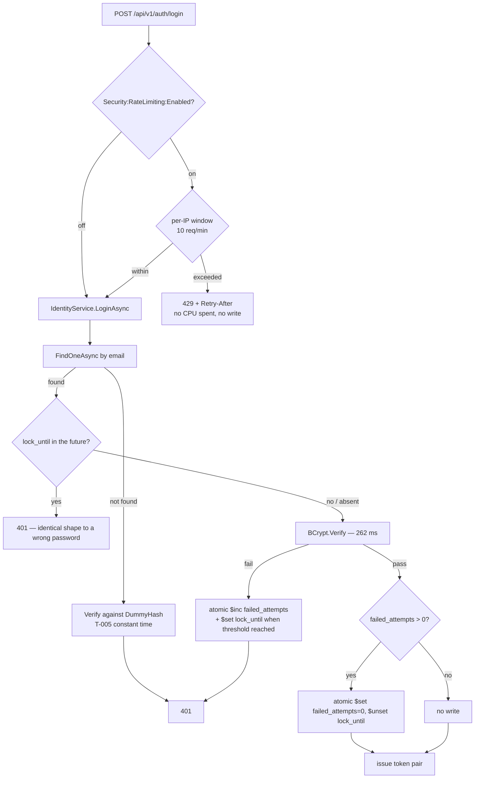
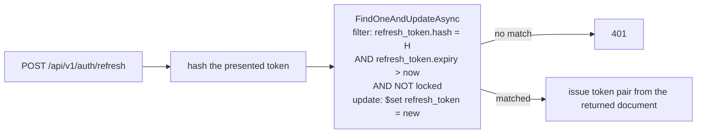

# Architecture — Identity Hardening (F-021)

**Date:** 2026-08-22 · **PRD:** [`PRD_F-021_identity-hardening_2026-08-22.md`](../../prds/PRD_F-021_identity-hardening_2026-08-22.md)
**Status:** Draft — pending the Step 12 design approval gate

---

## 1. What changes, and where

F-021 touches four places. Nothing new is deployed; no service is added.

| # | Change | Lives in | Blast radius |
|---|---|---|---|
| A | **Partial-update primitive** — one method on `IRepository<T>`, implemented in `MongoDbRepository<T>` | `Library/Repositories/` | Shared interface: 7 services + 12 test projects compile against it. §5 covers this. |
| B | **Non-destructive refresh rotation** + **failed-attempt counter** + **lock check** | `Identity/Services/IdentityService.cs` | Identity only |
| C | **Rate limiter** on `login` + `register` | `Identity/Program.cs` | Identity only — those are the only two routes that spend BCrypt |
| D | **Transport security** — HSTS policy + redirect ordering | `AgendaBuddy.ServiceDefaults/` **plus one edit per service** | All 7 services. §4 explains why it is not a single edit |

New persisted fields land on `CredentialEntity` (see [`data-model.md`](data-model.md)). No new endpoints — see [`api-contracts.md`](api-contracts.md), which documents changed *behaviour* on three existing routes.

---

## 2. The measurement that shaped this design

**BCrypt verify at work factor 12 costs 262 ms on this hardware** — measured 2026-08-22, 20 iterations after a JIT warm-up, `BCrypt.Net-Next` 4.0.3, `workFactor: 12` (`IdentityService.cs:50`). That is **3.8 attempts/sec/core**, or ~31/sec only if an attacker consumes all 8 logical cores.

Three consequences, and they reorder the feature's own priorities:

1. **Password guessing was never the dominant threat.** At 3.8 attempts/sec a remote attacker is not meaningfully closer to a password than they were yesterday. Rate limiting is still mandatory — unlimited attempts are indefensible — but it should not be justified by a brute-force story the numbers do not support.
2. **CPU exhaustion is the real threat.** Every unauthenticated login or register request buys **262 ms of server CPU**. Roughly **4 requests/sec pins one core**; ~31/sec pins the whole machine. This is a cheap, unauthenticated denial of service against a service that also serves every other domain's auth validation.
3. **`register` is as good a vector as `login`**, because it hashes at the same work factor (`IdentityService.cs:50`). Limiting only `login` would leave the amplification wide open — which is why the limiter covers both. `refresh` spends no BCrypt and is deliberately left unlimited.

There is a fourth, subtler consequence. Identity's **timing mitigation for user enumeration** (threat T-005) verifies the submitted password against a **dummy hash** when the email is unknown (`IdentityService.cs:96`). That is correct for enumeration — and it means a failed attempt against a **nonexistent** account costs the same 262 ms. So an attacker can burn CPU with random addresses, generating **no** per-account state at all. The per-account counter cannot see that traffic. **Only the per-IP limiter can.** The two controls are not redundant; they cover disjoint attacks.

---

## 3. Data flow

### 3.1 Login (the path that changed most)



Two orderings are load-bearing:

- **The per-IP limit is evaluated before any BCrypt work and before any write.** A throttled request costs no CPU and touches no document — which is the entire point, given §2. If the limiter sat behind the service call, the DoS would still land.
- **The lock check happens before `BCrypt.Verify`.** A locked account should not cost 262 ms per attempt, or the lock becomes its own amplifier.

### 3.2 Refresh (the destructive path, fixed)



**One round trip, one document, no delete.** The single-use guarantee is preserved by moving the old token's hash into the *filter*: the update matches only while the old hash is still present, so a replayed token finds nothing. `refresh_token.expiry > now` keeps the existing expiry check, and the lock condition satisfies AC-4 in the same operation rather than as a second query.

The whole class of failure disappears: there is no window in which the credential does not exist, because it is never deleted. A fault now leaves the document exactly as it was — which is what AC-2 asserts under injected fault.

---

## 4. Transport security: why "one place" is one policy plus seven one-line edits

The maintainer's decision was to centralize in `ServiceDefaults`, and that is right for the *policy*. It cannot be the whole story for the *ordering*, and the design says so rather than implying a single edit covers it:

- **Middleware order is a property of each `Program.cs`.** It is the sequence of `app.UseX()` calls. `AddServiceDefaults()` runs on the *builder*, before any pipeline exists, so it cannot reposition anything.
- **Therefore:** `ServiceDefaults` gains the policy — `AddHsts(...)` bound to `Security:Hsts`, and a new app-side extension `UseAgendaBuddyTransportSecurity()` that calls `UseHsts()` and `UseHttpsRedirection()` under their flags, in the correct relative order.
- **And each of the 7 `Program.cs` files gets exactly one edit:** call `app.UseAgendaBuddyTransportSecurity()` immediately before `app.UseAuthentication()`, and delete its own `app.UseHttpsRedirection()` line.

Net: one implementation, seven call-site moves, and service #8 inherits the policy but must still place the call — a residual the design accepts and names. Eliminating that last step means owning the whole pipeline in `ServiceDefaults`, which is F-019/F-020's job, not F-021's.

Identity's existing `if (!app.Environment.IsDevelopment())` guard around its redirect (`Identity/Program.cs:107-108`) is **removed** — superseded by the configuration flag, which is the point of §6.

---

## 5. The repository primitive

```csharp
// Library/Repositories/IRepository.cs — ONE new member.
Task<TEntity?> FindOneAndUpdateAsync(BsonDocument filter, BsonDocument update);
```

Returns the matched document (pre- or post-image chosen in the implementation and documented there), or `null` when the filter matches nothing.

**Why this shape:**

- **It is the smallest thing that fixes item 1.** Refresh rotation needs exactly "match on these conditions, apply this change, atomically, and tell me what you matched."
- **`$inc` and `$set`/`$unset` all fit it**, so the failed-attempt counter, the lock, and the counter reset are the same primitive — no second method.
- **It stops at the driver boundary.** `BsonDocument` filters are already this project's convention (`IRepository` exposes `Find`, `FindOneAsync`, `FindOneAndDeleteAsync`, `FindAllAsync` the same way), so this adds no new abstraction style. PRD requirement 3 forbids growing it into a query builder, and returning `BsonDocument` in and out is what keeps that promise.
- **`MustNotUpsert`:** the implementation passes no upsert option, so AC-9's "a failed login for an unknown email creates nothing" is a property of the primitive, not of each caller remembering.

**Why shared rather than Identity-only.** F-014 wires six capabilities that currently have to read-modify-write, and F-019/F-020 rewrite this layer; adding it once here is the cheapest point. The cost is that a shared interface gains a member — see §6 for the blast-radius treatment.

### 5.1 Fault injection (PRD requirement 4)

`Identity.Tests/Helpers/InMemoryRepository.cs` implements `IRepository<T>` for unit tests and **cannot currently simulate a fault between a read and a write** (`11-testing.md:65`) — which is why AC-2 is unexpressible today. It gains a test-only hook: a settable fault action invoked inside `FindOneAndUpdateAsync` between matching and applying. That hook is what makes AC-2 a real test rather than a citation.

⚠️ **This must land before AC-2's implementation**, or TDD has nothing to bite on. This is the same trap F-016 hit with threat T-004, where a mitigation was "verified" by citation because no test could reach it.

---

## 6. Architectural decisions

| ID | Decision | Rationale | Alternative rejected |
|---|---|---|---|
| **D-1** | Rotate via `FindOneAndUpdateAsync` with the old hash in the filter | Preserves single-use atomically without a delete; one round trip | A transaction around delete+insert — heavier, needs a replica set, and still deletes |
| **D-2** | One narrow primitive on `IRepository<T>`, shared | F-014 and F-019/F-020 both benefit; convention already uses `BsonDocument` filters | An Identity-only method (next caller re-solves it); a general query-builder (explicitly forbidden by requirement 3) |
| **D-3** | Per-IP limiting in middleware; per-account counting in `IdentityService` | ASP.NET resolves a limiter partition key from `HttpContext` **before** model binding, and the account identifier is in the JSON body. Buffering the body in middleware to partition on it is strictly worse than counting where the account is already loaded | A single middleware policy keyed on the body (needs request buffering); per-account only (blind to the unknown-email CPU attack, §2) |
| **D-4** | Limiter covers `login` **and** `register`; not `refresh` | Both hash at work factor 12 (262 ms); `refresh` spends no BCrypt | `login` only — leaves an equal-cost vector open |
| **D-5** | The lock is time-based and self-clearing; a past `lock_until` reads as unlocked with **no** write | F-022 does not exist, so a permanent lock strands a real provider — and lets an attacker lock any provider out deliberately. No write on the expiry path keeps reads cheap and needs no background job | Permanent lock + admin unlock (no surface exists, and it is an attacker's DoS arm); a sweeper job (new moving part for no gain) |
| **D-6** | Both controls gated on **configuration**, not `IsProduction()` | Services run as **Production under the local AppHost** — verified: `/swagger/v1/swagger.json` 404s on all seven, because `AppHostWiring.cs` passes `launchProfileName: null` and `launchSettings.json:9` sets `DOTNET_ENVIRONMENT=Development` for the AppHost process only. Gating on environment would emit HSTS on `localhost` (browsers cache it stickily, across projects) and throttle every local run | `IsProduction()` — the intuitive choice, and wrong here |
| **D-7** | Warn loudly at startup when a flag is off outside a local run | Keeps a misconfigured deploy visible without turning it into an outage | Fail-fast (a config slip becomes downtime); silent defaults (the R4 footgun) |
| **D-8** | Log credential mutations with a **hash prefix**, never the address | Email is PII (`CONSTITUTION.md` §4) and `PiiRedactingProcessor` redacts **spans, not logs**. `Identity/Program.cs:100-102` already forbids body logging on these routes | Logging the email (PII in logs); logging nothing (item 1 would recur untraceably) |
| **D-9** | Lock check **before** `BCrypt.Verify` | A locked account must not cost 262 ms per attempt, or the lock amplifies the DoS it exists beside | Verify first, then check the lock — simpler to read, strictly worse |

### Blast radius — D-2

Adding a member to `IRepository<T>` breaks every implementation that does not have it. Known implementations: `MongoDbRepository<T>` (production) and `Identity.Tests/Helpers/InMemoryRepository.cs` (tests). Both are updated by this feature. **A Design-time sweep must confirm there is no third implementation** — F-016's blast-radius review found 0 at-risk callers across 19 changed symbols by doing exactly this, and it is cheap.

---

## 7. Conformance with `CONSTITUTION.md`

| Constraint | How this design conforms |
|---|---|
| Business logic in the `Library` service layer, not API handlers | Lock and counter logic live in `IdentityService`. `Program.cs` gains only middleware registration — no branching on lock state |
| Repository pattern for all DB access | D-2 adds a repository primitive precisely so `IdentityService` does not reach for `IMongoCollection` directly |
| Async all the way | The new primitive returns `Task<TEntity?>` |
| `[BsonElement("snake_case")]` on persisted fields | `failed_attempts`, `lock_until` — see [`data-model.md`](data-model.md) |
| §4 — email is PII | D-8. AC-16 asserts no raw address reaches a log line |
| §7 test gates | Unit + Integration, plus the always-required security scan. AC-6/13/15 are integration-only by nature: a unit test on a policy object passes while the middleware is unregistered |
| ServiceDefaults stays storage-agnostic | HSTS configuration takes no `MongoDB.Driver` dependency, so the pinned-driver constraint is untouched |

---

## 8. What this design deliberately does not do

- **No `UseHsts` preload or includeSubDomains by default.** Both are hard to reverse — a wrong preload submission outlives the mistake. Defaults stay conservative; the deployment owns any escalation. F-017 owns TLS termination, without which HSTS is decorative in production anyway.
- **No distributed rate-limiter state.** ASP.NET's limiter is per-process, and `AddDistributedMemoryCache()` means this project has no shared cache today (`00-overview.md` finding 7). With one Identity replica the per-IP limit holds; with N replicas an attacker gets N× the allowance. Recorded as a known limitation rather than solved, because solving it needs the distributed cache F-021 is not scoped to add.
- **No account-lockout notification.** Telling a user they were locked needs `NotificationService`, which **F-014** wires.
- **No `MustResetPassword` enforcement.** A seam only (requirement 19). Note for F-022: `SeedAuthCredentials.cs:68` already writes `true` and nothing reads it.
