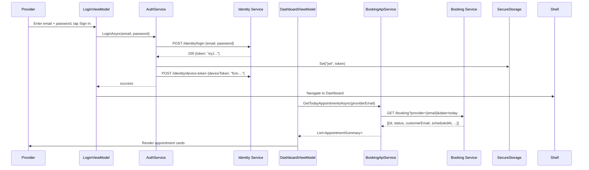
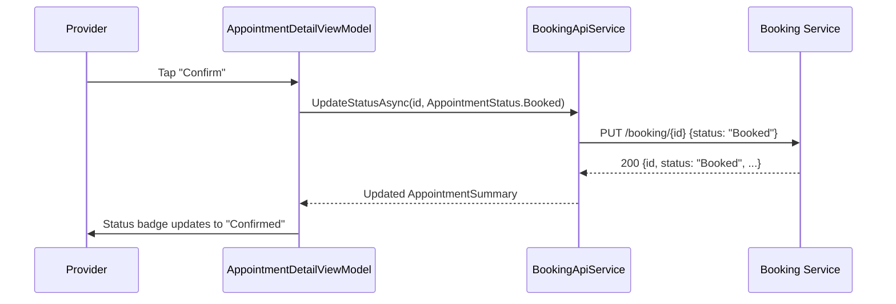
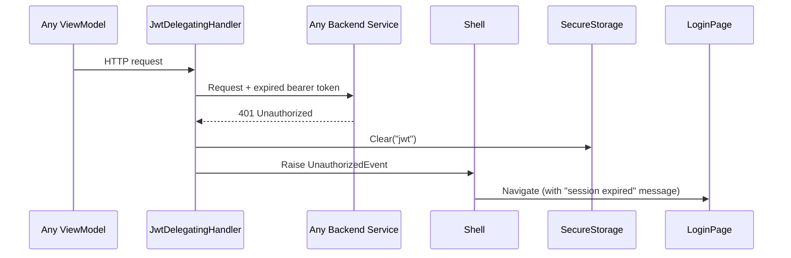
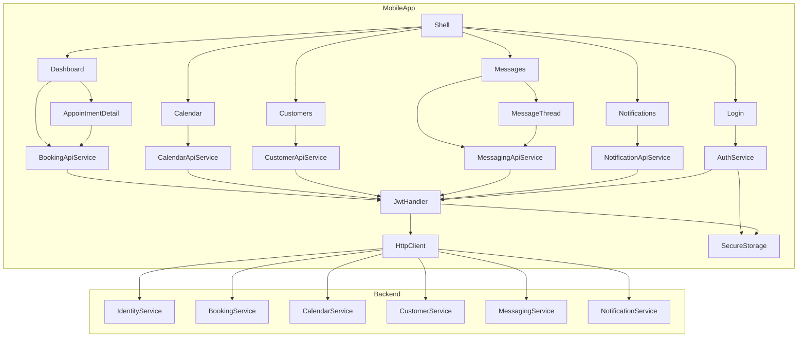

# Architecture: Mobile App (iOS + Android)
<!-- pdlc-template-version: 2.4.0 -->

**Feature:** mobile-app
**Date:** 2026-07-31
**Status:** Draft

---

## Overview

The Agenda Buddy mobile app is a .NET MAUI cross-platform client (iOS 16+ / Android API 33+) that sits in front of the existing six microservices. It is a pure API consumer — it introduces no new backend services and creates no direct database connections. All data mutations flow through the same REST endpoints used by any other API client; the app's only responsibility is to present, validate, and dispatch.

The single new backend surface is a device-token registration endpoint on the Identity service, required for push notification delivery.

---

## System Placement

```
┌─────────────────────────────────────────────────────────────────┐
│  MobileApp (.NET MAUI — net10.0-ios / net10.0-android)          │
│  Shell + MVVM + CommunityToolkit.Mvvm                           │
│  ┌────────────┐  ┌────────────┐  ┌────────────┐  ┌──────────┐  │
│  │ Login      │  │ Dashboard  │  │ Calendar   │  │ Messages │  │
│  │ ViewModel  │  │ ViewModel  │  │ ViewModel  │  │ ViewModel│  │
│  └────────────┘  └────────────┘  └────────────┘  └──────────┘  │
│  ┌────────────────────────────────────────────────────────────┐ │
│  │ API Services (one per domain — IHttpClientFactory)         │ │
│  │ BookingApiService  CalendarApiService  CustomerApiService  │ │
│  │ MessagingApiService  NotificationApiService  AuthService   │ │
│  └────────────────────────────────────────────────────────────┘ │
│  ┌────────────────────────────────────────────────────────────┐ │
│  │ Infrastructure                                             │ │
│  │ JwtDelegatingHandler  SecureStorage  FCM/APNs bridge       │ │
│  └────────────────────────────────────────────────────────────┘ │
└─────────────────────────────────────────────────────────────────┘
                          │ HTTPS / RS256 JWT
        ┌─────────────────┼─────────────────┐
        ▼                 ▼                 ▼
  ┌──────────┐    ┌──────────────┐   ┌──────────────┐
  │ Identity │    │   Booking    │   │   Calendar   │
  │ service  │    │   service    │   │   service    │
  └──────────┘    └──────────────┘   └──────────────┘
        ┌─────────────────┼─────────────────┐
        ▼                 ▼                 ▼
  ┌──────────┐    ┌──────────────┐   ┌──────────────┐
  │ Customer │    │   Provider   │   │  Notification│
  │ service  │    │   service    │   │  (via Booking│
  └──────────┘    └──────────────┘   │   service)   │
                                     └──────────────┘
```

---

## Component Responsibilities

### MAUI Project (`MobileApp/`)

| Directory | Contents |
|-----------|----------|
| `Views/` | XAML `ContentPage` per screen — LoginPage, DashboardPage, CalendarPage, CustomersPage, MessagingPage, NotificationsPage, AppointmentDetailPage, MessageThreadPage |
| `ViewModels/` | One CommunityToolkit.Mvvm `ObservableObject` per view; all `[ObservableProperty]` + `[RelayCommand]` |
| `Services/` | Domain API services (see below) + `AuthService` |
| `Models/` | Mobile DTOs — lightweight display shapes mapped from Library entities |
| `Infrastructure/` | `JwtDelegatingHandler`, `MauiProgram.cs` DI wiring, FCM/APNs registration |

### Navigation

Shell with tab bar:

| Tab | Root Screen | Detail Screens |
|-----|-------------|----------------|
| Dashboard | `DashboardPage` | `AppointmentDetailPage` |
| Calendar | `CalendarPage` | — |
| Customers | `CustomersPage` | — |
| Messages | `MessagingPage` | `MessageThreadPage` |
| Notifications | `NotificationsPage` | — |

Login screen (`LoginPage`) is a non-tabbed root page. After successful auth, Shell replaces it with the tab bar.

### API Services

Each domain API service is registered as a transient in DI and injected into the relevant ViewModel:

| Class | Consumed by | Backend endpoints |
|-------|-------------|-------------------|
| `AuthService` | `LoginViewModel` | `POST /identity/login`, `POST /identity/device-token` |
| `BookingApiService` | `DashboardViewModel`, `AppointmentDetailViewModel` | `GET /booking`, `PUT /booking/{id}` |
| `CalendarApiService` | `CalendarViewModel` | `GET /calendar` |
| `CustomerApiService` | `CustomersViewModel` | `GET /customer` |
| `MessagingApiService` | `MessagingViewModel`, `MessageThreadViewModel` | `GET /messages`, `POST /messages`, `PATCH /messages/{id}/read` |
| `NotificationApiService` | `NotificationsViewModel` | `GET /notifications`, `PATCH /notifications/{id}/read` |

### Infrastructure

**`JwtDelegatingHandler`** — `DelegatingHandler` registered on the `"AgendaBuddyApi"` named `HttpClient`. On each outbound request, reads the bearer token from `SecureStorage` and injects `Authorization: Bearer {token}`. On 401 response, clears `SecureStorage` and raises an `UnauthorizedEvent` that the Shell router intercepts to navigate back to login.

**`SecureStorage`** — MAUI's cross-platform abstraction over iOS Keychain and Android Keystore. Used exclusively for JWT storage; no other data is persisted locally in v1.

**FCM/APNs bridge** — `Plugin.Firebase.CloudMessaging` initialised in `MauiProgram.cs`. On first login (or permission grant), the device token is fetched and `POST /identity/device-token` is called. Incoming push payloads are routed to a local `PushNotificationService` that surfaces them as local MAUI notifications when the app is foregrounded, or as OS-level push notifications when backgrounded.

---

## Key User-Journey Data Flows

### Login → Dashboard



### Confirm Appointment



### JWT Expiry Mid-Session



---

## Architectural Decisions

| Decision | Chosen | Rationale |
|----------|--------|-----------|
| Navigation | Shell + tab bar | URI-based deep linking (push notification → specific appointment); standard scheduling app UX |
| MVVM pattern | CommunityToolkit.Mvvm source generators | ViewModel unit testability (PRD AC-12); `[ObservableProperty]` eliminates boilerplate |
| HttpClient management | `IHttpClientFactory` + named client | Prevents socket exhaustion; single JWT injection point in `JwtDelegatingHandler` |
| Entity sharing | Library enums + status types only; mobile DTOs for display | Avoids tight coupling of UI state to backend entity shape (brainstorm Adversarial Review finding) |
| Push notifications | Plugin.Firebase.CloudMessaging (FCM + APNs bridge) | Validated `net10.0-ios` + `net10.0-android` support; known risk: provisioning dependency (PRD Known Risks) |
| JWT storage | MAUI `SecureStorage` | iOS Keychain / Android Keystore — platform-native secure storage; token cleared on explicit logout (PRD NFR) |
| No offline writes | Graceful degradation only (stale banner) | PRD R14 — offline editing explicitly out of scope for v1 |

---

## Conformance with CONSTITUTION.md §3

- **Repository pattern** — no direct DB access; all data via API services
- **Service isolation** — one API service class per backend domain
- **Async all the way** — every API call returns `Task<T>`
- **Library project referenced** — enums and status types shared; no duplication
- **No secrets in source** — JWT stored in `SecureStorage`; backend base URL injected via `appsettings.json` (non-secret build-time config); no API keys in bundle (PRD R9)

---

## Mermaid Component Overview


