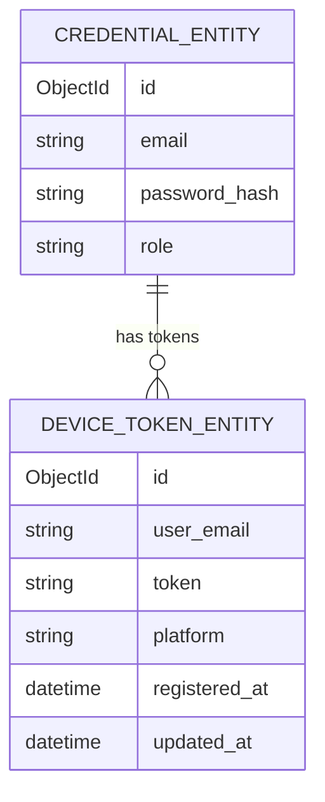

# Data Model: Mobile App (iOS + Android)
<!-- pdlc-template-version: 2.4.0 -->

**Feature:** mobile-app
**Date:** 2026-07-31
**Status:** Draft

---

## Summary

The mobile app introduces **one new MongoDB document type**: `DeviceTokenEntity` in the Identity service. All other data operations — appointments, calendar, messages, notifications, customers — consume existing collections via the existing microservice APIs. No existing schema is modified.

---

## New: `DeviceTokenEntity` (Identity service — `device_tokens` collection)

Stores the FCM (Android) or APNs (iOS) push token per user, so the backend push dispatcher knows where to deliver notifications.

| Field | BSON name | Type | Notes |
|-------|-----------|------|-------|
| `Id` | `_id` | `ObjectId` | Generated on insert |
| `UserEmail` | `user_email` | `string` | Identity of the token holder; indexed |
| `Token` | `token` | `string` | FCM registration token or APNs device token |
| `Platform` | `platform` | `string` | `"android"` or `"ios"` |
| `RegisteredAt` | `registered_at` | `DateTime` | UTC, set on insert |
| `UpdatedAt` | `updated_at` | `DateTime` | UTC, updated on upsert |

**Index:** `user_email` (unique per platform — one token per user per platform; upsert on re-registration).

**C# entity:**
```csharp
public class DeviceTokenEntity
{
    [BsonId, BsonRepresentation(BsonType.ObjectId)]
    public string Id { get; set; } = string.Empty;

    [BsonElement("user_email"), Required]
    public string UserEmail { get; set; } = string.Empty;

    [BsonElement("token"), Required]
    public string Token { get; set; } = string.Empty;

    [BsonElement("platform"), Required]
    public string Platform { get; set; } = string.Empty;

    [BsonElement("registered_at")]
    public DateTime RegisteredAt { get; set; } = DateTime.UtcNow;

    [BsonElement("updated_at")]
    public DateTime UpdatedAt { get; set; } = DateTime.UtcNow;
}
```

---

## Mobile DTOs (client-side only — not persisted)

These lightweight shapes live in `MobileApp/Models/` and are mapped from Library entities in the API client layer. They exist only in memory on the device and are never written to any store.

### `AppointmentSummary`

| Property | Source field | Notes |
|----------|-------------|-------|
| `Id` | `AppointmentEntity.Id` | Used as navigation key |
| `CustomerEmail` | `AppointmentEntity.EmailCustomer` | |
| `ProviderEmail` | `AppointmentEntity.EmailProvider` | |
| `ScheduledAt` | `AppointmentEntity.ScheduledAt` | UTC; formatted locally |
| `Status` | `AppointmentEntity.AppointmentStatus` | Shared `AppointmentStatus` enum from Library |
| `ServiceId` | `AppointmentEntity.ServiceId` | For display (service name resolution deferred) |

### `MessageSummary`

| Property | Source field | Notes |
|----------|-------------|-------|
| `Id` | `MessageEntity.Id` | |
| `ThreadId` | `MessageEntity.ThreadId` | Stable thread key |
| `SenderEmail` | `MessageEntity.SenderEmail` | |
| `Body` | `MessageEntity.Body` | |
| `SentAt` | `MessageEntity.SentAt` | UTC |
| `IsRead` | `MessageEntity.IsRead` | |

### `NotificationSummary`

| Property | Source field | Notes |
|----------|-------------|-------|
| `Id` | `NotificationEntity.Id` | |
| `Type` | `NotificationEntity.NotificationType` | Shared `NotificationType` enum from Library |
| `Message` | `NotificationEntity.Message` | |
| `CreatedAt` | `NotificationEntity.CreatedAt` | |
| `IsRead` | `NotificationEntity.IsRead` | |

### `CustomerSummary`

| Property | Source field | Notes |
|----------|-------------|-------|
| `Id` | `CustomerEntity.Id` | |
| `Email` | `CustomerEntity.Email` | |
| `FullName` | `CustomerEntity.FullName` | |

---

## ER Diagram



---

## Data NOT Persisted

| Data | Reason not persisted |
|------|---------------------|
| JWT token (beyond `SecureStorage`) | One-layer platform secure storage is sufficient; no local DB needed |
| Appointment list / calendar slots | Fetched fresh on each screen load; no offline cache in v1 (PRD R14) |
| Message threads | Same: no offline queue; v1 is online-only |
| Draft messages | Out of scope for v1 |
| Customer list | Read-only display; fetched fresh |

---

## Migration Notes

- **New collection:** `device_tokens` in the Identity service MongoDB database. No migration script required — MongoDB creates the collection on first document insert. The index (`user_email` + `platform`, unique) should be declared in `Identity/Program.cs` at startup via `IMongoCollection<DeviceTokenEntity>.Indexes.CreateOneAsync(...)`.
- **No existing collections modified.** All existing entities (`AppointmentEntity`, `MessageEntity`, `NotificationEntity`, etc.) are read-only from the mobile app's perspective — no schema changes.
