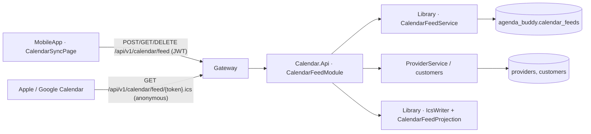

# Architecture: Native Calendar Sync (F-038)

## Shape

- **Library/Calendar/** — `IcsWriter` (pure RFC 5545 serialiser: CRLF, escaping, 75-octet folding, UTC
  `yyyyMMdd'T'HHmmss'Z'`), `CalendarFeedProjection` (appointments + names + language → events; window, cap,
  status mapping, localized text), `CalendarFeedToken` (generate 32 random bytes base64url, validate shape, hash).
- **Library/Entities/CalendarFeedEntity** — `identifier`, `owner_email`, `token_hash`, `language`, `created_at`.
- **Library/Services/CalendarFeedService** — enable (delete owner's rows, insert new), status, revoke, resolve by
  token hash.
- **Calendar.Core** — `EnableCalendarFeedCommandHandler`, `DisableCalendarFeedCommandHandler`,
  `GetCalendarFeedStatusQueryHandler` (audited). The anonymous fetch lives in the module and calls the service
  and projection directly (ADR-074).
- **Calendar.Api/Modules/CalendarFeedModule** — four routes under the existing `api/v1/calendar` group, so the
  Gateway's `calendar` allowlist row already forwards them.
- **AppHost** — injects `CalendarFeed__BaseUrl` = Gateway endpoint into Calendar (mirrors `Showcase__Go__BaseUrl`).
- **ServiceDefaults/PiiRedactingProcessor** — also redacts `/calendar/feed/<token>`.
- **Account erasure** — deletes `calendar_feeds` rows for the owner.
- **MobileApp** — `CalendarFeedRouteBuilder`, `ICalendarFeedApiService`, `CalendarSubscriptionLinks` (webcal and
  Google `cid` URLs, pure), `CalendarSyncViewModel`, `CalendarSyncPage` (route `calendarSync`), entry rows on
  `ProfilePage` and `CalendarPage`; link persisted in secure storage on the enabling device.

## Data model

`calendar_feeds`: `{ _id, identifier, owner_email, token_hash (hex SHA-256), language ("en"|"es"), created_at }`.
At most one row per owner by construction (enable deletes then inserts).

## API contracts

| Verb | Path | Auth | Body / response |
|---|---|---|---|
| GET | `/api/v1/calendar/feed` | JWT | `DataResponse<{ enabled, createdAt? }>` |
| POST | `/api/v1/calendar/feed` | JWT | `{ language? }` → `DataResponse<{ url, createdAt }>` |
| DELETE | `/api/v1/calendar/feed` | JWT | `204` always |
| GET | `/api/v1/calendar/feed/{token}.ics` | anonymous | `200 text/calendar` or `404` |

## Threat model (lite — Phantom)

| Threat | STRIDE | Mitigation |
|---|---|---|
| T-381 token leaks via telemetry | I | redact in `PiiRedactingProcessor` (AC-7) |
| T-382 token oracle | I | identical 404 for every failure (AC-5) |
| T-383 DB read exposes live tokens | I | hash-only storage |
| T-384 feed over-shares | I | minimal content, no contact data (AC-6) |
| T-385 stale access after erasure | E | erasure deletes the row (AC-9) |
| T-386 brute force | S | 256-bit token; no limiter needed |

## UX (lite — Muse)

States: loading · off (explainer + **Turn on calendar sync**) · on with link on this device (Apple / Google /
Copy / Reset / Turn off) · on without link on this device (explains the link is shown once; **Get a new link**
rotates) · error banner. Destructive actions confirm. Pinned actions sit outside the scroller (`PinnedActionTest`).
