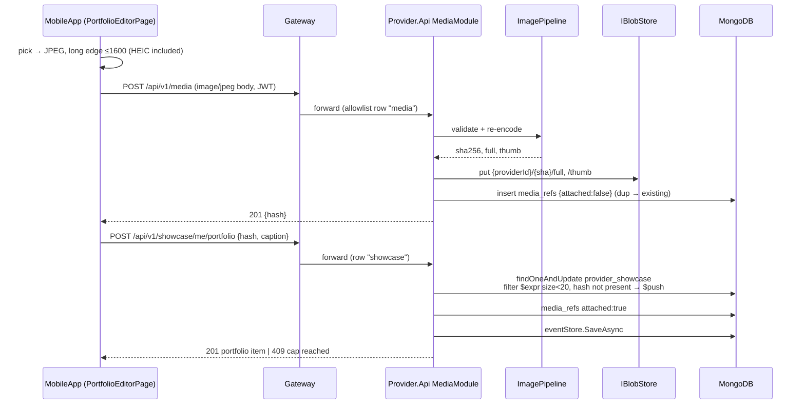
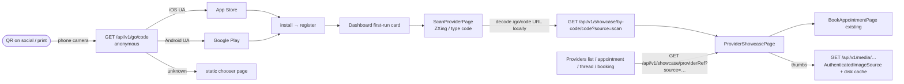

# Architecture — F-037 Provider Showcase

**PRD:** [PRD_F-037_provider-showcase_2026-09-30.md](../../prds/PRD_F-037_provider-showcase_2026-09-30.md)
**Status:** Approved 2026-09-30 (all six packages approved)
**Date:** 2026-09-30

---

## 1. Where it lives

The whole backend surface lives in the **Provider service**. It adds no new process, no new Aspire project and no new `deployable` path. The Provider service already owns the provider document, already runs every provider write through Clean Architecture handlers, and is the only service that needs blob access. Putting storage anywhere else would give a second service a storage credential it has no use for.

| Layer | Project | Adds |
|---|---|---|
| API (endpoints and DI only) | `AgendaBuddy.Provider.Api` | `Modules/ShowcaseModule.cs`, `Modules/MediaModule.cs`, `Modules/GoModule.cs`; the `/go` rate limiter; the media sweep hosted service |
| Handlers | `AgendaBuddy.Provider.Core` | ~12 command/query handlers (§4), each auditing via `eventStore.SaveAsync` |
| Contracts | `AgendaBuddy.Provider.Domain` | commands, queries, request/response DTOs |
| Shared domain | `AgendaBuddy.Library` | `Showcase/` (entities, `ShowcaseService`, `PublicCodeGenerator`), `Media/` (`IBlobStore`, `AzureBlobStore`, `InMemoryBlobStore`, `ImagePipeline`, `MediaService`, `MediaSweepService`), and `AccountErasure` extensions |
| Edge | `AgendaBuddy.Gateway` | three allowlist rows (`showcase`, `media`, `go`) → provider cluster |
| Composition | `AgendaBuddy.AppHost` | Azure Storage resource (Azurite locally), referenced by `provider` only |
| Client | `AgendaBuddy.MobileApp` | 7 views, `AuthenticatedImageSource`, `IQrScanner`, `ShareImageComposer`, `Routing/ShowcaseRouteBuilder`, `Routing/MediaRouteBuilder` |

`AgendaBuddy.Provider.Infrastructure` stays empty. `IBlobStore` goes in Library next to `IRepository<T>`, following the existing convention that storage abstractions are shared primitives.

## 2. New modules and their boundaries

- **`ImagePipeline`** (Library, pure, no I/O).
  - **Input:** bytes. **Output:** `{sha256, full, thumb, width, height}` or a typed rejection.
  - **Steps:**
    1. Check magic bytes (JPEG `FF D8 FF`, PNG `89 50 4E 47`, WebP `RIFF....WEBP`). The extension and `Content-Type` are ignored.
    2. Check the byte cap (5 MB).
    3. Read the header dimensions with `SKCodec` *before* decoding, and reject anything over 8000 px on a side or 40 MP in total.
    4. Decode the first frame only.
    5. Convert to sRGB.
    6. Resize to at most 1600 px (`full`) and at most 480 px (`thumb`).
    7. Encode as JPEG q85.
    8. Hash the **re-encoded `full`** bytes.
  - Hashing the output rather than the input makes deduplication survive re-encoding, and no uploaded byte is ever stored. Stripping metadata is a consequence of re-encoding, not a separate step that could be skipped.
- **`IBlobStore`**: `PutAsync(key, bytes, contentType)`, `OpenReadAsync(key)`, `ExistsAsync(key)`, `DeletePrefixAsync(prefix)`, `ListAsync(prefix)`.
  - `AzureBlobStore` uses one private container (`media`, public access `None`), authenticates with `DefaultAzureCredential` in the cloud, and uses the Aspire-injected connection string locally.
  - `InMemoryBlobStore` backs the unit tests.
- **`MediaService`**: runs the pipeline, then `PutAsync` for both variants, then inserts the `media_refs` record (`attached=false`). Re-uploading bytes the provider already has returns the existing hash (the `(provider_id, hash)` pair is unique) with no second write.
- **`ShowcaseService`**: every targeted write to `provider_showcase` (§4), public-code get-or-create, the viewer projection (relationship banner, NEW tags) and visit recording.
- **`PublicCodeGenerator`**: uses `RandomNumberGenerator.GetInt32(31)` six times over `23456789ABCDEFGHJKMNPQRSTUVWXYZ`. A duplicate-key on `public_code` retries, up to 5 attempts.
- **`MediaSweepService`**: a `BackgroundService` running hourly, same shape as `AppointmentAutoCompletionService`.
  - Deletes the blobs of `media_refs` where `attached=false AND created_at < now-24h`, then the ref itself.
  - Deletes blob prefixes whose provider no longer has a showcase document (finishing an interrupted erasure).
  - Idempotent, so overlapping replicas are harmless.
- **`GoModule`**: anonymous. Classifies the platform from `User-Agent`, `$inc`s the counter, and 302s to the configured store URL. If the platform can't be determined, it serves the static chooser HTML.

## 3. Data flow

### 3.1 Provider authoring: add a portfolio image (mirrors Journey A)

The provider sees the image in the editor only after the second `201`. Until then the tile shows per-tile progress and retry. That is the moment the persisted state and the user-facing state become consistent.

### 3.2 Customer discovery (mirrors UX Discovery Q2-A)

The in-app scanner **never follows** the `/go` URL. It pulls the code out of the path locally, so an in-app scan doesn't inflate the anonymous counter, and the URL's host is never trusted (a foreign QR fails the pattern and gets the inline "not an AgendaMe code" message).

### 3.3 Viewing (one read, one best-effort write)

`GET /showcase/{providerRef}` or `/by-code/{code}` does the following:

1. Resolves the provider. It answers 404 if the provider is missing, deactivated or erased, **or if the caller has hidden them**. All four cases return the same body.
2. Reads `provider_showcase`, the caller's upcoming appointment (from the provider's embedded appointments, filtered by the caller's email and `status ∈ {Requested, Booked}` and a future time), whether the caller is subscribed, and the caller's `showcase_visits.last_seen_at`.
3. Builds the view.
4. **After building the response**, upserts the visit record. This is best-effort; its failure is logged and never fails the read. The provider's own visits and repeats within 24h don't count.

### 3.4 Erasure

`AccountErasureService` gains a showcase step for provider accounts, run in this order:

1. Delete the `provider_showcase` document. From here on the showcase is 404 to every caller.
2. `DeleteManyAsync` on the provider's `media_refs`, `showcase_visits`, `showcase_reports` (as subject), and `showcase_blocks` (as subject). Also the customer-side `showcase_blocks` and `showcase_visits` where the erased account is the customer.
3. `IBlobStore.DeletePrefixAsync("{providerId}/")`.
4. `go_counters` for the code are deleted in the same step.

If step 3 fails, the sweep finishes it (its second clause), and the route still answers 204. Deleting the document first means nothing addresses the blobs any longer, even while they physically exist.

## 4. Handlers (`AgendaBuddy.Provider.Core`)

| Handler | Write | Guard |
|---|---|---|
| `UploadMediaCommandHandler` | blob ×2 + `media_refs` insert | role Provider, `sub` |
| `SetShowcaseTextCommandHandler` | `$set tagline, about` | same |
| `SetShowcasePhotoCommandHandler` / `SetShowcaseLogoCommandHandler` | `$set photo_hash` / `logo_hash` (null clears); hash must be an owned `media_refs` record | same |
| `AddPortfolioItemCommandHandler` | `$push` guarded by `$size`, with no duplicate hash | same |
| `UpdatePortfolioItemCommandHandler` | positional `$set` caption / service_id; `service_id` must be one of the provider's services | same |
| `RemovePortfolioItemCommandHandler` | `$pull`; ref → `attached=false` (the sweep collects it) | same |
| `ReorderPortfolioCommandHandler` | `$set portfolio` filtered on the current hash set (permutation check atomic in the filter) | same |
| `GetOrCreatePublicCodeCommandHandler` | insert-if-absent `public_code` | same |
| `GetMyShowcaseQueryHandler` | read + completeness + funnel | same |
| `GetShowcaseForViewerQueryHandler` | read + visit upsert | any signed-in user, not blocked |
| `ReportShowcaseCommandHandler` | insert report + operator email (best-effort) | any signed-in user |
| `SetShowcaseBlockCommandHandler` | insert/delete `showcase_blocks` | Customer role, `sub` |

Every authoring route is keyed **by the JWT `sub`** (`/showcase/me/…`), not by an address in the path. That removes both the ownership-substitution question and a T-004 URL leak at once. The existing `/providers/{email}` routes keep their shape.

**Photo as avatar.** The photo is stored **only** on `provider_showcase`, never on `ProviderEntity`, because the whole-document `PUT /providers/{email}` would erase it on the next profile save (`agenda-buddy-2wf`). The places that draw an avatar get it like this:

- **`ProviderSummary`:** gains `providerRef` and `photoHash`, joined in `GetProvidersQueryHandler` with one `$in` over the page's provider ids.
- **Anywhere that holds only an email** (appointment detail, message thread): these call `POST /api/v1/showcase/lookup {emails[]}` → `[{email, providerRef, photoHash}]`. It is a POST so the addresses travel in the body, not the URL (T-004).

## 5. Architectural decisions

| # | Decision | Rationale | ADR |
|---|---|---|---|
| D-1 | Private Azure Blob + authenticated proxy route; no SAS, no CDN, no public container | All content is sign-in-only (user decision). A SAS URL would be a bearer credential that works signed out and can be shared | ADR-069 |
| D-2 | Every image re-encoded server-side by SkiaSharp; hash of the output | Strips EXIF/GPS by construction; defeats polyglots; one encoder serves every client | ADR-069 |
| D-3 | Keys `{providerId}/{sha256}/{variant}`; dedup per provider only | Erasure becomes one prefix delete, with no reference counting across accounts | ADR-069 |
| D-4 | `/go/{code}` is the only anonymous route: content-free 302, identical for unknown codes, counter holds no identifier | Keeps the "no content signed out" rule while letting a poster reach both stores | ADR-070 |
| D-5 | No deferred deep linking; printed code + Dashboard card instead | Deferred linking needs fingerprinting or clipboard writes | ADR-070 |
| D-6 | Separate `provider_showcase` collection, photo included | Keeps every showcase write out of the whole-document provider `PUT` (`2wf`) | ADR-071 |
| D-7 | Cap and permutation enforced **in the update filter** | Atomic under concurrency; no read-then-write window (ADR-032 idiom) | ADR-071 |
| D-8 | Media GET open to any signed-in user | Promotional content; 256-bit hashes; relationship checks would break Preview and the scan-first flow. Accepted risk, recorded in threat-model.md | ADR-069 |
| D-9 | Storage kept out of `/health` readiness | A storage outage must not take provider CRUD down with it | — |
| D-10 | QR generated on-device (QRCoder, pure C#); exports drawn with `Microsoft.Maui.Graphics` | SkiaSharp is not transitive in MobileApp (verified: 0 hits in `project.assets.json`), and there is no new rendering stack | — |
| D-11 | Scanner behind `IQrScanner`; ZXing.Net.Maui default implementation | Swappable for VisionKit / ML Kit if ZXing proves unfit on .NET 10 | — |

## 6. Conformance with CONSTITUTION §3

- **Business logic in the service layer:** modules call `mediator.Send` only; the rules live in `ShowcaseService` / `MediaService` / `ImagePipeline`.
- **Repository pattern:** `MongoDbRepository<T>` for all five new collections. `IBlobStore` is the parallel abstraction for bytes, not a bypass.
- **Async everywhere:** every blob and DB call is `Task`-returning, and the pipeline runs synchronously on a buffered, capped array.
- **`[BsonElement("snake_case")]`:** on every new field.
- **Audit:** every command handler calls `eventStore.SaveAsync`; `EventStoreWriteGuardTest` already scans `AgendaBuddy.Provider.Core`.
- **Transport security:** unchanged. The Provider service already calls `UseAgendaBuddyTransportSecurity()` before `UseAuthentication()`.
- **Packages (§9), pending approval at the gate:**

  | Package | Where | License |
  |---|---|---|
  | `Azure.Storage.Blobs` | Library | MIT |
  | `Azure.Identity` | Library | MIT |
  | `SkiaSharp` + `SkiaSharp.NativeAssets.Linux.NoDependencies` | Library | MIT |
  | `QRCoder` | MobileApp | MIT |
  | `ZXing.Net.Maui` | MobileApp | MIT |
  | `Aspire.Hosting.Azure.Storage` | AppHost | MIT |

  None touches MongoDB.Driver.

## 7. Infrastructure

- **Local:** `builder.AddAzureStorage("storage").RunAsEmulator(e => e.WithDataVolume()).AddBlobs("media")`, then `provider.WithReference(media).WaitFor(storage)`. Azurite runs as a container next to MongoDB, and there is no new secret.
- **Cloud:**
  - The same resource is declared **unconditionally**; azd emits the Storage account plus a `Storage Blob Data Contributor` role assignment to the provider container app's managed identity.
  - The container is created at startup by `AzureBlobStore.EnsureContainerAsync` (idempotent, public access `None`).
  - It needs one `provision: true` run of `deploy.yml`.
- **Configuration:**
  - `Showcase:Go:AppStoreUrl`, `Showcase:Go:PlayStoreUrl`, `Showcase:Go:BaseUrl` (the absolute URL encoded in QR codes), and `Showcase:ReportEmail`. Non-secret, with defaults.
  - An empty store URL falls back to the chooser page, so `/go` works before the store listing exists (`agenda-buddy-1hk.14`).
- **Rate limiting:** a per-IP fixed window on `/go` of 30 requests per minute, gated on `Security:RateLimiting:Enabled` (ADR-033). The Provider service is added to the AppHost's rate-limited set.
- **Upload size:** `/media` sets `RequestSizeLimit(5 MB + 1 KB)`, so Kestrel refuses larger bodies before buffering them.

## 8. Client architecture

- **`AuthenticatedImageSource`:** a `StreamImageSource` factory. It gets the bearer token from `IUserSessionService`, then looks in the disk cache (`FileSystem.CacheDirectory/media/{hash}_{variant}`, 30-day TTL, evicted on the owning showcase's 404), and only fetches over HTTP on a miss. Every showcase image binds through it; `UriImageSource` can't send a token.
- **`IQrScanner`:** a `ZXingQrScanner` wraps `CameraBarcodeReaderView`, QR format only. `ShowcaseCodeParser` (Maui-free, `net10.0`-testable) accepts `{BaseUrl}/api/v1/go/{code}` or a bare 6-char code and rejects everything else.
- **`ShareImageComposer`:** Maui-free layout math with `Microsoft.Maui.Graphics` drawing. It produces Story (1080×1920), Square (1080×1080) and Printable card, all from localised strings, and hands them to `Share.RequestAsync`.
- **Permissions:**
  - iOS `Info.plist` gains `NSCameraUsageDescription` and `NSPhotoLibraryUsageDescription`.
  - Android gains the `CAMERA` permission; the photo picker needs none on API 33+, and `READ_MEDIA_IMAGES` isn't requested.
- **Route builders:** `Routing/ShowcaseRouteBuilder` and `Routing/MediaRouteBuilder`, Maui-free and DI-free, as for the existing `*ApiService` classes.

## UX-Driven Design Decisions

### Component Reuse

| Component | Used by | Inherited from |
|---|---|---|
| `BrandHeader` (incl. derived `‹` back) | all 7 new views | shared shell pattern (`BrandHeaderPresenceTest`, `BackNavigationTest`) |
| `BrandGradient` hero | `ProviderShowcasePage` cover fallback, `MyShowcasePage` preview | `ProfilePage` full-bleed avatar hero |
| `Avatar` | showcase hero, hub "You" card, providers list, appointment chip, thread header | `AvatarCatalog` / contacts & messaging |
| `SafeButton` | pinned Book / Subscribe / Message; Save on editors | booking and profile flows |
| Pinned actions outside the scroller | `ProviderShowcasePage`, `PortfolioEditorPage` | `PinnedActionTest`, Professions Save |
| Settings-card rows | `MyShowcasePage` hub cards; "Scan a code" More row | `ProfilePage` / `MorePage` |
| Dashboard card | first-run "Found a provider?" card | Dashboard cards |
| Snackbar via `IInAppAlertService` | post-scan "Opened from {FirstName}'s code", upload failures | foreground push banner |
| Distinct not-found vs network-error messages | showcase, scanner | `AppointmentDetailPage` |
| Dedicated `IsRefreshing` | showcase pull-to-refresh | `RefreshViewBindingTest` rule |

### New Components

| Component | Responsibility | Family going forward |
|---|---|---|
| `AuthenticatedImage` (control over `AuthenticatedImageSource`) | Draws any stored media with token + cache + placeholder | `Controls/`, beside `Avatar`; `Avatar` gains a `PhotoHash` input so a photo supersedes the catalogue mark everywhere |
| `PortfolioGrid` | 3-column thumbnail grid, NEW tag overlay, tap → viewer | `Controls/`; a bounded, non-nested `CollectionView` (`ScrollableListNestingTest`) |
| `CompletenessMeter` | "N of 5 done" bar | `Controls/`, a generic progress row for future setup checklists |
| `ProviderWorkStrip` | 4-thumbnail strip + "See {FirstName}'s work" chip used on appointment detail and booking | `Controls/`, the reusable "reassurance" element |
| `NextSessionBanner` | relationship banner on the showcase | `Controls/` |

### Design Deviations

None. UX Discovery recorded no deviations from established patterns (brainstorm log, "Design Deviations").
