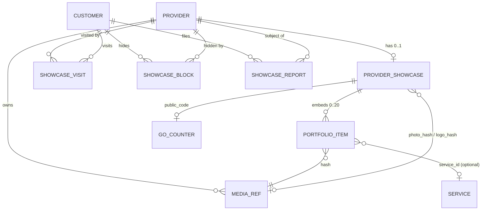

# Data Model — F-037 Provider Showcase

All new collections live in the `agenda_buddy` database, are written only by the Provider service, and use `[BsonElement("snake_case")]` on every field. **No existing collection's documents change shape.** `ProviderSummary` (a DTO, not stored) gains two projected fields.

---

## 1. `provider_showcase` (new): one document per provider, created on the first authoring write

| Field | BSON | Type | Rules |
|---|---|---|---|
| Id | `_id` | ObjectId | |
| ProviderId | `provider_id` | ObjectId | **unique index**; = `ProviderEntity.Id` |
| ProviderEmail | `provider_email` | string | the owner's `sub`; used by `/showcase/me/*` routes and erasure. Never returned to a non-owner |
| PublicCode | `public_code` | string? | 6 chars from `23456789ABCDEFGHJKMNPQRSTUVWXYZ`; **unique sparse index**; null until first use |
| Tagline | `tagline` | string? | ≤80 grapheme clusters |
| About | `about` | string? | ≤600 grapheme clusters |
| PhotoHash | `photo_hash` | string? | 64-hex sha256; must match an owned `media_refs` record |
| LogoHash | `logo_hash` | string? | same |
| Portfolio | `portfolio` | `PortfolioItem[]` | 0–20; order is display order; element 0 is the cover |
| HiddenByOperator | `hidden_by_operator` | bool? | operator takedown (T-375); set by direct DB write in this feature; when true the showcase and its media are 404 to everyone but the owner |
| UpdatedAt | `updated_at` | DateTime (UTC) | set on every write |
| PortfolioChangedAt | `portfolio_changed_at` | DateTime (UTC)? | drives the directory's "N NEW" chip without scanning the array |

**`PortfolioItem`** (embedded):

| Field | BSON | Type | Rules |
|---|---|---|---|
| Hash | `hash` | string | unique within the array (enforced in the `$push` filter) |
| Caption | `caption` | string? | ≤140 grapheme clusters; also the image's accessible description |
| ServiceId | `service_id` | ObjectId? | must reference one of the provider's own `ServiceEntity.Id`s at write time; a service deleted later leaves a dangling id, which the client renders as no link |
| Width / Height | `width` / `height` | int | of the stored `full` variant; lets the grid reserve space before the image loads |
| AddedAt | `added_at` | DateTime (UTC) | drives NEW tags |

**Write shapes** (all `FindOneAndUpdateAsync`; ADR-032):
- **Add:**
  - Filter: `{provider_id, "portfolio.hash": {$ne: h}, $expr: {$lt: [{$size: "$portfolio"}, 20]}}`
  - Update: `$push`
  - A null result is followed by one read to tell "cap reached" (409) from "already present" (200, idempotent).
- **Reorder:**
  - Filter: `{provider_id, portfolio: {$size: n}, "portfolio.hash": {$all: hashes}}`
  - Update: a pipeline-free `$set` of the array rebuilt server-side from the **current** items (read in the same handler), re-validated by the filter.
  - A mismatch is 409. Reordering into the same order is 200: the `MatchedCount` lesson.
- **Remove:** `$pull {portfolio: {hash}}`, then set `media_refs.attached=false` unless the same hash is also the photo or logo.
- **Create:** `InsertOneAsync` with a duplicate-key catch on `provider_id`, called by every authoring handler before its update. It is idempotent and never an upsert.

## 2. `media_refs` (new): one per stored image

| Field | BSON | Type | Rules |
|---|---|---|---|
| Id | `_id` | ObjectId | |
| ProviderId | `provider_id` | ObjectId | compound **unique index** `(provider_id, hash)` |
| Hash | `hash` | string | sha256 of re-encoded `full` |
| Attached | `attached` | bool | false until referenced by photo/logo/portfolio |
| Bytes | `bytes` | long | full + thumb, for quota reporting |
| CreatedAt | `created_at` | DateTime (UTC) | index `(attached, created_at)` for the sweep |

Blob keys `{providerId}/{hash}/full` and `{providerId}/{hash}/thumb` in container `media`. A provider can hold at most 22 attached images (20 portfolio images plus a photo and a logo). There's no hard cap on unattached ones, but they never outlive 24 hours plus one sweep. **Upload rate limit:** at most 60 `POST /media` per provider per hour, enforced by counting `media_refs.created_at` in the last hour; above that, 429.

## 3. `showcase_visits` (new): attribution

| Field | BSON | Type | Rules |
|---|---|---|---|
| ProviderId | `provider_id` | ObjectId | compound **unique index** `(provider_id, customer_email)` |
| CustomerEmail | `customer_email` | string | the visitor's `sub` |
| FirstSource | `first_source` | enum string | `scan \| code \| directory \| appointment \| message \| booking` |
| FirstSeenAt | `first_seen_at` | DateTime (UTC) | |
| LastSeenAt | `last_seen_at` | DateTime (UTC) | NEW-tag baseline |
| VisitCount | `visit_count` | int | incremented only when `last_seen_at` < now − 24h |
| SourceCounts | `source_counts` | `{source: int}` | same 24h rule |

One document per `(provider, customer)` pair, not one per visit, so the collection's size is bounded by relationships rather than traffic. Written with a single conditional `$set` / `$inc` (one attempt, then an `InsertOne` with a duplicate-key retry on first contact). The funnel is computed from this collection, `go_counters`, and `appointments` (customer + provider, `created_at` within 7 days of `first_seen_at` when `first_source ∈ {scan, code}`).

## 4. `go_counters` (new): anonymous

| Field | BSON | Type |
|---|---|---|
| Code | `code` | string, **unique index** |
| Ios / Android / Other | `ios` / `android` / `other` | long |

The counter is written with an upsert-free `$inc` on the existing document, which is created alongside the public code. An unknown code matches nothing and writes nothing, so it creates no row and leaves no trace. **No IP address, browser identifier, timestamp or visitor identifier is stored.**

## 5. `showcase_reports` (new)

| Field | BSON | Type |
|---|---|---|
| Id | `_id` | ObjectId |
| ProviderId | `provider_id` | ObjectId |
| ReporterEmail | `reporter_email` | string |
| Reason | `reason` | `inappropriate \| not_their_work \| spam \| other` |
| Detail | `detail` | string? ≤500 |
| PortfolioHash | `portfolio_hash` | string? (a specific image, if reported from the viewer) |
| CreatedAt | `created_at` | DateTime (UTC) |
| Status | `status` | `open \| resolved` (operator-managed; no route in this feature) |

A compound index on `(reporter_email, provider_id, created_at)` supports the anti-spam rule: one report per reporter per provider per 24h. A duplicate within that window returns 202 without writing.

## 6. `showcase_blocks` (new)

| Field | BSON | Type |
|---|---|---|
| CustomerEmail | `customer_email` | string |
| ProviderId | `provider_id` | ObjectId |
| CreatedAt | `created_at` | DateTime (UTC) |

Unique `(customer_email, provider_id)`. Read by the viewer query, the directory (`$nin` over the caller's blocked ids) and `by-code`.

## 7. Modified: `ProviderSummary` (DTO only)

`+ ProviderRef` (string, `ProviderEntity.Id`) and `+ PhotoHash` (string?, from `provider_showcase`, joined per page with one `$in`) and `+ PortfolioChangedAt` (DateTime?, for the "N NEW" chip, compared on the client with the customer's own visit). **`ProviderEntity` is not modified**, so the whole-document `PUT` can't erase the photo.

## 8. Entity relationships

## 9. Migration notes

- **No data migration.** Every existing provider has no showcase document, and the empty state is the designed state. The public code is created on first use.
- **Index creation:** there is no migration framework. Indexes are created idempotently at Provider service startup (`CreateIndexesAsync` in a hosted initializer), the same pattern the existing unique indexes use. The unique `public_code` index is **sparse**, because many documents hold null.
- **Blob container:** created at startup by `AzureBlobStore.EnsureContainerAsync`.
- **Rollback:** dropping the five collections and the container leaves every pre-existing flow untouched, because nothing outside the feature reads them.
- Record the schema change in DECISIONS.md as **ADR-071**, as CONSTITUTION requires.

## 10. Deliberately NOT persisted

| Not stored | Why |
|---|---|
| Original uploaded bytes | Only re-encoded variants exist. Nothing a client sent is ever served back (polyglots, EXIF/GPS) |
| EXIF / GPS / camera metadata | Discarded by re-encoding; never parsed into fields |
| Visitor IP, browser identifier or timestamp on `/go` | Keeps the only anonymous route free of identifiers (ADR-070) |
| Per-visit rows | One row per relationship bounds growth and holds nothing the funnel needs |
| The QR image and share exports | Generated on-device from the code and logo every time; storing them would add erasure scope for no gain |
| SAS tokens or public blob URLs | None exist. Media is reachable only through the authenticated proxy route |
| A cover image field | Cover = `portfolio[0]`, falling back to the photo, then the gradient. A separate field would be a sixth hub item for little gain |
