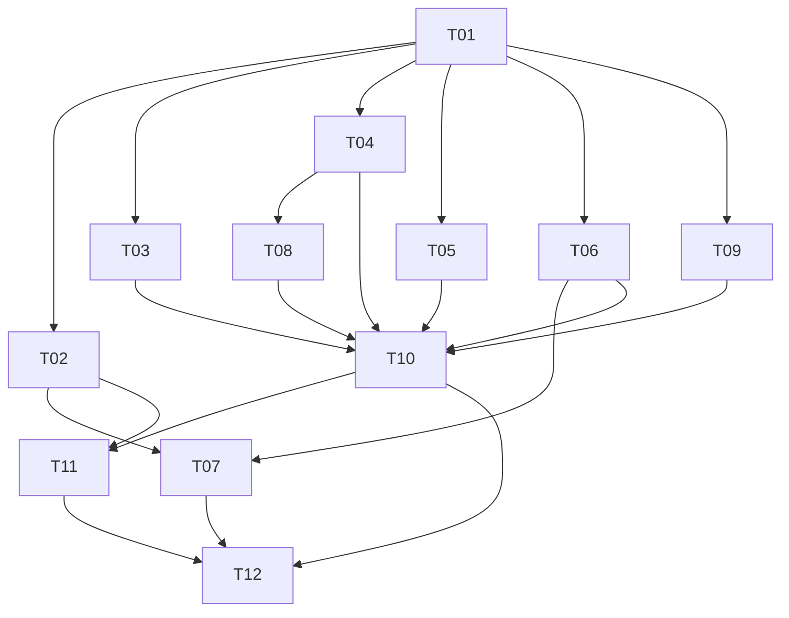

# Work Plan: Spanish Mobile Localization (F-033)

## Effort

| Area | Engineering effort | External effort |
|---|---:|---:|
| Resource foundation, culture lifecycle, Shell replacement | 3–4 days | — |
| XAML extraction (231 measured literals) | 3–4 days | — |
| C# runtime-copy extraction and formatting | 4–5 days | — |
| Profession display map (115 entries) | 1–2 days | 1–2 translation days |
| In-app and lock-screen notification localization | 2–3 days | 0.5–1 translation day |
| Error categorization and localized UX copy | 2–3 days | 1 translation day |
| Legal resource conversion | 1–2 days | 2–4 legal/translation days |
| Platform packaging and language metadata | 1–2 days | — |
| Automated, visual, accessibility, and regression verification | 4–6 days | 1–2 review days |
| **Total** | **21–31 engineer-days** | **5–10 specialist-days** |

Expected elapsed time is 4–6 weeks for one engineer with translation/legal work in parallel, or 2–3 weeks for
two engineers once the English resource catalog is stable. The critical path is resource foundation → complete
string extraction → reviewed translation/legal copy → platform/visual verification → enablement.

## Waves

### Wave 1 — Foundation

1. Resource catalog and automated parity/literal guards.
2. Synchronous preference/culture coordinator and Shell replacement.

These establish the contract every later task consumes. Spanish remains unavailable.

### Wave 2 — Mobile Surface

3. XAML extraction.
4. Runtime C# copy, formatting, statuses, counts, and errors.
5. Profession display mapping.
6. In-app notification localization.

Tasks 3–6 can proceed in parallel after the resource naming convention is fixed.

### Wave 3 — Cross-Process and Legal

7. Device locale contract and localized push banners.
8. Terms, Privacy Policy, consent copy, and review evidence.
9. Spanish translation/glossary and native-speaker review.

Push work can run in parallel with legal/translation work.

### Wave 4 — Packaging and Enablement

10. Android/iOS locale metadata and release-build verification.
11. Full automated, visual, accessibility, and both-role smoke test.
12. Enable Spanish only after every gate passes.

## Task Definitions

### T01 — Resource foundation and completeness guards (M, 2–3 days)

Add neutral/Spanish RESX files, generated resource access, semantic naming rules, parity tests, and structural
literal scans. Seed enough representative keys to prove XAML and C# access under mobile and `net10.0` targets.

### T02 — Culture persistence and safe Shell replacement (M, 2–3 days)

Add preference/coordinator/shell-service boundaries; apply initial culture before Shell construction; make
route/event registration one-time; preserve session and restore a safe route across repeated language changes.

### T03 — Extract all XAML-visible copy (L, 3–4 days)

Replace the 231 measured literals across 31 views/controls. Include titles, placeholders, buttons, empty states,
tooltips, and accessibility descriptions. Keep glyphs and automation identifiers literal.

### T04 — Extract runtime and formatted C# copy (L, 4–5 days)

Localize view-model/model/service messages, role/status/payment/fee labels, date bands, weekdays, relative time,
counts, duration/currency formatting, toast/banner actions, and gateway display names. Add singular/plural resource
templates rather than concatenating sentence fragments.

### T05 — Localize the seeded profession catalog (M, 1–2 days)

Map all 115 canonical English names to localized display resources. Search and group by display name; send the
canonical name on every API operation. `ProfessionLocalizationTest` iterates
`ProfessionSeedData.SeedData()`, asserts every name has a display entry for each supported locale, and asserts
that no mapping is orphaned. Unknown values fall back to the canonical name. No backend migration.

### T06 — Localize in-app notification presentation (M, 1–2 days)

Cover all 12 notification types with localized labels and privacy-safe generic title/body. Preserve original
message content in authenticated expanded detail and retain legacy subject/body fallback for unknown rows.

### T07 — Persist device locale and localize push banners (M, 2–3 days)

Add optional language code to device-token request/entity/service, repost locale after a language change, and
make backend `DisplayText` locale-aware with English fallback. Test every notification type and old clients.

### T08 — Localize actionable errors without a global API rewrite (M, 2–3 days)

Introduce mobile operation/result categories, stop presenting raw server English from the four current parsing
services, and resource every user-facing fallback. Add narrow backend codes later only when status plus operation
cannot preserve required meaning.

### T09 — Resource and review legal/consent content (M engineering + external gate)

Convert both 10-clause documents to resource-backed structures, add parity/disclosure tests, translate consent
and destructive-action copy, and record legal/native-speaker approval. This task can be code-complete but cannot
be marked done without human review evidence.

### T10 — Complete and review `es-MX` translation (L, 4–7 specialist days)

Translate the frozen resource catalog, maintain a product glossary and formal/informal voice rule, review all
screens in context, and resolve expansion/ambiguity defects. Machine output may assist drafting but is not final
review evidence.

### T11 — Platform locale declaration and package checks (M, 1–2 days)

Advertise `en`/`es-MX` on Android and iOS, synchronize the in-app choice with platform behavior where supported,
and add package-level checks proving Spanish resources survive Release builds.

### T12 — End-to-end verification and enablement (L, 4–6 days)

Run all three test suites, Android/iOS builds, repeated-switch/session tests, small-screen visual and accessibility
review, and both-role workflow smoke tests. Flip `AppLanguages` only in this task. Produce release evidence and
leave no unavailable/coming-soon Spanish copy behind.

## Dependency Graph

## Recommended Delivery Shape

Use one feature branch/PR only if one engineer owns the whole feature and can keep it under review continuously.
For parallel work, use three mergeable slices behind the unavailable-language gate:

1. foundation + English extraction;
2. notification/platform backend + profession/error surfaces;
3. reviewed Spanish resources + enablement.

Every intermediate commit/build remains English-only and releasable. The final flag change is intentionally
small and independently reversible.