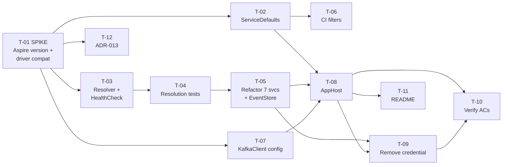

# Plan — Aspire Wiring (F-013)

**Author:** Neo (Architect)
**Date:** 2026-08-15
**Status:** Approved (pre-approved by user instruction)
**PRD:** [PRD_aspire-wiring_2026-08-15.md](../../archive/prds/PRD_aspire-wiring_2026-08-15.md)
**Design:** [ARCHITECTURE.md](../../archive/design/aspire-wiring/ARCHITECTURE.md) · [threat-model.md](../../archive/design/aspire-wiring/threat-model.md)
**Task records:** `docs/pdlc/tasks/F-013/`

---

## Wave structure

Five waves. Wave 1 is a **decision gate**, not a build step — nothing else starts until R-1 is resolved.

| Wave | Tasks | Parallel? | Gate to exit |
|---|---|---|---|
| **1** | T-01 | — | **R-1 resolved.** Aspire version pinned; Mongo-integration compatibility with driver 2.25.0 known; escape hatch taken or not; `ARCHITECTURE.md` §3.4/§8 updated |
| **2** | T-02, T-03, T-07, T-12 | ✅ all four | ServiceDefaults builds; resolver + health check exist; Kafka config-driven; ADR recorded |
| **3** | T-04 → T-05, T-06 | T-06 parallel with T-04/T-05 | Tests written **before** the refactor they cover; all 7 services + EventStore refactored; **CI actually runs** |
| **4** | T-08 → T-09 | sequential | AppHost starts 9 resources; credential gone from tracked files |
| **5** | T-10, T-11 | ✅ both | Every AC verified and attested; README covers the new workflow |

## Task detail

| ID | Task | Prio | Depends on | Key ACs | Risk |
|---|---|---|---|---|---|
| **T-01** | **Spike:** resolve Aspire version + `MongoDB.Driver` 2.25.0 compatibility | 1 | — | OQ-3 | **R-1** |
| T-02 | Create `AgendaBuddy.ServiceDefaults` | 2 | T-01 | AC-3.1, 3.3, 3.5 | — |
| T-03 | `MongoConnectionResolver` + `MongoHealthCheck` | 2 | T-01 | AC-2.5, 3.2, 4.2 | T-002 |
| T-04 | Connection-resolution tests, all 7 services | 2 | T-03 | AC-5.5 | **R-3** |
| T-05 | Refactor Mongo wiring, 7 services + `EventStore` | 3 | T-03, T-04 | AC-4.2, 4.3, 5.3 | **R-3** |
| T-06 | CI path filters + AppHost build + guard assertions | 3 | T-02 | AC-1.5, 2.1, 2.2, 5.4 | **R-8** |
| T-07 | `KafkaClient.BootstrapServers` from configuration | 3 | T-01 | AC-5.5 | — |
| T-08 | Create `AgendaBuddy.AppHost`, wire 9 resources | 4 | T-02, T-05, T-07 | AC-1.1–1.5 | R-5, T-003 |
| T-09 | Remove the committed Atlas credential (14 files) | 4 | T-05, T-08 | AC-2.1–2.4 | **T-001**, T-005 |
| T-10 | Verify acceptance criteria; attest the manual run | 5 | T-08, T-09 | AC-1.x, 3.x, 4.1, 5.x | E-7, T-004 |
| T-11 | Document the AppHost workflow in README | 5 | T-08 | E-3, E-4, E-9 | — |
| T-12 | Record ADR-013 (Aspire adoption) | 5 | T-01 | §9 compliance | — |

## Sequencing rationale

**Why T-01 is a gate, not a task.** R-1 is the only risk that can invalidate the design. If `Aspire.MongoDB.Driver` requires driver 3.x, the choice is between a second migration (excluded by the PRD) and the escape hatch (plain `AddSingleton<IMongoClient>`). That decision changes one line in T-05 and one package reference in seven `.csproj` files — cheap if known first, expensive if discovered at T-08.

**Why T-04 precedes T-05.** The code being refactored has **zero test coverage** (R-3) — no test exists for any `ServiceCollectionExtension`, and the solution has no integration test at all. Writing the resolution tests first gives the refactor its only safety net. Reversing the order would mean refactoring 15 files blind.

**Why T-06 is wave 3, not wave 5.** The `dorny/paths-filter` gate currently ignores `global.json`, `Dockerfile*`, `docker-compose*`, and `.github/**`, and new top-level projects may miss the `api` filter (R-8). If CI is fixed last, every earlier push runs zero jobs and the first real signal arrives at the end. Fixing it in wave 3 means T-08 and T-09 get verified as they land.

**Why T-09 follows T-08.** The credential can only be safely deleted once the AppHost demonstrably injects a working replacement. Deleting first would leave the repo in a state where nothing starts — and per threat T-005, that is exactly what drives a developer to paste the secret back.

**Why T-10 is a task at all.** Six acceptance criteria (AC-1.1/1.2/1.3, AC-3.2/3.4, AC-4.1) cannot be automated — there is no `WebApplicationFactory` or `TestServer` anywhere in the solution (E-7, `11-testing.md`). T-10 makes the manual verification an explicit, tracked deliverable with a recorded attestation rather than an assumption.

## Test strategy

| Layer | Approach |
|---|---|
| **New unit tests** | T-04: per-service connection resolution — Aspire key, each legacy fallback, and the named-key failure. Plus `KafkaClient` config resolution. |
| **Existing tests** | All 256 must pass **unmodified** (AC-5.1, AC-5.2). A test needing a change is a regression signal to escalate, not edit. |
| **Integration** | None possible — the solution has no harness. Recorded as an accepted gap, not silently skipped. |
| **Manual** | T-10, with the outcome attested in the episode. |
| **CI guards** | T-06: AppHost-has-no-MobileApp-reference; no credential URI in tracked files; `dotnet build /p:MobileWorkloads=false` succeeds. |

⚠️ **The `CONSTITUTION.md` §7 mandatory security scan (dependency audit + secret scan) is still not implemented.** T-06 adds a narrow single-pattern credential assertion, which is not a scanner. This gap is deliberate and deferred to **F-017** — it is called out here so the plan does not read as closing it.

## Rollback

Single `git revert` of one PR. No data migration, no schema change. `docker-compose*.yml` and every legacy configuration key are retained (E-12, R-4), so the pre-Aspire path still works after a revert — the only loss is the deleted credential value, which is recoverable from history and should be rotated anyway (T-001).

## Definition of Done

Beyond the ACs:

- [ ] ADR-013 in `DECISIONS.md`, including the T-01 outcome and whether the escape hatch was taken
- [ ] XML doc comments on both new public `ServiceDefaults` methods (`CONSTITUTION.md` §5)
- [ ] README updated (T-11)
- [ ] Episode drafted, including: the T-01 finding; the manual T-10 attestation; the connection-pool behaviour change from N-clients-per-request to one-per-process (Pulse, Progressive Thinking R3); and the threat T-003/T-004 verification results
- [ ] F-014…F-017 present in `ROADMAP.md` as `Planned`
- [ ] **OQ-1 surfaced to the user as an operational action:** rotate the `agenda_buddy` Atlas credential and review the cluster access log. Merging this feature does **not** close it

## Known-unsatisfiable Definition-of-Done items

`CONSTITUTION.md` §5 requires "All integration tests pass" — there are none in the solution. Recorded rather than quietly dropped; F-017's scope is the natural home for building that capability.
