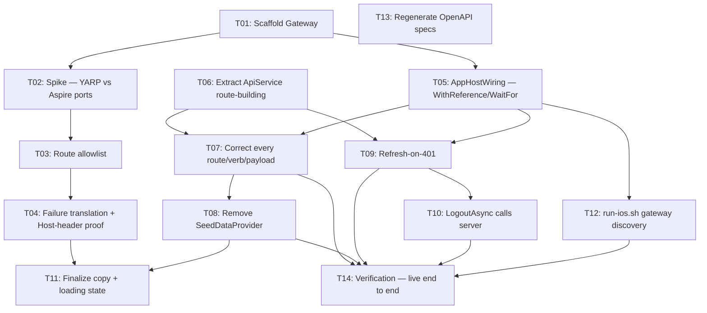

# Plan: API Gateway and Mobile Contract

**Feature:** api-gateway-and-mobile-contract
**Date:** 2026-08-23
**PRD:** [PRD_F-015_api-gateway-and-mobile-contract_2026-08-23.md](../PRD_F-015_api-gateway-and-mobile-contract_2026-08-23.md)

---

## Tasks

| Task ID | Title | Labels | Depends On | Author | Created (UTC) |
|---------|-------|--------|-----------|--------|---------------|
| F-015-T01 | Scaffold the Gateway project | backend, devops | — | ogdevlabs | 2026-08-23 |
| F-015-T02 | Spike: YARP vs. Aspire dynamic ports | backend, devops | F-015-T01 | ogdevlabs | 2026-08-23 |
| F-015-T03 | YARP route table: explicit allowlist | backend, security | F-015-T02 | ogdevlabs | 2026-08-23 |
| F-015-T04 | Gateway failure translation + Host-header proof | backend, security | F-015-T03 | ogdevlabs | 2026-08-23 |
| F-015-T05 | Wire Gateway into AppHostWiring.cs | backend, devops | F-015-T01 | ogdevlabs | 2026-08-23 |
| F-015-T06 | Extract *ApiService route-building logic | frontend | — | ogdevlabs | 2026-08-23 |
| F-015-T07 | Correct every *ApiService route/verb/payload | frontend | F-015-T06, F-015-T05 | ogdevlabs | 2026-08-23 |
| F-015-T08 | Remove SeedDataProvider; wire error/empty states | frontend | F-015-T07 | ogdevlabs | 2026-08-23 |
| F-015-T09 | Wire refresh-on-401; never auto-retry ambiguous writes | frontend | F-015-T06, F-015-T05 | ogdevlabs | 2026-08-23 |
| F-015-T10 | LogoutAsync calls the server | frontend | F-015-T09 | ogdevlabs | 2026-08-23 |
| F-015-T11 | Finalize copy; map failed-service error; loading state | frontend, ux | F-015-T04, F-015-T08 | ogdevlabs | 2026-08-23 |
| F-015-T12 | run-ios.sh discovers the gateway's address | devops | F-015-T05 | ogdevlabs | 2026-08-23 |
| F-015-T13 | Regenerate OpenAPI specs | devops | — | ogdevlabs | 2026-08-23 |
| F-015-T14 | Verification: all 13 ACs, live end to end | backend, frontend, devops | F-015-T07, F-015-T08, F-015-T09, F-015-T10, F-015-T12 | ogdevlabs | 2026-08-23 |

---

## Dependency Graph

---

## Implementation Order

**Wave 1** (no dependencies — fully parallel): F-015-T01 (scaffold Gateway), F-015-T06 (extract ApiService
route-building), F-015-T13 (regenerate OpenAPI specs).

**Wave 2** (depends only on Wave 1): F-015-T02 (YARP/Aspire spike, needs T01), F-015-T05 (AppHostWiring,
needs T01).

**Wave 3** (depends on Wave 1–2): F-015-T03 (route allowlist, needs T02), F-015-T07 (route corrections,
needs T06 + T05), F-015-T09 (refresh-on-401, needs T06 + T05), F-015-T12 (run-ios.sh discovery, needs T05).

**Wave 4** (depends on Wave 3): F-015-T04 (failure translation, needs T03), F-015-T08 (remove
SeedDataProvider, needs T07), F-015-T10 (LogoutAsync, needs T09).

**Wave 5** (closing): F-015-T11 (finalize copy, needs T04 + T08), F-015-T14 (verification, needs T07, T08,
T09, T10, T12 — the gateway-only tasks T01–T05 and the copy task T11 are exercised transitively through the
tasks that depend on them).

**Sizing note (Discover/Adversarial finding #10):** 14 tasks across 5 waves — larger than any prior shipped
feature in this project (F-016's 20 tasks/8 waves is bigger by task count but had 8 tasks pre-approved from
F-018's plan; F-015's 14 are all new). Kept as one PRD per the Discovery decision; flagged here for the
Step 18.6 readiness party's extra scrutiny rather than split retroactively.
