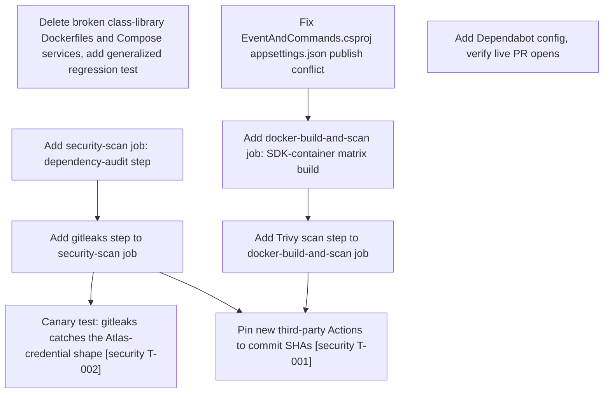

# Plan: Container and CI/CD Hardening

**Feature:** container-and-cd-hardening
**Date:** 2026-08-25
**PRD:** [PRD_F-017_container-and-cd-hardening_2026-08-25.md](../PRD_F-017_container-and-cd-hardening_2026-08-25.md)

---

## Tasks

| Task ID | Title | Labels | Depends On | Author | Created (UTC) |
|---------|-------|--------|-----------|--------|---------------|
| F-017-T01 | Delete broken class-library Dockerfiles and Compose services, add generalized regression test | `epic:container-and-cd-hardening`, `story:F-017-US-01`, `devops` | — | ogdevlabs | 2026-08-25T22:50:35Z |
| F-017-T02 | Fix EventAndCommands.csproj appsettings.json publish conflict | `epic:container-and-cd-hardening`, `story:F-017-US-02`, `backend`, `devops` | — | ogdevlabs | 2026-08-25T22:50:35Z |
| F-017-T03 | Add security-scan job: dependency-audit step | `epic:container-and-cd-hardening`, `story:F-017-US-03`, `devops` | — | ogdevlabs | 2026-08-25T22:50:35Z |
| F-017-T04 | Add gitleaks step to security-scan job | `epic:container-and-cd-hardening`, `story:F-017-US-03`, `devops` | F-017-T03 | ogdevlabs | 2026-08-25T22:50:35Z |
| F-017-T05 | Canary test: gitleaks catches the Atlas-credential shape, with log-redaction proof `[security T-002]` | `epic:container-and-cd-hardening`, `story:F-017-US-03`, `devops`, `backend` | F-017-T04 | ogdevlabs | 2026-08-25T22:50:35Z |
| F-017-T06 | Add docker-build-and-scan job: SDK-container matrix build | `epic:container-and-cd-hardening`, `story:F-017-US-04`, `devops` | F-017-T02 | ogdevlabs | 2026-08-25T22:50:35Z |
| F-017-T07 | Add Trivy scan step to docker-build-and-scan job | `epic:container-and-cd-hardening`, `story:F-017-US-04`, `devops` | F-017-T06 | ogdevlabs | 2026-08-25T22:50:35Z |
| F-017-T08 | Add Dependabot config, verify live PR opens | `epic:container-and-cd-hardening`, `story:F-017-US-05`, `devops` | — | ogdevlabs | 2026-08-25T22:50:35Z |
| F-017-T09 | Pin new third-party Actions (gitleaks, Trivy) to commit SHAs `[security T-001]` | `epic:container-and-cd-hardening`, `devops` | F-017-T04, F-017-T07 | ogdevlabs | 2026-08-25T22:50:35Z |

---

## Dependency Graph

---

## Implementation Order

Four waves, matching the PRD's 3-sequential-PR decision plus the cross-cutting hardening task that spans them:

1. **Wave 1 (parallel, no dependencies):** `F-017-T01` (delete the 3 broken Dockerfiles/Compose services), `F-017-T02` (fix the `EventAndCommands.csproj` publish conflict), `F-017-T03` (dependency-audit step), `F-017-T08` (Dependabot config). None of these four block each other — all can land in parallel or as the first PR.
2. **Wave 2 (depends on Wave 1):** `F-017-T04` (gitleaks step, needs `F-017-T03`'s job to exist) and `F-017-T06` (image-build matrix job, needs `F-017-T02`'s fix or every service's publish fails).
3. **Wave 3 (depends on Wave 2):** `F-017-T05` (canary test, needs `F-017-T04`'s gitleaks step) and `F-017-T07` (Trivy scan step, needs `F-017-T06`'s job).
4. **Wave 4 (depends on Waves 2 and 3):** `F-017-T09` (pin both new third-party Actions to commit SHAs — can only fully complete once both `F-017-T04`'s gitleaks reference and `F-017-T07`'s Trivy reference exist).

This lands as roughly 3 PRs (Wave 1 → Wave 2+3 combined as the "security-scan" and "image-build" PRs respectively, per the PRD's 3-sequential-PR decision), with `F-017-T09` folded into whichever of those two PRs lands last.
