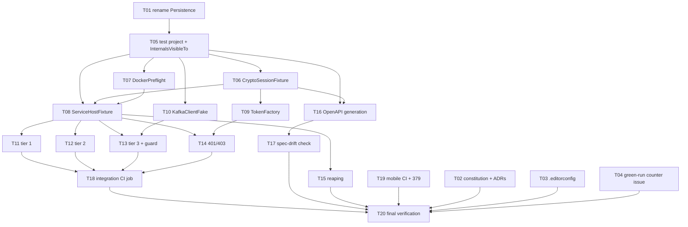

# Plan: API Refactor Foundations

**Feature:** api-refactor-foundations (F-018, stage 1 of 3)
**Date:** 2026-08-18
**PRD:** [PRD_F-018_api-refactor-foundations_2026-08-18.md](../PRD_F-018_api-refactor-foundations_2026-08-18.md)
**Design:** [`docs/pdlc/design/api-refactor-foundations/`](../../design/api-refactor-foundations/)
**Branch:** `feat/F-018-api-refactor-foundations`

**20 tasks · 7 waves · 31 acceptance criteria (27 + 3 threat-derived + 1 added at the Step 18 gate) · 9 user stories**

---

## Tasks

| Task ID | Title | Labels | Depends On | ACs |
|---|---|---|---|---|
| F-018-T01 | Rename `EventAndCommands/Persitency` → `Persistence` | `story:US-08`, `backend` | — | 16 |
| F-018-T02 | Amend CONSTITUTION §1/§4/§9, verify ADR-014…020, fix the Identity comment | `story:US-08`, `docs` | — | 23, 25 |
| F-018-T03 | Add `.editorconfig` and enforce `dotnet format` in CI | `story:US-08`, `devops` | — | 26 |
| F-018-T04 | File the beads issue tracking the 10-green-run count | `story:US-09`, `devops` | — | 27 |
| F-018-T05 | Create `AgendaBuddy.IntegrationTests`; `InternalsVisibleTo` × 7 | `story:US-01`, `backend`, `devops` | T01 | 1, 2 |
| F-018-T06 | `CryptoSessionFixture` — session RSA keypair, in memory, never on disk | `story:US-01`, `backend`, `security` | T05 | 3, **30 `[security]` T-002** |
| F-018-T07 | `DockerPreflight` — actionable infrastructure diagnostics | `story:US-05`, `backend`, `devops` | T05 | 10, 11, 14 |
| F-018-T08 | `ServiceHostFixture` — container per class, fail-closed endpoint guard | `story:US-01`, `backend`, `security` | T05, T06, T07 | 4, 12, 13b, **28 `[security]` T-001**, **29 `[security]` T-004** |
| F-018-T09 | `TokenFactory` — valid / expired / foreign-subject RS256 | `story:US-04`, `backend`, `security` | T06 | 9 *(mechanism)* |
| F-018-T10 | `KafkaClientFake` — recording substitute, no Kafka container | `story:US-01`, `backend` | T05 | **31** |
| F-018-T11 | **Tier 1** — route contract, 7 services | `story:US-02`, `backend` | T08 | 5 |
| F-018-T12 | **Tier 2** — persistence round-trip, 7 services | `story:US-02`, `backend` | T08 | 6, 8 |
| F-018-T13 | **Tier 3** — audit fired (6 services) + permanent guard test | `story:US-03`, `backend` | T08, T10 | 7, 15 |
| F-018-T14 | Auth failure paths — 401 expired, 403 foreign subject | `story:US-04`, `backend`, `security` | T08, T09 | 9 |
| F-018-T15 | Verify container reaping after an abnormal exit | `story:US-05`, `devops` | T08 | 13 |
| F-018-T16 | OpenAPI generation via `ISwaggerProvider`, byte-determinism proven | `story:US-06`, `backend` | T05, T06 | 17, 18 |
| F-018-T17 | CI spec-drift check | `story:US-06`, `devops` | T16 | 19 |
| F-018-T18 | Integration CI job — separate, blocking from run 1, duration enforced | `story:US-07`, `devops` | T11, T12, T13, T14 | 20, 21 |
| F-018-T19 | Confirm the 3 mobile CI jobs pass; report 379 | `story:US-08`, `devops` | — | 22 |
| F-018-T20 | Final verification — 379 green, no test deleted, ACs attested | `story:US-07`, `backend`, `devops` | T02, T03, T04, T15, T17, T18, T19 | 24 |

---

## Dependency Graph

---

## Implementation Order

**Wave 1 — 5 tasks, fully parallel.** `T01` `T02` `T03` `T04` `T19`
`T01` (the rename) is on the critical path and **must land as its own commit before any integration test is authored** (AC-16) — it gates everything in the harness. The other four are independent: governance, tooling, and the mobile-CI confirmation.

**Wave 2 — 1 task.** `T05`
Creates the test project and adds `InternalsVisibleTo` to all seven services. The single narrowest point in the plan: nothing else in the harness can start until this lands.

**Wave 3 — 4 tasks, parallel.** `T06` `T07` `T09` `T10`
The fixtures and doubles. `T06` (crypto) and `T07` (Docker preflight) both feed `T08`; `T09` (tokens) and `T10` (Kafka fake) feed the tier tasks.

**Wave 4 — 1 task.** `T08`
`ServiceHostFixture` — the central fixture, and the second bottleneck. Everything in wave 5 depends on it.

**Wave 5 — 6 tasks, parallel.** `T11` `T12` `T13` `T14` `T15` `T16`
The three tiers, auth paths, reaping, and OpenAPI generation. **`T16` is deliberately independent of `T08`** — spike-confirmed that spec generation needs no container, so it can start as soon as `T05`/`T06` are done and does not wait on the fixture.

**Wave 6 — 2 tasks.** `T17` `T18`
CI wiring. `T17` follows `T16`; `T18` needs all four tier/auth tasks.

**Wave 7 — 1 task.** `T20`
Final verification and the AC attestation document.

### Critical path

`T01 → T05 → T06 → T08 → T13 → T18 → T20` — **7 tasks deep.** The two bottlenecks are `T05` and `T08`; everything else fans out around them.

---

## What the plan front-loads, and why

Both PRD risks flagged as gating were **spiked before Design**, so no task here rests on an unproven approach:

| Spike | Outcome | Effect on this plan |
|---|---|---|
| Testcontainers on Rancher | ✅ works with **zero** configuration | No spike task needed. But it measured **4.45 s** warm container startup vs the 1–3 s assumed, which **reversed** container-per-test → container-per-class (ADR-017) and reshaped `T08` |
| Deterministic OpenAPI | ✅ `ISwaggerProvider` from host DI — no HTTP, no Development override, **no sixth package** | `T16` needs no container, so it moves off the critical path and into wave 5 in parallel |

---

## Threat-derived security ACs

Three "mitigate now" threats are materialized as structured `[security]` ACs, not merely task-body citations:

| Threat | AC | Task | Enforcement |
|---|---|---|---|
| **T-001** | PRD AC-28 | `F-018-T08` AC1 | TDD gate demands a failing-first test; `tasks.cjs done` refuses to close without a linked test |
| **T-004** | PRD AC-29 | `F-018-T08` AC2 | same |
| **T-002** | PRD AC-30 | `F-018-T06` AC1 | same |

`tasks.cjs check` currently reports **3 `security-ac-untested` findings** — expected until Build links the tests. Recorded as an ADR-021 addendum since these ACs were added after the Define gate.

---

## Known gaps this plan carries into Construction

Stated rather than hidden, because each could surprise the implementer:

1. **`T16` carries two unresolved decisions**: the spec output location/naming, and whether full-document byte-determinism actually holds — the spike proved stable *path sets* only. AC-19's drift check produces false failures if it doesn't. This is the same "reasoned, not observed" trap that made threat T-004 wrong in F-013.
2. **`T17`, `T18` and `T19` cannot be verified locally.** They need a real CI run on a short-lived throwaway branch **pushed by the maintainer on request**. `main` is PR-protected. Deliberately not downgraded to "the command passes locally".
3. **`T15` (container reaping) is unverified by design** — it must be proven by an actual mid-flight kill. Precedent: killing the AppHost with `SIGTERM` at the v0.1.0 ship left six orphan processes.
4. **The cache-aside invariant gets no guard** while the audit invariant gets two. CONSTITUTION §3 protects both equally. Deferred deliberately (audit loss is unrecoverable; cache-aside failure degrades performance) — **revisit in F-019**.
5. **Seven MobileApp tests are skipped and nobody knows why** — only 372 of 379 execute. `T19` investigates.
7. **`T17`/`T18`/`T19` are gated on a maintainer-pushed throwaway branch**, and the dependency graph cannot express "waits on a human". The readiness party flagged this as `dependency-missed`; it is disclosed rather than fixed, because the no-push constraint is deliberate. Plan around it: those three cannot be scheduled like ordinary tasks.
6. **F-018 has no rollback story.** It edits seven production `.csproj` files and renames a namespace. Both land as isolated commits, so revert is mechanical, but there is no scripted path.
