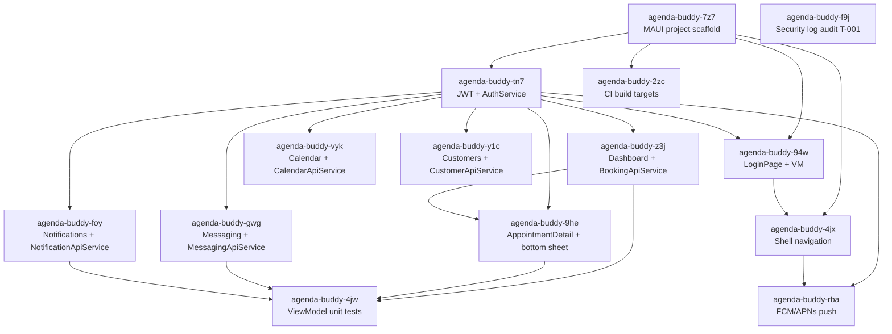

# Plan: Mobile App (iOS + Android)

**Feature:** mobile-app
**Date:** 2026-07-31
**PRD:** [PRD_mobile-app_2026-07-31.md](../PRD_mobile-app_2026-07-31.md)

---

## Tasks

| Beads ID | Title | Labels | Depends On | Author | Created (UTC) |
|----------|-------|--------|-----------|--------|---------------|
| agenda-buddy-7z7 | MAUI project scaffold — solution setup, DI wiring, Library reference | epic:mobile-app, frontend | — | ogdevlabs | 2026-07-31T10:55:32Z |
| agenda-buddy-tn7 | JwtDelegatingHandler + SecureStorage AuthService | epic:mobile-app, frontend | agenda-buddy-7z7 | ogdevlabs | 2026-07-31T10:55:32Z |
| agenda-buddy-f9j | Security: login endpoint log sanitization audit (Phantom T-001) | epic:mobile-app, backend, security | — | ogdevlabs | 2026-07-31T10:55:32Z |
| agenda-buddy-94w | LoginPage + LoginViewModel (US-001) | epic:mobile-app, frontend, ux | agenda-buddy-7z7, agenda-buddy-tn7 | ogdevlabs | 2026-07-31T10:55:32Z |
| agenda-buddy-z3j | BookingApiService + DashboardPage + DashboardViewModel (US-002) | epic:mobile-app, frontend, ux | agenda-buddy-tn7 | ogdevlabs | 2026-07-31T10:55:32Z |
| agenda-buddy-vyk | CalendarApiService + CalendarPage (US-004) | epic:mobile-app, frontend, ux | agenda-buddy-tn7 | ogdevlabs | 2026-07-31T10:55:32Z |
| agenda-buddy-y1c | CustomerApiService + CustomersPage | epic:mobile-app, frontend, ux | agenda-buddy-tn7 | ogdevlabs | 2026-07-31T10:55:32Z |
| agenda-buddy-gwg | MessagingApiService + MessagingPage + MessageThreadPage (US-005) | epic:mobile-app, frontend, ux | agenda-buddy-tn7 | ogdevlabs | 2026-07-31T10:55:32Z |
| agenda-buddy-foy | NotificationApiService + NotificationsPage + mark-read (US-007) | epic:mobile-app, frontend, ux | agenda-buddy-tn7 | ogdevlabs | 2026-07-31T10:55:32Z |
| agenda-buddy-9he | AppointmentDetailPage + status mutation + confirmation bottom sheet (US-003) | epic:mobile-app, frontend, ux | agenda-buddy-tn7, agenda-buddy-z3j | ogdevlabs | 2026-07-31T10:55:32Z |
| agenda-buddy-4jx | Shell navigation + tab bar wiring | epic:mobile-app, frontend | agenda-buddy-7z7, agenda-buddy-94w | ogdevlabs | 2026-07-31T10:55:32Z |
| agenda-buddy-rba | FCM/APNs push notification registration + delivery (US-006) | epic:mobile-app, frontend, backend | agenda-buddy-tn7, agenda-buddy-4jx | ogdevlabs | 2026-07-31T10:55:32Z |
| agenda-buddy-4jw | ViewModel unit tests — AC-12 coverage | epic:mobile-app, frontend, test | agenda-buddy-z3j, agenda-buddy-9he, agenda-buddy-gwg, agenda-buddy-foy | ogdevlabs | 2026-07-31T10:55:32Z |
| agenda-buddy-2zc | CI: Android + iOS build targets in GitHub Actions | epic:mobile-app, devops, ci | agenda-buddy-7z7 | ogdevlabs | 2026-07-31T10:55:32Z |

---

## Dependency Graph

---

## Implementation Order

**Wave 1 — Foundation (parallel: agenda-buddy-7z7, agenda-buddy-f9j)**
- **7z7:** MAUI project scaffold — creates the project, DI wiring, Library reference, directory structure. Everything else depends on this.
- **f9j:** Security log sanitization audit — Identity service; independent of mobile scaffold.

**Wave 2 — Auth infrastructure (agenda-buddy-tn7)**
- Depends on scaffold. JwtDelegatingHandler + SecureStorage AuthService + device-token endpoint in Identity service. All screen tasks depend on this.

**Wave 3 — Login screen + CI (parallel: agenda-buddy-94w, agenda-buddy-2zc)**
- **94w:** LoginPage + LoginViewModel — depends on scaffold + auth.
- **2zc:** CI Android + iOS build targets — depends only on scaffold; can run parallel to auth.

**Wave 4 — All list screens + Security audit integration (parallel: agenda-buddy-z3j, agenda-buddy-vyk, agenda-buddy-y1c, agenda-buddy-gwg, agenda-buddy-foy)**
- Five independent screens: Dashboard, Calendar, Customers, Messaging, Notifications. All depend on auth (Wave 2) only and can build in parallel.

**Wave 5 — Detail screens + Shell wiring (parallel: agenda-buddy-9he, agenda-buddy-4jx)**
- **9he:** AppointmentDetail — depends on Dashboard (needs appointment ID from list).
- **4jx:** Shell navigation wiring — depends on LoginPage (94w).

**Wave 6 — Push notifications (agenda-buddy-rba)**
- Depends on auth + Shell (needs deep-link routes). Known risk: FCM/APNs provisioning; may become a fast-follow after core app ships.

**Wave 7 — ViewModel unit tests (agenda-buddy-4jw)**
- Depends on Dashboard, AppointmentDetail, Messaging, Notifications ViewModels all being implemented.
